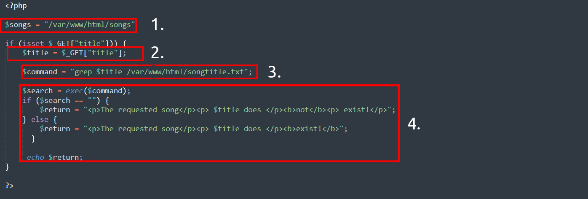

# Command Injection

Platform: TryHackMe
Difficulty: easy
OS: Linux
Category: Web
Tags: Command Injection, Blind Injection, Web Exploitation
Date: 2026-06-10

# Discovering Command Injection

In order to discover a command injection. One must understand how the web application works, such as its source code. For example:

In this code snippet, the application takes data that a user enters in an input field named `$title` to search a directory for a song title. 

1. The application stores MP3 files in a directory contained on the operating system.
2. The user inputs the song title they wish to search for. The application stores this input into the `$title` variable.
3. The data within this `$title` variable is passed to the command `grep` to search a text file names *songtitle.txt* for the entry of whatever the user wishes to search for.
4. The output of this search of *songtitle.txt* will determine whether the application informs the user that the song exists or not.

Now, this sort of information would typically be stored in a database; however, this is just an example of where an application takes input from a user to interact with the application’s operating system.

An attacker could abuse this application by injecting their own commands for the application to execute. Rather than using `grep` to search for an entry in `songtitle.txt`, they could ask the application to read data from a more sensitive file.

Abusing applications in this way can be possible no matter the programming language the application uses. As long as the application processes and executes it, it can result in command injection. For example, this code snippet below is an application written in Python.

Note, you are not expected to understand the syntax behind these applications. However, for the sake of reason, I have outlined the steps of how this Python application works as well.

1. The "flask" package is used to set up a web server
2. A function that uses the "subprocess" package to execute a command on the device
3. We use a route in the webserver that will execute whatever is provided. For example, to execute `whoami`, we'd need to visit http://flaskapp.thm/whoami

# Exploiting Command Injection

As discussed earlier, this kind of exploit relies on code review. For example: If a web application has an input form to ping a machine `ping -c 4 <ip addres>` we can exploit this if it is not **SANITIZED**. In a web application all we need to do is input the IP address, like `127.0.0.1` this input will be passed down to the variable that would take our input. Then we can pass a command such as `127.0.0.1; whoami` a similar command to unix which would execute `whoami` after pinging **127.0.0.1**.

You can often determine whether or not command injection may occur by the behaviours of an application, as you will come to see in the practical session of this room.

Applications that use user input to populate system commands with data can often be combined in unintended behaviour. **For example, the shell operators `;`, `&` and `&&` will combine two (or more) system commands and execute them both**. If you are unfamiliar with this concept, it is worth checking out the [Linux fundamentals module](https://tryhackme.com/module/linux-fundamentals) to learn more about this.

Command Injection can be detected in mostly one of two ways:

1. Blind command injection
2. Verbose command injection

| **Method** | **Description** |
| --- | --- |
| Blind | This type of injection is where there is no direct output from the application when testing payloads. You will have to investigate the behaviours of the application to determine whether or not your payload was successful. |
| Verbose | This type of injection is where there is direct feedback from the application once you have tested a payload. For example, running the `whoami` command to see what user the application is running under. The web application will output the username on the page directly. |

Detecting Blind Command Injection

Blind command injection is when command injection occurs; however, there is no output visible, so it is not immediately noticeable. For example, a command is executed, but the web application outputs no message.

For this type of command injection, we will need to use payloads that will cause some time delay. For example, the `ping` and `sleep` commands are significant payloads to test with. Using `ping` as an example, the application will hang for *x* seconds in relation to how many *pings* you have specified.

Another method of detecting blind command injection is by forcing some output. This can be done by using redirection operators such as `>`. If you are unfamiliar with this, I recommend checking out the [Linux fundamentals module](https://tryhackme.com/module/linux-fundamentals). For example, we can tell the web application to execute commands such as `whoami` and redirect that to a file. We can then use a command such as `cat` to read this newly created file’s contents.

Testing command injection this way is often complicated and requires quite a bit of experimentation, significantly as the syntax for commands varies between Linux and Windows.

The `curl` command is a great way to test for command injection. This is because you are able to use `curl` to deliver data to and from an application in your payload. Take this code snippet below as an example, a simple curl payload to an application is possible for command injection.

`curl http://vulnerable.app/process.php%3Fsearch%3DThe%20Beatles%3B%20whoami`

Detecting Verbose Command Injection

Detecting command injection this way is arguably the easiest method of the two. Verbose command injection is when the application gives you feedback or output as to what is happening or being executed.

For example, the output of commands such as `ping` or `whoami` is directly displayed on the web application.

Useful payloads

I have compiled some valuable payloads for both Linux & Windows into the tables below.

Linux

| **Payload** | **Description** |
| --- | --- |
| whoami | See what user the application is running under. |
| ls | List the contents of the current directory. You may be able to find files such as configuration files, environment files (tokens and application keys), and many more valuable things. |
| ping | This command will invoke the application to hang. This will be useful in testing an application for blind command injection. |
| sleep | This is another useful payload in testing an application for blind command injection, where the machine does not have `ping` installed. |
| nc | Netcat can be used to spawn a reverse shell onto the vulnerable application. You can use this foothold to navigate around the target machine for other services, files, or potential means of escalating privileges. |

Windows

| **Payload** | **Description** |
| --- | --- |
| whoami | See what user the application is running under. |
| dir | List the contents of the current directory. You may be able to find files such as configuration files, environment files (tokens and application keys), and many more valuable things. |
| ping | This command will invoke the application to hang. This will be useful in testing an application for blind command injection. |
| timeout | This command will also invoke the application to hang. It is also useful for testing an application for blind command injection if the `ping` command is not installed. |