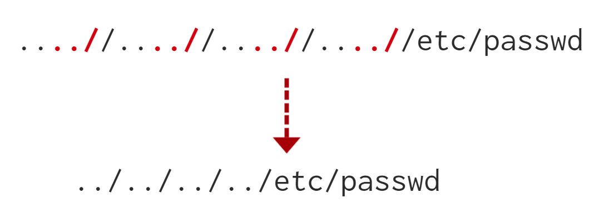

# File Inclusion

Platform: TryHackMe
Difficulty: medium
OS: Linux
Category: Web
Tags: LFI, Path Traversal, Null Byte, PHP
Date: 2026-06-05

This writeup is from the **Junior Penetration Tester Course.** It’s more of a note rather than the other writeups here.

# Why do File inclusion vulnerabilities happen?

File inclusion vulnerabilities are commonly found and exploited in various programming languages for web applications, such as PHP that are poorly written and implemented. The main issue of these vulnerabilities is the input validation, in which the user inputs are not sanitized or validated, and the user controls them. When the input is not validated, the user can pass any input to the function, causing the vulnerability.

# What is the risk of File inclusion?

By default, an attacker can leverage file inclusion vulnerabilities to leak data, such as code, credentials or other important files related to the web application or operating system. Moreover, if the attacker can write files to the server by any other means, file inclusion might be used in tandem to gain remote command execution (RCE).

## Path Traversal Vulnerability

Path Traversal (aka Directory Traversal) is a web vulnerability that allows an attacker to access files and directories outside the intended web root by manipulating file path input. This typically occurs when user input is passed directly into file-handling functions (e.g., `file_get_contents()` in PHP) without proper validation or sanitization.

**Example Exploit:**

If a web app exposes a parameter like `get.php?file=`, an attacker can use payloads such as:

```
bash
CopyEdit
http://webapp.thm/get.php?file=../../../../etc/passwd
```

This payload climbs directories using `../` to reach sensitive files like `/etc/passwd` or `C:\boot.ini` (on Windows).

**Impact:**

Successful exploitation can lead to information disclosure, including user credentials (`/etc/passwd`, `/etc/shadow`), system configuration (`/etc/issue`, `/proc/version`), command history, logs, and even private SSH keys.

**Mitigation:**

Validate and sanitize user input, use whitelisting for file access, and avoid directly referencing user-supplied paths in file operations.

# Local File Inclusion (LFI)

This often happens due to a developer’s lack of security awareness. With PHP, using functions such as `include`, `require`, `include_once`, and `require_once` often contribute to vulnerable web applications.

Suppose the web application provides two languages, and the user can select between the `EN` and `AR`

```php
<?PHP
		include($_GET["lang"]);
?>
```

The PHP code above uses a GET request via the URL parameter lang to include the file of the page. The call can be done by sending the following HTTP request as follows: `http://webapp.thm/index.php?lang=EN.php` to load the English page or `http://webapp.thm/index.php?lang=AR.php` to load the Arabic page, where EN.php and AR.php files exist in the same directory.

Theoretically, we can access and display any readable file on the server from the code above if there isn't any input validation. Let's say we want to read the `/etc/passwd` file, which contains sensitive information about the users of the Linux operating system, we can try the following: `http://webapp.thm/get.php?file=/etc/passwd`

In this case, it works because there isn't a directory specified in the include function and no input validation.

In this example, the developer decided to specify the directory inside the function.

```php
<?PHP
			include("languages/". $_GET['lang']);
?>
```

Since the developer decided to use the `include` function to call `PHP` files/pages in the `languages` directory only via `lang` parameters.

Considering that there is no input validation, the attacker can manipulate the URL by replacing the `lang` input with other OS-sensitive files such as `/etc/passwd` 

So it will be `index.php?lang=../../../../etc/passwd` 

In this example, we don’t know the source code but we are presented with an error.

```php
Warning: include(languages/THM.php): failed to open stream: No such file or directory in /var/www/html/THM-4/index.php on line 12
```

The error message discloses significant information. By entering THM as input, an error message shows what the include function looks like: `include(languages/THM.php);`.

If we use the technique earlier `../../../etc/passwd` we will receive an error.

```php
Warning: include(languages/../../../../../etc/passwd.php): failed to open stream: No such file or directory in /var/www/html/THM-4/index.php on line 12
```

Meaning that in the source code it points to a `php` file in the specified directory.

To do this we need to inject a null byte `%00` at the end to bypass the filter.

Using null bytes is an injection technique where URL-encoded representation such as %00 or 0x00 in hex with user-supplied data to terminate strings. You could think of it as trying to trick the web app into disregarding whatever comes after the Null Byte.

By adding the Null Byte at the end of the payload, we tell the include function to ignore anything after the null byte which may look like:

`include("languages/../../../../../etc/passwd%00").".php");` which is equivalent to `include("languages/../../../../../etc/passwd");`

In this example, the developer decided to filter keywords to avoid disclosing sensitive information! The /etc/passwd file is being filtered. There are two possible methods to bypass the filter. First, by using the NullByte %00 or the current directory trick at the end of the filtered keyword `/..` The exploit will be similar to `http://webapp.thm/index.php?lang=/etc/passwd/`. We could also use `http://webapp.thm/index.php?lang=/etc/passwd%00`.

To make it clearer, if we try this concept in the file system using `cd ..`, it will get you back one step; however, if you do `cd .`, It stays in the current directory. Similarly, if we try `/etc/passwd/..`, it results to be `/etc/` and that's because we moved one to the root. Now if we try `/etc/passwd/.`, the result will be `/etc/passwd` since dot refers to the current directory.

In the following scenarios, the developer starts to use input validation by filtering some keywords. Let's test out and check the error message!

`http://webapp.thm/index.php?lang=../../../../etc/passwd`

We got the following error!

```php
Warning: include(languages/etc/passwd): failed to open stream: No such file or directory in /var/www/html/THM-5/index.php on line 15

```

If we check the warning message in the `include(languages/etc/passwd)` section, we know that the web application replaces the `../` with the empty string. There are a couple of techniques we can use to bypass this.

First, we can send the following payload to bypass it: `....//....//....//....//....//etc/passwd`.

Why did this work?

This works because the PHP filter only matches and replaces the first subset string `../` it finds and doesn't do another pass, just like in this picture.



Lastly, the developer forces the include to read from a defined directory! For example, if the web application asks to supply input that has to include a directory such as: `http://webapp.thm/index.php?lang=languages/EN.php` then, to exploit this, we need to include the directory in the payload like so: `?lang=languages/../../../../../etc/passwd`.