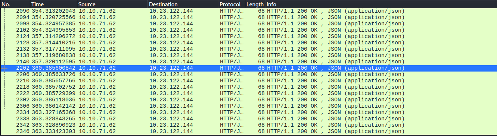

# Race Conditions

Platform: TryHackMe
Difficulty: medium
OS: N/A
Category: Web
Tags: Race Condition, Concurrency, Web
Date: 2026-06-25

# About Race Conditions

Race condition occurs when multiple threads execute simultaneously. The output is unpredictable as it will depend on the program itself.

### Example of Race Condition

Take a look at this python program and observe:

```python
import threading
import time

# Shared counter variable
counter = 0

# Number of increments each thread will perform
increments = 100000

def increment_counter():
    global counter
    for _ in range(increments):
        temp = counter
        # Introduce a tiny delay to increase the chance of a context switch
        time.sleep(0.000001)
        temp += 1
        counter = temp

# Creating two threads
thread1 = threading.Thread(target=increment_counter)
thread2 = threading.Thread(target=increment_counter)

# Starting the threads
thread1.start()
thread2.start()

# Waiting for both threads to complete
thread1.join()
thread2.join()

# Printing the final value of the counter
print(f"Final counter value: {counter}")
```

Both threads are executed together, and the output on whether which thread would finish first is unknown. Which would result that the expected result from the client side is different.

### Scenario 1 | Sending Request in Sequence

When executing race condition in sequence, the requests are sent one after the another. In a simple logic, it’s like you’re just spamming the button to send. If you only have $30 and you’re sending $10 to someone, when sending 10 request 3 out of 10 will only be successful since the requests are not running simultaneously but as an individual.

### Scenario 2 | Sending Request in Parallel

This is the very likely scenario that should be used by pentesters. As the requests are sent together, it will reach the destination at the same time.



Take a look at this photo, these are the request sent in parallel. They are successful request to modify something, and all of the successful request has a length of frame 68.